# Awesome GPT Image 2 Prompts

A curated collection of **150 production-ready prompts** for OpenAI's GPT Image 2 model, organized by category with example results.

[](https://opensource.org/licenses/MIT)
[](CONTRIBUTING.md)
[](#prompt-categories)

**[English](README.md)** | [中文](README_zh.md)

---

## Prompt Categories

| # | Category | Description | Count |
|---|----------|-------------|-------|
|  1 | [Cinematic Portraits](#01-cinematic-portraits) | Film stills, editorial headshots, moody portraits, and dramatic character photography | 25 |
|  2 | [Action & Sports](#02-action-sports) | Frozen motion, dynamic scenes, athletic photography, and high-speed capture | 9 |
|  3 | [Nature & Landscapes](#03-nature-landscapes) | Aerial views, atmospheric scenes, and travel photography | 13 |
|  4 | [Fantasy & Illustration](#04-fantasy-illustration) | Anime, cyberpunk, Ghibli, concept art, and illustration | 16 |
|  5 | [Product & Commercial](#05-product-commercial) | Product shots, advertising, brand imagery, packaging | 18 |
|  6 | [UI/UX Design](#06-ui-ux-design) | App mockups, landing pages, dashboard designs | 13 |
|  7 | [Game Assets](#07-game-assets) | Character sprites, environments, in-game screenshots, items | 12 |
|  8 | [Character Design](#08-character-design) | Character sheets, turnarounds, expression boards | 12 |
|  9 | [Poster & Graphic Design](#09-poster-graphic) | Movie posters, flyers, album covers, infographics, logos | 16 |
| 10 | [Text Rendering](#10-text-rendering) | Typography, signage, calligraphy, word art | 16 |

---

## Cinematic Portraits

Film stills, editorial headshots, moody portraits, and dramatic character photography

<table><tr>
<td width="50%" valign="top">
<a href="images/01-cinematic-portraits/01-neo-noir-hong-kong-alley.jpg">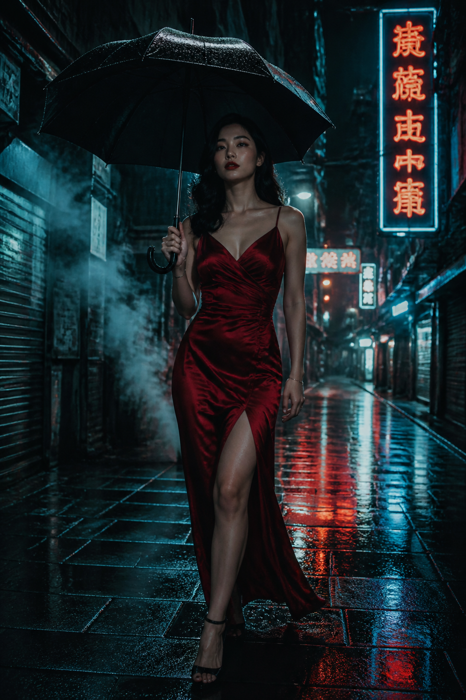</a>

<details>
<summary><b>01. Neo-Noir Hong Kong Alley</b> · Film Noir / Cinematic</summary>

```
Film noir cinematic shot. A dangerously beautiful femme fatale in a curve-hugging red silk dress with a thigh-high slit, walking through a rain-soaked Hong Kong back alley at night. Neon signs in Chinese characters reflect red and blue on the wet cobblestones. She carries a black umbrella over one shoulder, her red-painted lips the only warm color against the cold teal lighting. Smoke wisps from a nearby vent. Anamorphic lens, shallow depth of field, cinematic grain. Ultra-realistic 4K noir film frame.
```

*Technique: The color story (red against teal) is explicit, the camera is named (anamorphic), and the era (film noir) gives the model a stylistic anchor.*

</details>
</td>
<td width="50%" valign="top">
<a href="images/01-cinematic-portraits/02-jazz-bar-rembrandt-lighting.jpg">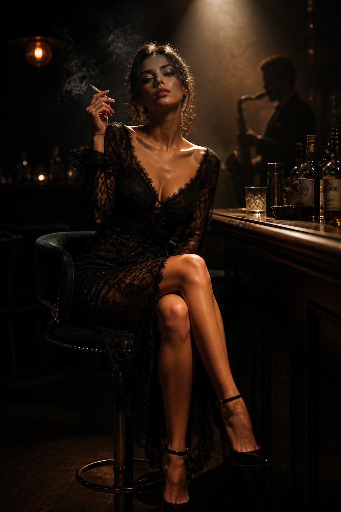</a>

<details>
<summary><b>02. Jazz Bar Rembrandt Lighting</b> · Film Noir / Moody Interior</summary>

```
Moody jazz bar interior. A mysterious woman in a sheer black lace dress sits on a velvet barstool, one leg crossed showing stiletto heels. Cigarette smoke curls around her silhouette. Warm amber spotlight from above illuminates her face and exposed collarbones while the rest fades into deep shadow. A saxophone player is a blurred silhouette in the background. Film noir meets modern luxury aesthetic. Dramatic Rembrandt lighting, 35mm film look. Ultra-realistic 4K.
```

</details>
</td>
</tr>
<tr>
<td width="50%" valign="top">
<a href="images/01-cinematic-portraits/03-blade-runner-rooftop.jpg">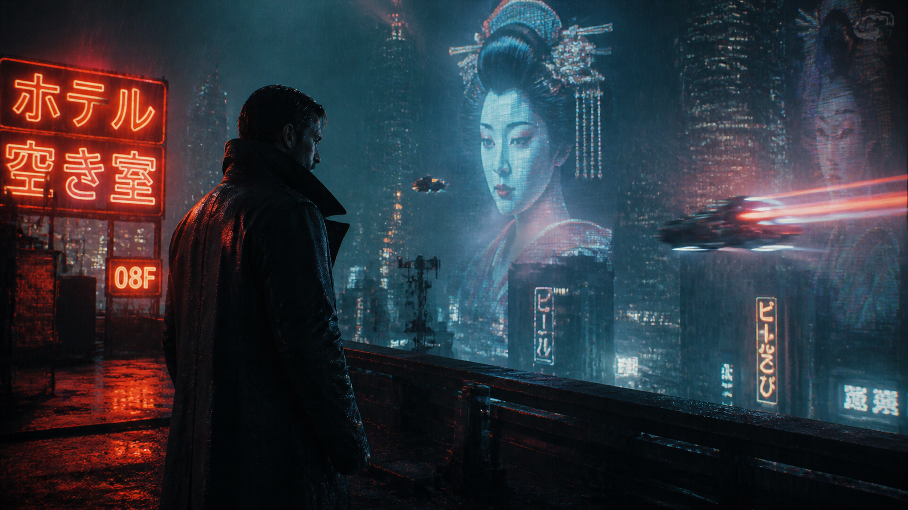</a>

<details>
<summary><b>03. Blade Runner Rooftop</b> · Cyberpunk / Cinematic</summary>

```
Cyberpunk cinematic wide shot. A lone detective in a wet black trench coat stands on a neon-drenched Tokyo rooftop at 3am. Giant holographic advertisements of a geisha float across the skyline behind him, casting shifting pink and cyan light on his face. Light rain catches the glow. Flying cars streak past as horizontal light trails. Shot on anamorphic lens, 2.39:1 aspect, shallow depth of field. Blade Runner 2049 color grade -- teal shadows, orange highlights. Ultra-realistic 4K cinematic frame.
```

</details>
</td>
<td width="50%" valign="top">
<a href="images/01-cinematic-portraits/04-wes-anderson-symmetrical-hotel-lobby.jpg">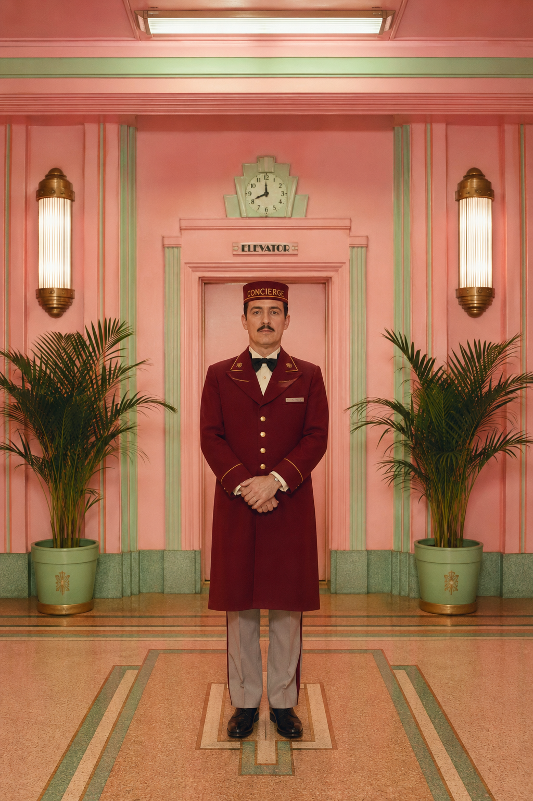</a>

<details>
<summary><b>04. Wes Anderson Symmetrical Hotel Lobby</b> · Symmetrical / Pastel Cinematic</summary>

```
Wes Anderson style cinematic composition. A 1960s hotel concierge in a burgundy uniform stands dead-center in a pastel-pink Art Deco lobby, flanked by perfectly symmetrical potted palms and brass sconces. Flat front-on framing, everything on center axis. Soft fluorescent overhead lighting. Pastel pink and mint green color palette. 35mm film look. Ultra-detailed 4K.
```

</details>
</td>
</tr>
<tr>
<td width="50%" valign="top">
<a href="images/01-cinematic-portraits/05-korean-thriller-kitchen-standoff.jpg">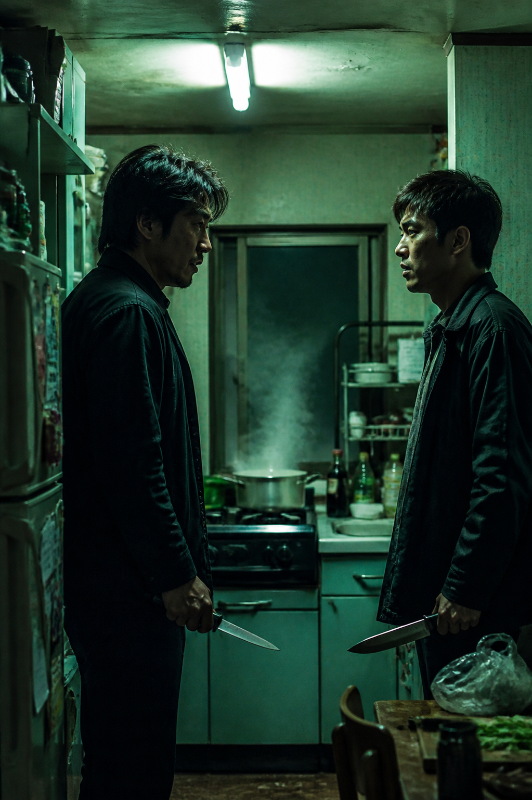</a>

<details>
<summary><b>05. Korean Thriller Kitchen Standoff</b> · Crime Thriller / Tension</summary>

```
Cinematic still from a modern Korean crime thriller. Two men face each other across a small Seoul apartment kitchen at 2am, both holding knives but frozen in a tense moment. Single fluorescent tube overhead casts hard green-tinted light and harsh shadows. Steam rises from an abandoned pot on the stove. Tight composition, 40mm lens, handheld feel. Bong Joon-ho style. Ultra-realistic 4K.
```

</details>
</td>
<td width="50%" valign="top">
<a href="images/01-cinematic-portraits/06-french-new-wave-cafe.jpg">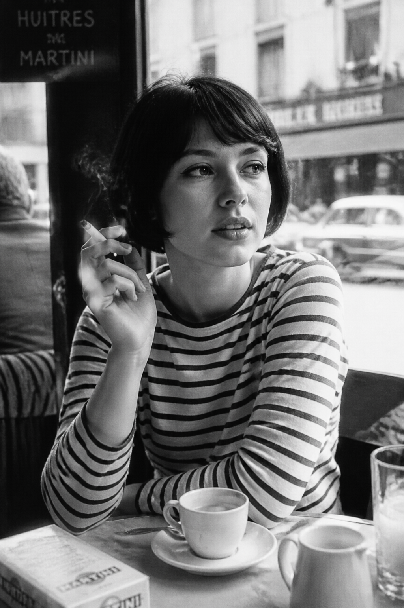</a>

<details>
<summary><b>06. French New Wave Cafe</b> · Black & White / Vintage Cinematic</summary>

```
Black and white French New Wave cinematic still. A young woman in a striped Breton shirt and dark bob haircut smokes at a Paris cafe table in 1962. She looks off-camera with soft intensity. Natural window light, high contrast, slightly overexposed highlights. Film grain visible. Godard aesthetic. 35mm monochrome, 50mm lens. Ultra-detailed.
```

</details>
</td>
</tr>
<tr>
<td width="50%" valign="top">
<a href="images/01-cinematic-portraits/07-miami-vice-neon-drive.jpg">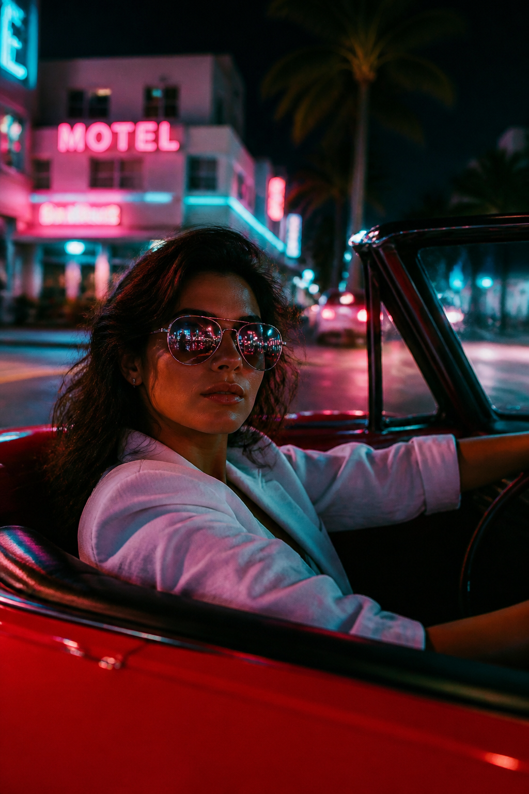</a>

<details>
<summary><b>07. Miami Vice Neon Drive</b> · 1980s Retro / Neon Cinematic</summary>

```
1980s Miami Vice cinematic shot. A woman in a white linen blazer drives a red convertible at night through downtown Miami. Palm trees and neon motel signs blur past. She looks at the camera with sunglasses reflecting the pink and turquoise glow of the city. Lens flare, soft film grain. Teal and magenta color grade. Ultra-realistic 4K.
```

</details>
</td>
<td width="50%" valign="top">
<a href="images/01-cinematic-portraits/08-studio-ghibli-live-action-adaptation.jpg">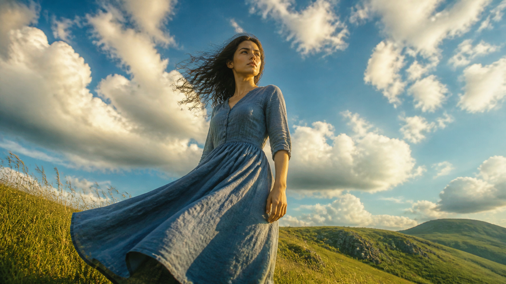</a>

<details>
<summary><b>08. Studio Ghibli Live-Action Adaptation</b> · Live-Action Anime / Pastoral</summary>

```
Cinematic still styled as a live-action Studio Ghibli adaptation. A young woman in a simple blue linen dress stands in a vast green hillside field, wind blowing her hair and skirt. Fluffy white clouds race overhead. Soft golden hour light. Warm, painterly color grading with gentle film grain. Wide lens, low-angle composition making her heroic against the sky. Ultra-detailed 4K.
```

</details>
</td>
</tr>
<tr>
<td width="50%" valign="top">
<a href="images/01-cinematic-portraits/09-candid-elderly-sailor.jpg">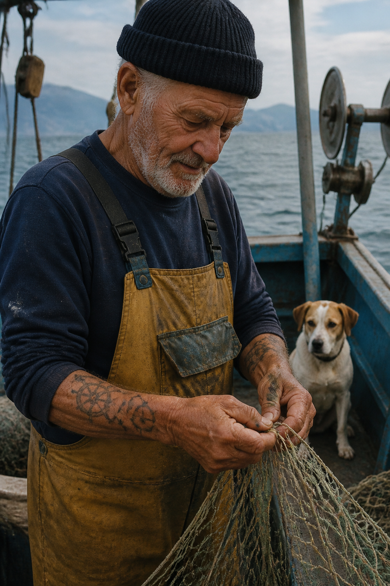</a>

<details>
<summary><b>09. Candid Elderly Sailor</b> · Documentary / Photorealistic</summary>

```
Create a photorealistic candid photograph of an elderly sailor standing on a small fishing boat. He has weathered skin with visible wrinkles, pores, and sun texture, and a few faded traditional sailor tattoos on his arms. He is calmly adjusting a net while his dog sits nearby on the deck. Shot like a 35mm film photograph, medium close-up at eye level, using a 50mm lens. Soft coastal daylight, shallow depth of field, subtle film grain, natural color balance. The image should feel honest and unposed, with real skin texture, worn materials, and everyday detail. No glamorization, no heavy retouching.
```

</details>
</td>
<td width="50%" valign="top">
<a href="images/01-cinematic-portraits/10-reflection-self-portrait-in-night-train.jpg">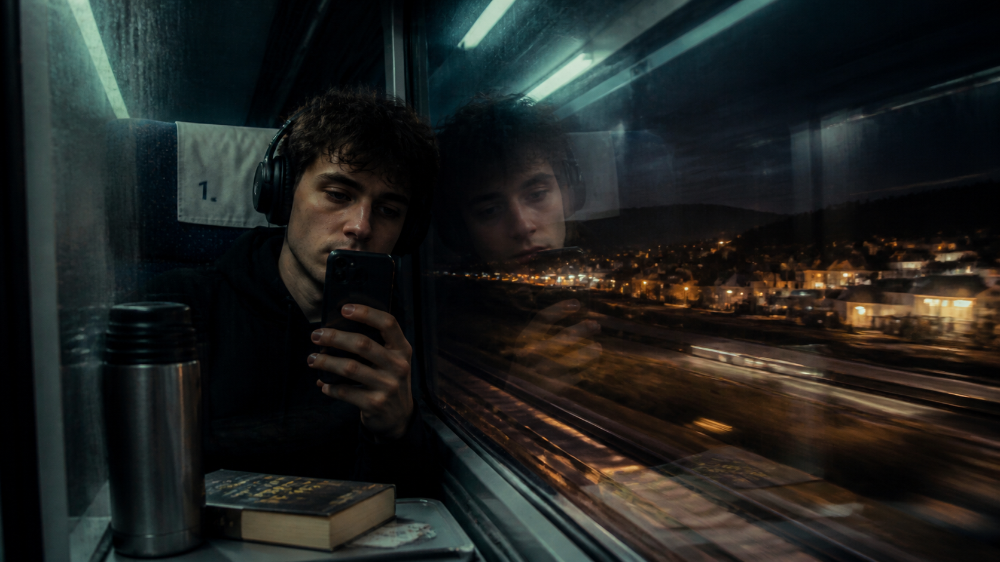</a>

<details>
<summary><b>10. Reflection Self-Portrait in Night Train</b> · Intimate / Cinematic Travel</summary>

```
Create a reflection self portrait in a night train window showing a young traveler with headphones and a tired expression, while the landscape outside blurs past at speed. Cool overhead train light mixed with warm town lights outside, ghosted double reflection on the glass, condensation at the edge, a thermos and a book on the tray table. Cinematic but believable. No watermark.
```

</details>
</td>
</tr>
<tr>
<td width="50%" valign="top">
<a href="images/01-cinematic-portraits/11-professional-linkedin-headshot.jpg"></a>

<details>
<summary><b>11. Professional LinkedIn Headshot</b> · Studio Portrait / Professional</summary>

```
A professional medium-shot portrait of a confident woman in her 30s wearing a tailored navy blue blazer. Neutral grey studio background. Soft three-point lighting. Realistic skin texture, visible pores, and natural hair strands. 8k resolution, shot on 85mm lens.
```

</details>
</td>
<td width="50%" valign="top">
<a href="images/01-cinematic-portraits/12-quiet-still-life---elderly-hands.jpg">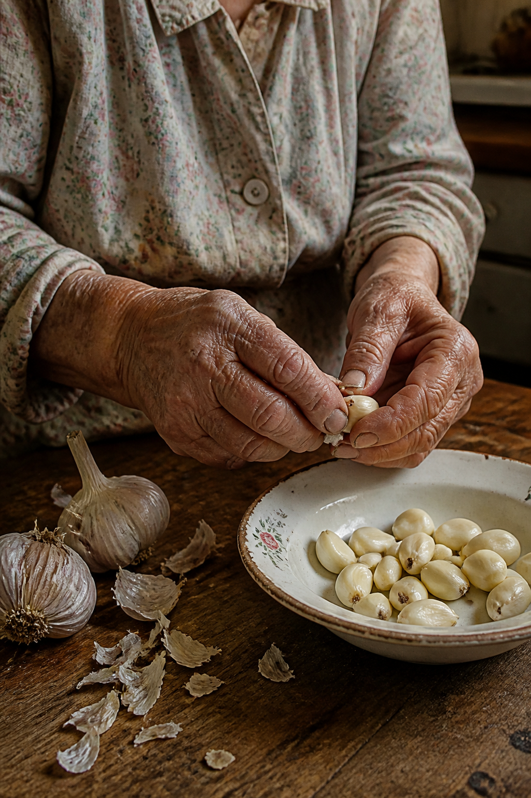</a>

<details>
<summary><b>12. Quiet Still Life - Elderly Hands</b> · Documentary / Intimate Portrait</summary>

```
Create a tight medium format portrait of an elderly woman's hands peeling garlic at a worn wooden kitchen table. Window light from camera left, faded floral housedress sleeves, a chipped porcelain bowl half full of peeled cloves, papery garlic skins scattered. Every wrinkle and nail imperfection visible, warm color palette, no stylization. No watermark.
```

*Technique: Medium format feel, north-window light, wrinkles, nail imperfection. Restraint is the aesthetic -- specify visible imperfections to avoid plastic-looking results.*

</details>
</td>
</tr>
<tr>
<td width="50%" valign="top">
<a href="images/01-cinematic-portraits/13-convenience-store-neon-portrait.jpg">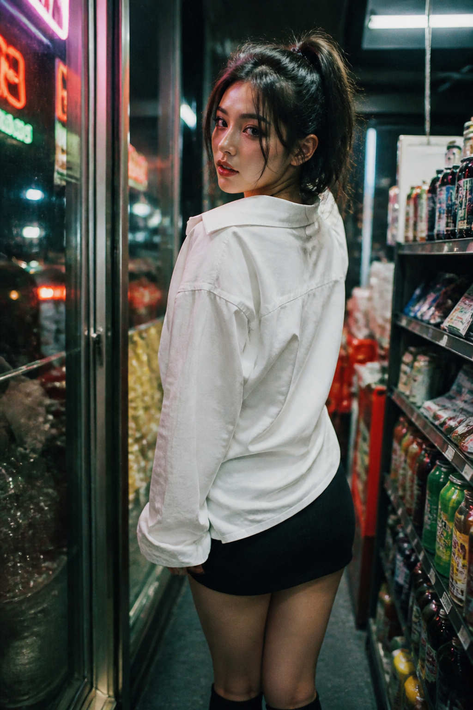</a>

<details>
<summary><b>13. Convenience Store Neon Portrait</b> · Editorial / Neon Street Photography</summary>

```
35mm film photography with harsh convenience store fluorescent lighting mixed with colorful neon signs from outside, authentic film grain, high contrast, cinematic street editorial style, intimate medium shot, late-night convenience store atmosphere, realistic reflections on glass, natural skin texture, oversized white shirt, black mini skirt, messy high ponytail, seductive but grounded urban portrait energy, no watermark, no text.
```

</details>
</td>
<td width="50%" valign="top">
<a href="images/01-cinematic-portraits/14-soft-black-mist-idol-portrait.jpg">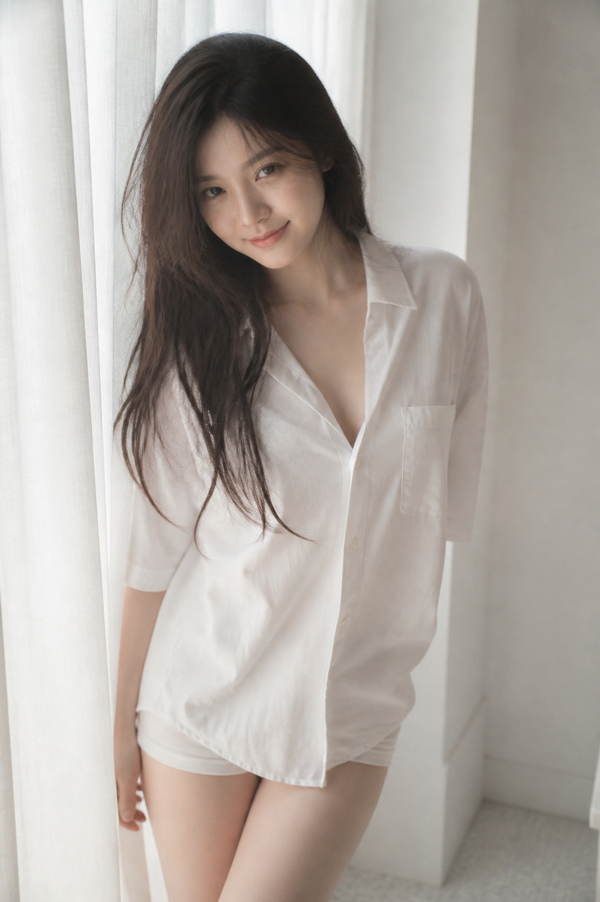</a>

<details>
<summary><b>14. Soft Black Mist Idol Portrait</b> · Korean Idol / Soft Editorial</summary>

```
9:16 vertical -- Korean idol portrait photography, single subject. Soft black mist filter effect, lowered contrast, gentle highlight bloom, subtle glow, soft diffusion, slightly faded blacks. Minimal indoor setting near window, white curtains, clean light-toned background. Young Korean female idol, natural minimal makeup, dewy realistic skin texture, subtle imperfections. Outfit: oversized white button-up shirt with short bottoms, slightly loose fit, soft and casual styling. Hair: long dark hair, slightly messy, natural volume, softly flowing. Pose: relaxed standing or slight lean, body subtly angled, one leg slightly forward, shoulders relaxed. Expression: soft cute smile, slightly playful eyes, direct or slightly off-camera gaze. Camera: close to mid-body framing, eye-level, intimate distance. Lighting: diffused natural daylight, soft shadows, gentle light wrapping around face and body. Mood: cute yet subtly sensual, intimate, everyday softness. Quality: ultra-realistic, fine film grain, slight softness at edges, natural imperfections, dreamy understated tone.
```

</details>
</td>
</tr>
<tr>
<td width="50%" valign="top">
<a href="images/01-cinematic-portraits/15-villeneuve-desert-epic.jpg">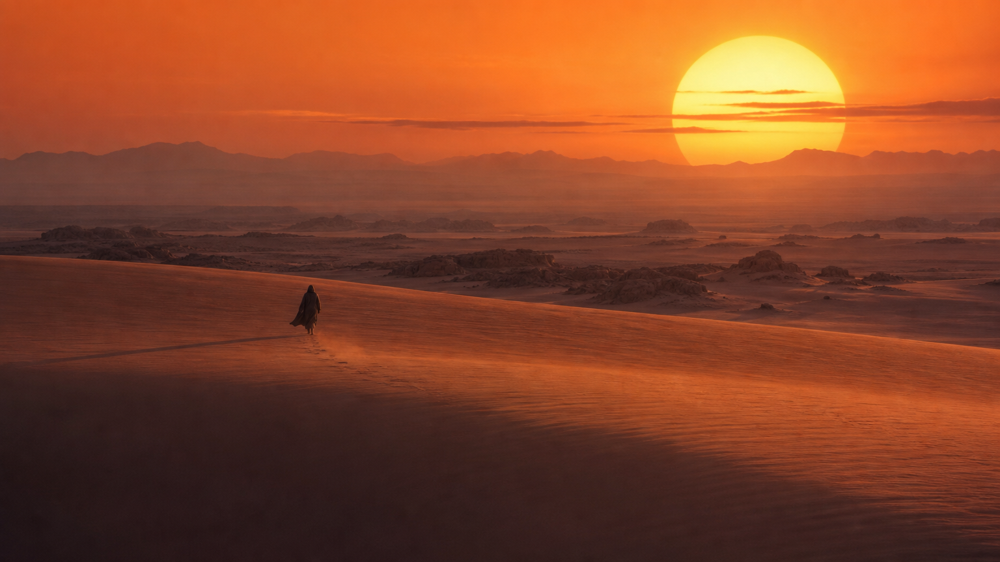</a>

<details>
<summary><b>15. Villeneuve Desert Epic</b> · Epic Cinematic / Landscape-Scale</summary>

```
Epic cinematic wide shot in Denis Villeneuve style. A lone hooded figure in flowing desert robes walks across a vast orange sand dune at sunset. The sun is enormous on the horizon, casting elongated shadows. Scale is extreme -- the figure is tiny, the landscape overwhelming. Dust kicks up in the wind. Warm amber palette with deep violet shadows. Shot on 65mm, ultra-wide aspect. Ultra-realistic 4K cinematic quality.
```

</details>
</td>
<td width="50%" valign="top">
<a href="images/01-cinematic-portraits/16-fenty-beauty-macro-portrait.jpg">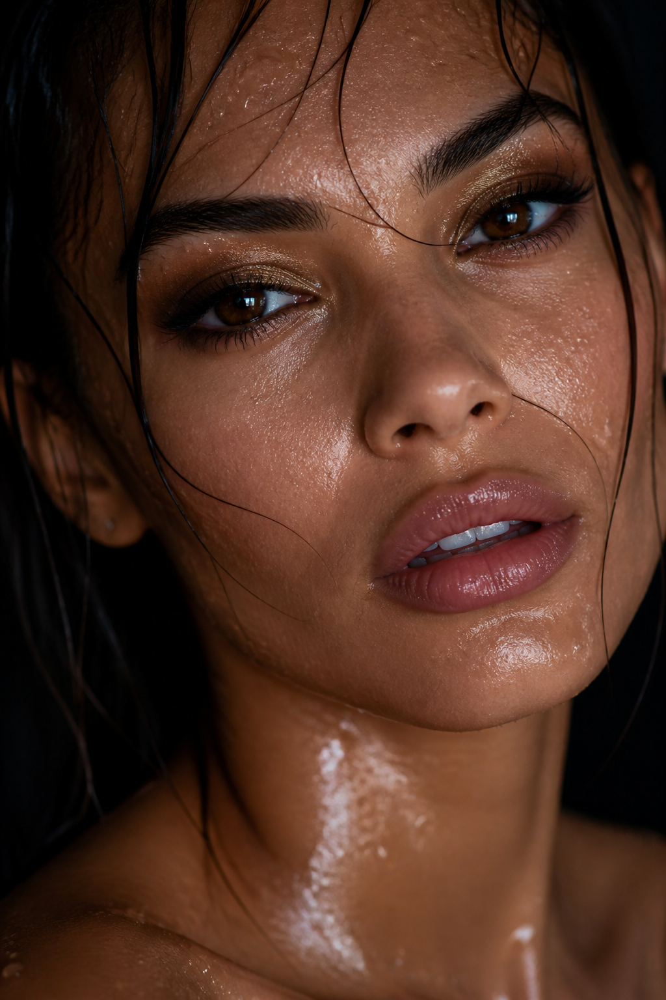</a>

<details>
<summary><b>16. Fenty Beauty Macro Portrait</b> · Beauty Editorial / Macro Photography</summary>

```
Extreme close-up beauty portrait. A stunning model with wet dewy skin and tousled damp hair, bare shoulders glistening. Water droplets on her face and neck catch the light of a ring light. Flawless skin texture in macro detail -- every pore, every water droplet razor sharp. Smoky eye makeup with subtle gold shimmer. Lips slightly parted, intense gaze at camera. Dark background. Fenty Beauty campaign aesthetic. 85mm macro lens, f/1.4, ultra-shallow depth of field. Ultra-realistic 4K.
```

</details>
</td>
</tr>
<tr>
<td width="50%" valign="top">
<a href="images/01-cinematic-portraits/17-golden-hour-romantic-portrait.jpg"></a>

<details>
<summary><b>17. Golden Hour Romantic Portrait</b> · Romantic / Golden Hour Photography</summary>

```
Sun-drenched golden hour portrait. A woman in a flowing cream linen dress stands in a wheat field at 7pm on a summer evening. The sun is low behind her, creating a halo of golden backlight through her hair and the sheer fabric. Lens flare across the frame. Her eyes are closed, face tilted up to the warmth. 135mm telephoto lens, f/2, compressed background. Warm honey color grade. Ultra-realistic 4K.
```

</details>
</td>
<td width="50%" valign="top">
<a href="images/01-cinematic-portraits/18-dark-academia-library-portrait.jpg">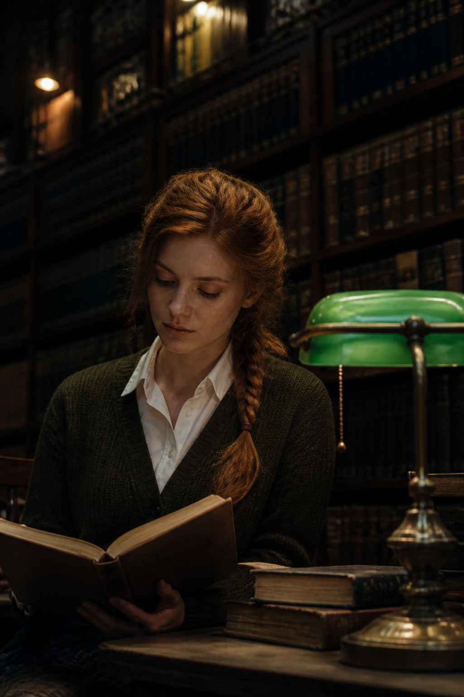</a>

<details>
<summary><b>18. Dark Academia Library Portrait</b> · Editorial / Dark Academia</summary>

```
Dark academia editorial portrait. A young woman with auburn hair in a loose braid wears a wool cardigan over a white collared shirt in an old university library. She holds an open leather-bound book, reading by the light of a green banker's lamp. Towering bookshelves around her fade into shadow. Warm tungsten light, deep navy and olive color palette. 50mm lens, f/2.8. Ultra-realistic 4K.
```

</details>
</td>
</tr>
<tr>
<td width="50%" valign="top">
<a href="images/01-cinematic-portraits/19-art-deco-penthouse-fashion-editorial.jpg">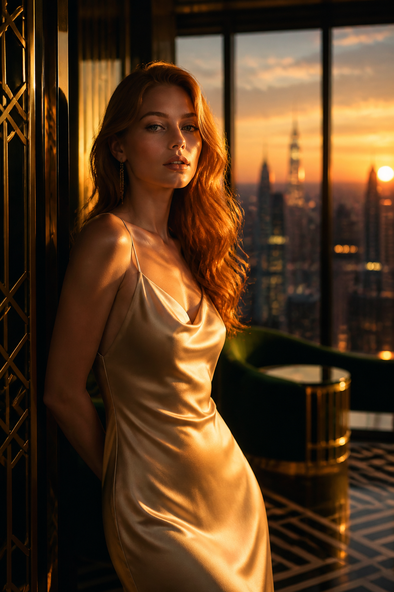</a>

<details>
<summary><b>19. Art Deco Penthouse Fashion Editorial</b> · Luxury Fashion / Editorial</summary>

```
A breathtaking young woman with flowing auburn hair stands in a luxurious Art Deco penthouse at golden hour. She wears a champagne-colored satin slip dress that catches the warm light. Floor-to-ceiling windows behind her show a panoramic city sunset. Dramatic side lighting creates deep shadows and golden highlights on her face and bare arms. The composition follows the rule of thirds. Cinematic depth of field with gorgeous city bokeh. Fashion editorial quality. Ultra-realistic 4K.
```

*Technique: Same subject as "A woman standing in a room" but every ambiguity has been resolved for the model.*

</details>
</td>
<td width="50%" valign="top">
<a href="images/01-cinematic-portraits/20-35mm-flash-editorial-portrait.jpg">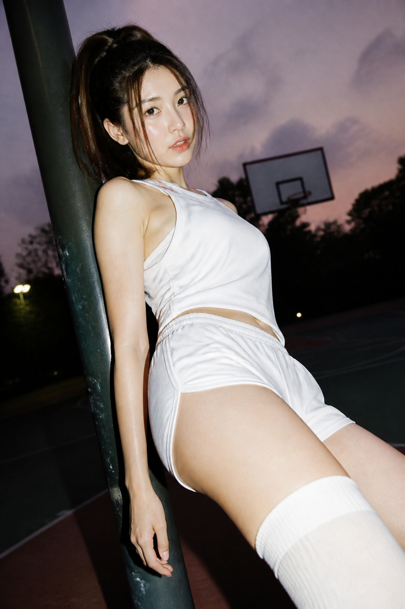</a>

<details>
<summary><b>20. 35mm Flash Editorial Portrait</b> · 35mm Film / Flash Photography / Fashion</summary>

```
35mm color film photography with harsh direct on-camera flash, specular highlights on skin and clothing, strong catchlights in eyes, high contrast flash illumination, authentic film grain and color shift, high fashion fresh innocent basketball court editorial style, intimate first-person low-angle POV shot from below, early 20s East Asian female with delicate refined features, seductive almond-shaped eyes with natural double eyelids, flawless realistic porcelain skin with cool ivory undertone and visible flash specular highlights, fine skin texture with subtle pores and natural dewy glow under flash, fresh natural sporty makeup, subtle natural flush on cheeks, natural pink lips slightly parted, long dark brown hair tied in a high playful ponytail with loose strands framing the face, wearing a loose white tank top and white high-waisted basketball shorts, white knee-high sports socks, leaning pose against basketball hoop pole on outdoor court at dusk, harsh direct on-camera flash creating sharp specular highlights and strong catchlights, blurred basketball court and hoop under dusk sky, authentic 35mm direct flash film color grading, no watermark, no text.
```

</details>
</td>
</tr>
<tr>
<td width="50%" valign="top">
<a href="images/01-cinematic-portraits/21-vertical-wuxia-heroine-portrait.jpg">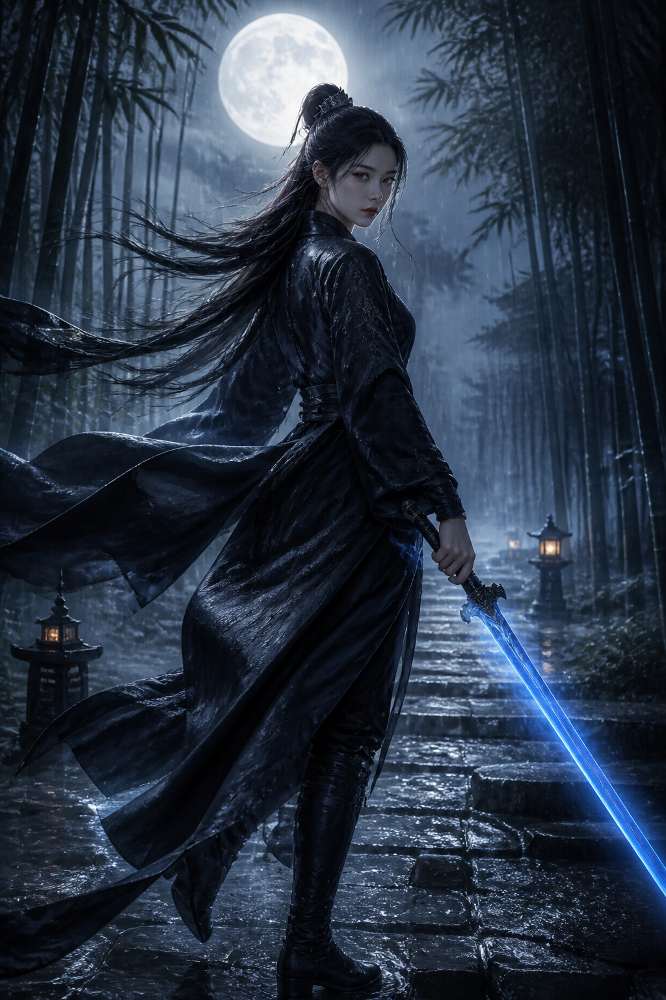</a>

<details>
<summary><b>21. Vertical Wuxia Heroine Portrait</b> · Wuxia / Eastern Fantasy / Cinematic</summary>

```
9:16 vertical, ultimate wuxia style, a stunning young Eastern swordswoman, cold and sharp phoenix eyes, porcelain skin, long straight black hair wet and windswept. Wearing a soaked dark black martial arts outfit with a wide-sleeved dark robe, blown dramatically by the wind. A soft sword belt at the waist, long boots, right hand holding an ancient sword emitting a faint blue sword qi glow. Dynamic pose: body slightly turned, looking back over shoulder, robes billowing. Background: moonlit rain-mist-covered bamboo forest path, giant full moon, stone path, ancient lanterns, thin mist and rain. Dramatic cold moonlight combined with blue sword qi, wet-surface water reflections, ultra-dynamic feel with detailed fabric folds, hair strand movement, and realistic water droplet reflections. Cinematic lighting, 8K, masterpiece, ultra realistic, dramatic atmosphere.
```

</details>
</td>
<td width="50%" valign="top">
<a href="images/01-cinematic-portraits/22-moody-monochrome-portrait.jpg">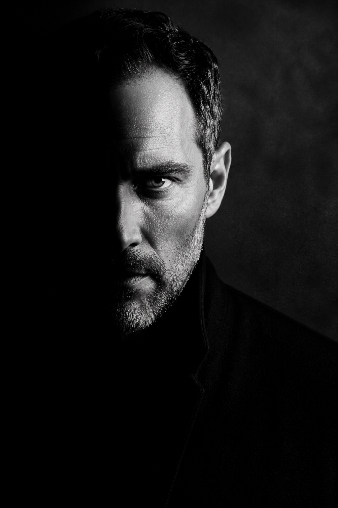</a>

<details>
<summary><b>22. Moody Monochrome Portrait</b> · Black & White / Dramatic</summary>

```
Dramatic black and white portrait. A man with a short salt-and-pepper beard and intense dark eyes stares into the lens. Only half his face is lit -- hard side light from camera right, pure black shadow on the other side. Textured gray background fades to black. Shot on medium format film aesthetic, 80mm lens. Film grain. Peter Lindbergh style monochrome. Ultra-detailed.
```

</details>
</td>
</tr>
<tr>
<td width="50%" valign="top">
<a href="images/01-cinematic-portraits/23-soft-airy-35mm-portrait.jpg">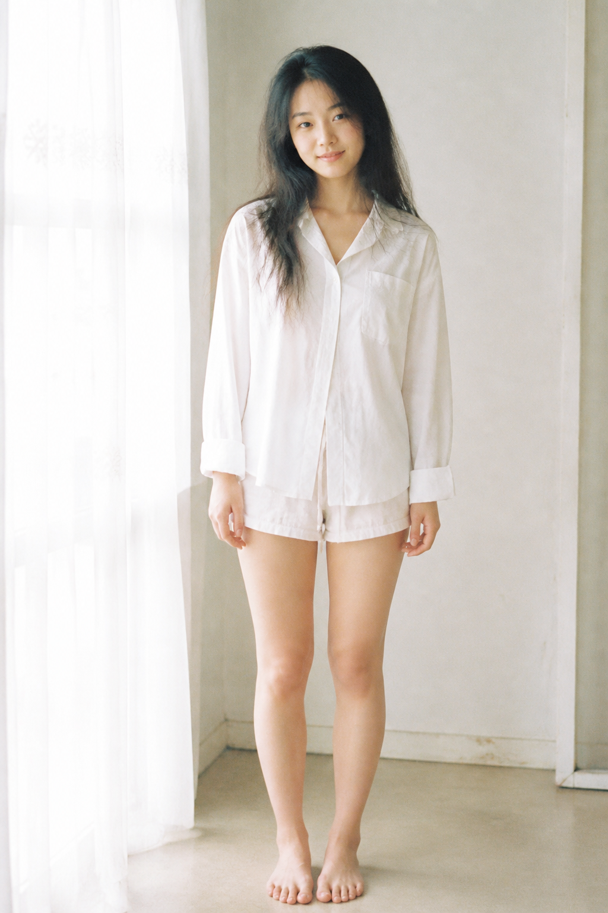</a>

<details>
<summary><b>23. Soft Airy 35mm Portrait</b> · Analog Film / Japanese Aesthetic</summary>

```
Analog 35mm film photography, soft airy Japanese-style aesthetic, gentle diffused natural window light, slight overexposure, pastel tones, low contrast, soft highlights, minimal indoor setting near a window with white curtains, clean light-colored wall, natural composition, eye-level, slightly closer full-body framing (mid-thigh to head), young East Asian woman, natural minimal makeup, soft realistic skin texture, long slightly messy dark hair, oversized white button-up shirt, light casual shorts, barefoot, simple and relaxed styling, standing naturally with relaxed posture, arms loosely at sides, facing camera, gentle soft smile, subtle stillness, focus on light, air, and quiet everyday mood, soft film grain, dreamy and understated atmosphere.
```

</details>
</td>
<td width="50%" valign="top">
<a href="images/01-cinematic-portraits/24-woodstock-crowd-scene-world-knowledge.jpg">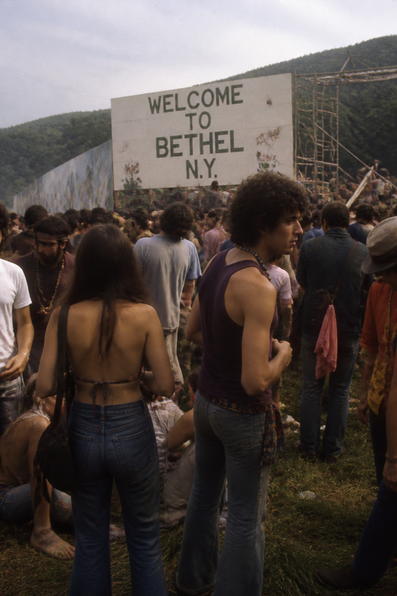</a>

<details>
<summary><b>24. Woodstock Crowd Scene (World Knowledge)</b> · Documentary / Historical</summary>

```
Create a realistic outdoor crowd scene in Bethel, New York on August 16, 1969.
Photorealistic, period-accurate clothing, staging, and environment.
```

*Technique: GPT Image 2 leverages world knowledge -- it infers Woodstock from the date/location without being explicitly told.*

</details>
</td>
</tr>
<tr>
<td width="50%" valign="top">
<a href="images/01-cinematic-portraits/25-fishmonger-at-dawn.jpg">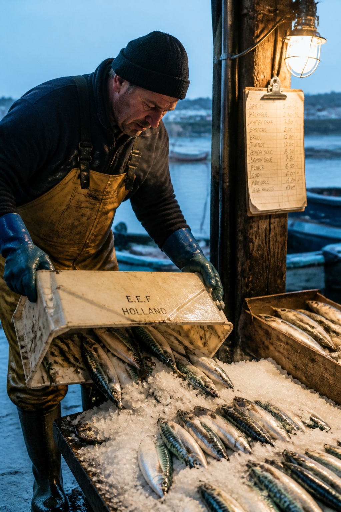</a>

<details>
<summary><b>25. Fishmonger at Dawn</b> · Documentary / Reportage</summary>

```
Create a color documentary photograph of a fishmonger unpacking crates of mackerel onto crushed ice at a small coastal market just after dawn. Steam from breath in the cold air, rubber boots, wet concrete floor, incandescent work lamp spilling warm light, a paper ledger with handwritten prices clipped to a wooden post. Realistic skin texture and fish scales, shallow depth of field, 35mm feel. No commercial styling, no watermark.
```

*Technique: Cold air, wet floor, a named lamp, a named lens. The image reads as a real photograph because each detail was specified.*

</details>
</td>
<td></td>
</tr>
</table>


---

## Action & Sports

Frozen motion, dynamic scenes, athletic photography, and high-speed capture

<table><tr>
<td width="50%" valign="top">
<a href="images/02-action-sports/01-nike-training-freeze-frame.jpg">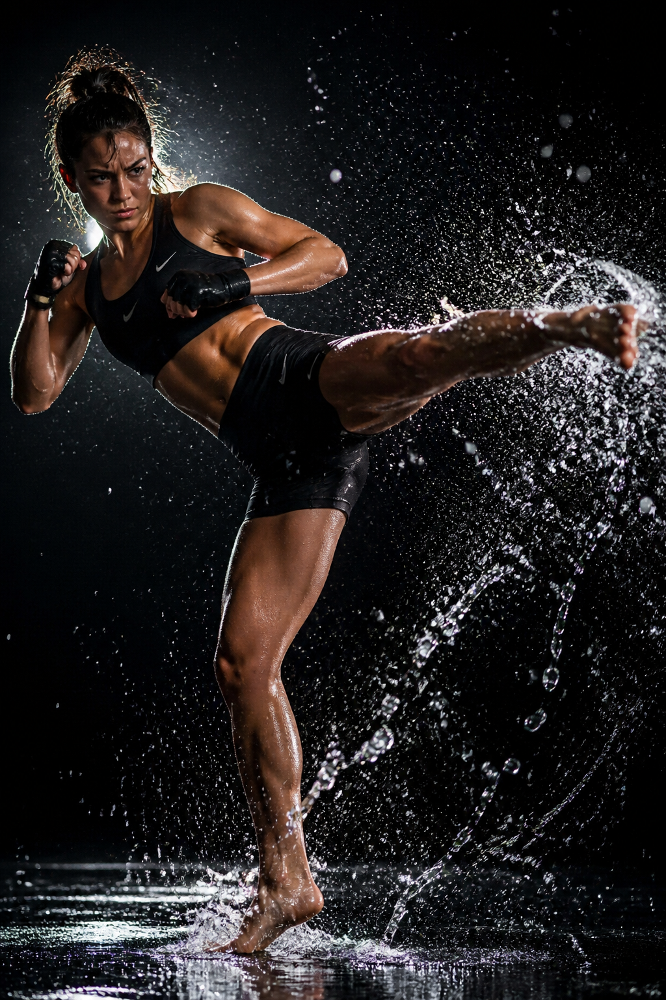</a>

<details>
<summary><b>01. Nike Training Freeze-Frame</b> · Sports / Frozen Motion</summary>

```
Dynamic action freeze-frame. An athletic woman in a fitted sports bra and high-waisted compression shorts executes a powerful spinning roundhouse kick. Water splashes frozen in mid-air around her legs and feet in a dramatic spray pattern. Her toned abs and defined muscles visible. Dramatic single-source rim lighting from behind creates a glowing silhouette edge. Dark studio background. Nike Training campaign energy. High-speed photography feel -- ultra-sharp subject, motion blur on water droplets. Ultra-realistic 4K.
```

*Technique: Rim light from behind is what sculpts the silhouette against a chaotic background.*

</details>
</td>
<td width="50%" valign="top">
<a href="images/02-action-sports/02-big-wave-surfer-barrel.jpg">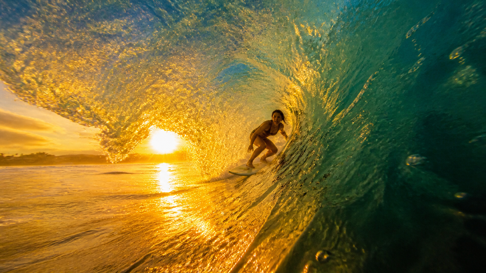</a>

<details>
<summary><b>02. Big-Wave Surfer Barrel</b> · Surf Photography / Epic Action</summary>

```
Epic wide-angle shot of a female surfer riding inside a massive crystal-clear barrel wave at golden hour. Her silhouette and athletic body visible through the translucent turquoise water of the wave tube. Golden sunlight creates an explosion of light and water mist behind her. Dramatic backlit composition. The wave is enormous and perfectly formed. GoPro-style immersive perspective. Ultra-realistic 4K cinematic quality.
```

</details>
</td>
</tr>
<tr>
<td width="50%" valign="top">
<a href="images/02-action-sports/03-parkour-rooftop-leap.jpg">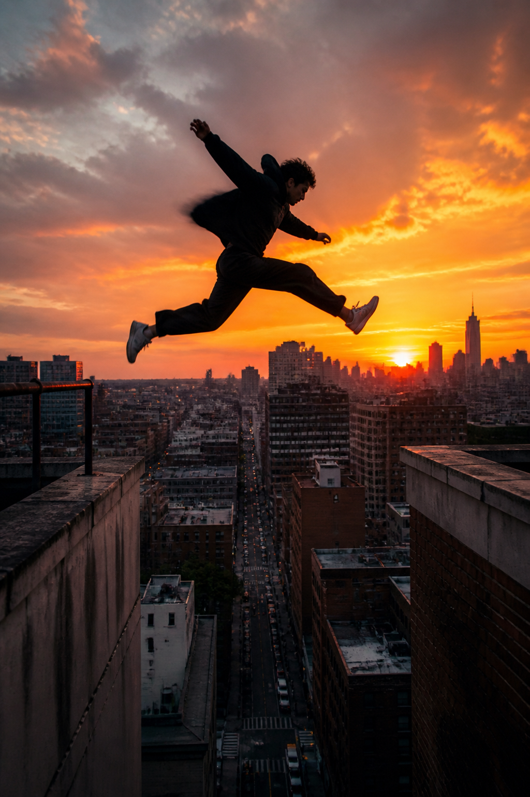</a>

<details>
<summary><b>03. Parkour Rooftop Leap</b> · Urban Action / High-Speed</summary>

```
High-speed action shot of a parkour athlete mid-leap between two Brooklyn rooftops at sunset. Frozen at the apex of the jump, arms and legs extended, silhouetted against a burning orange sky. The gap below him is dizzying -- city streets far below. Motion blur on the trailing edge of his hoodie. Shot from a drone at his height, 35mm lens. Ultra-realistic 4K cinematic action.
```

</details>
</td>
<td width="50%" valign="top">
<a href="images/02-action-sports/04-mma-ring-spotlight.jpg">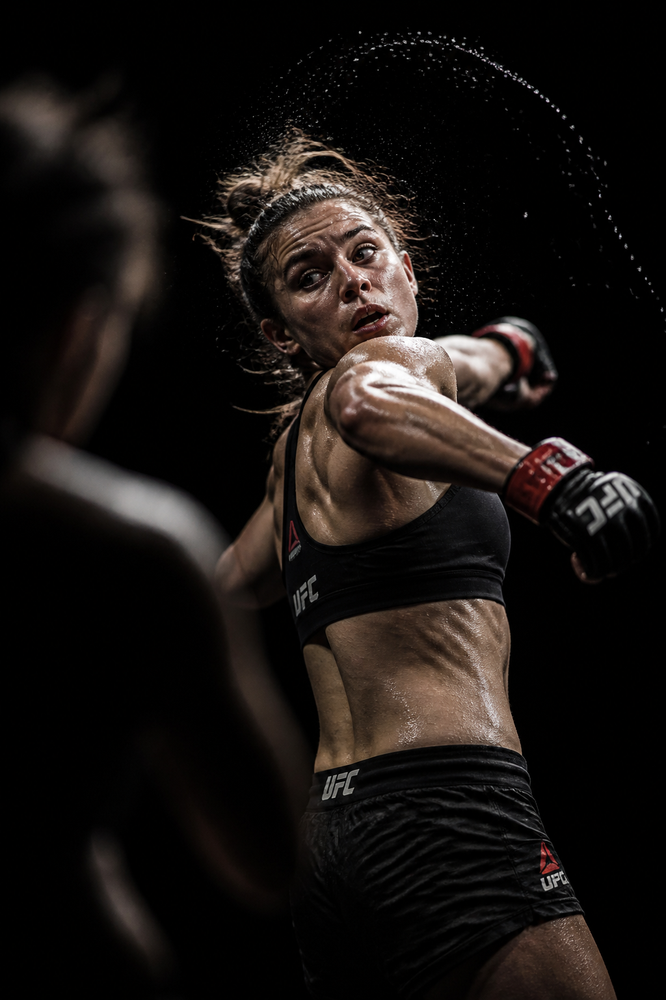</a>

<details>
<summary><b>04. MMA Ring Spotlight</b> · Fight Photography / High Contrast</summary>

```
Dramatic fight night action. A female MMA fighter mid-spinning back elbow, sweat flying from her hair in a visible arc of droplets. Single harsh overhead ring spotlight isolates her from pure black background -- classic boxing photography look. Her opponent is a blurred silhouette out of focus. 70-200mm lens at 200mm, f/2.8, 1/2000 shutter frozen motion. High contrast, desaturated. Ultra-detailed 4K.
```

</details>
</td>
</tr>
<tr>
<td width="50%" valign="top">
<a href="images/02-action-sports/05-motocross-dust-storm.jpg">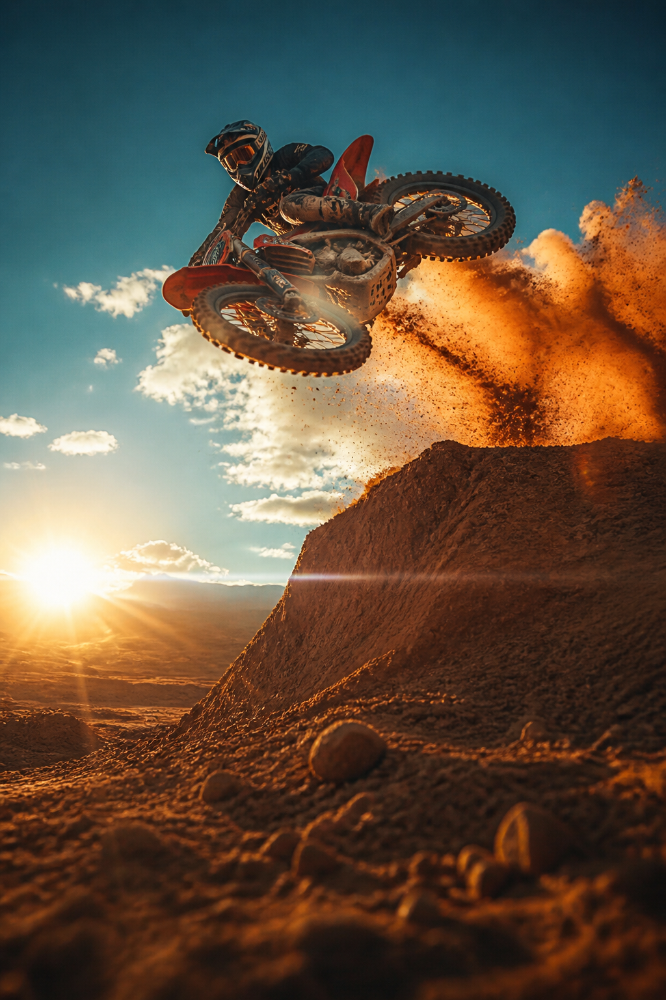</a>

<details>
<summary><b>05. Motocross Dust Storm</b> · Motorsport / Low-Angle Action</summary>

```
Low-angle action shot of a motocross rider airborne over a dirt jump, red desert dust exploding behind the rear tire. Late afternoon sun casts long shadows. The bike is tilted aggressively mid-trick. Camera is just above ground level looking up, making the jump look monumental. Anamorphic lens flare from the sun. Orange and teal color grade. Ultra-realistic 4K action.
```

</details>
</td>
<td width="50%" valign="top">
<a href="images/02-action-sports/06-ballet-grand-jete-studio.jpg">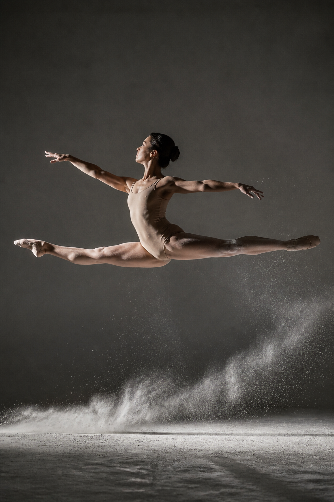</a>

<details>
<summary><b>06. Ballet Grand Jete Studio</b> · Dance / Chiaroscuro</summary>

```
Contemporary ballet dancer mid-grand jete frozen in the air, arms extended, body perfectly horizontal. She wears a simple nude leotard. Plain gray cyclorama studio background. Strong side-light from camera left creates a sculptural chiaroscuro on her musculature. Powder disturbed from the floor traces her leap in a soft cloud. 1/4000 shutter speed feel. Ultra-detailed 4K.
```

</details>
</td>
</tr>
<tr>
<td width="50%" valign="top">
<a href="images/02-action-sports/07-basketball-slam-dunk.jpg">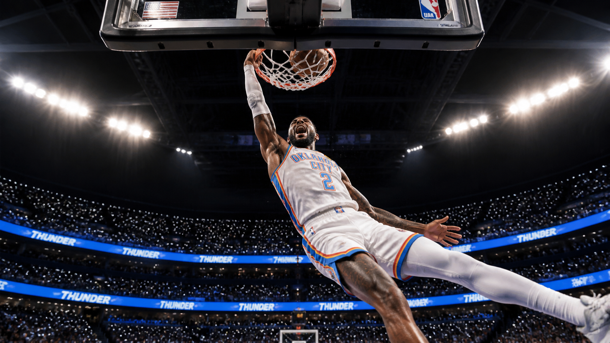</a>

<details>
<summary><b>07. Basketball Slam Dunk</b> · Sports / Low-Angle Hero</summary>

```
Low-angle hero shot of a male basketball player mid-slam dunk, one hand gripping the rim, body extended diagonally across the frame. Arena lights streak as lens flares. Crowd is a soft blurred wall of phone flashes behind him. Frozen sweat and net motion. Shot on 24mm wide from directly below the hoop. NBA official photography energy. Ultra-realistic 4K.
```

</details>
</td>
<td width="50%" valign="top">
<a href="images/02-action-sports/08-horse-gallop-ocean-splash.jpg">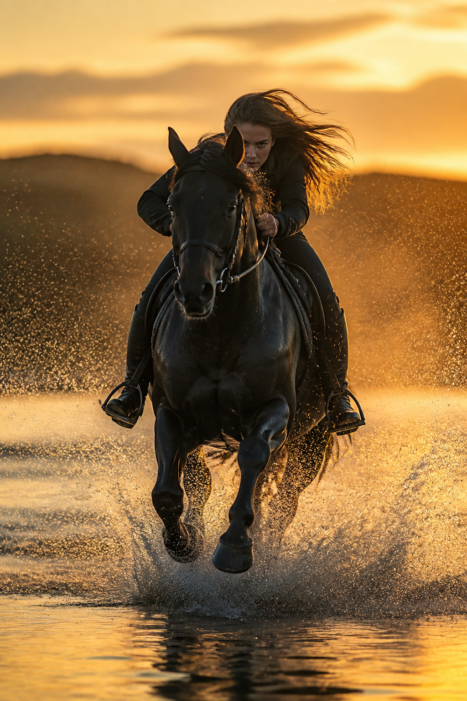</a>

<details>
<summary><b>08. Horse Gallop Ocean Splash</b> · Equestrian / Nature Action</summary>

```
A rider on a powerful black horse gallops through knee-deep shallow ocean water at sunrise. Water explodes from each hoofstrike, frozen in a dramatic spray. The rider is leaned low, hair streaming behind. Warm golden backlight from the rising sun. Mist rising off the water. Shot at 1/4000 shutter, 200mm telephoto compression. Ultra-realistic 4K equine photography.
```

</details>
</td>
</tr>
<tr>
<td width="50%" valign="top">
<a href="images/02-action-sports/09-bear-attack-campsite-action-scene.jpg">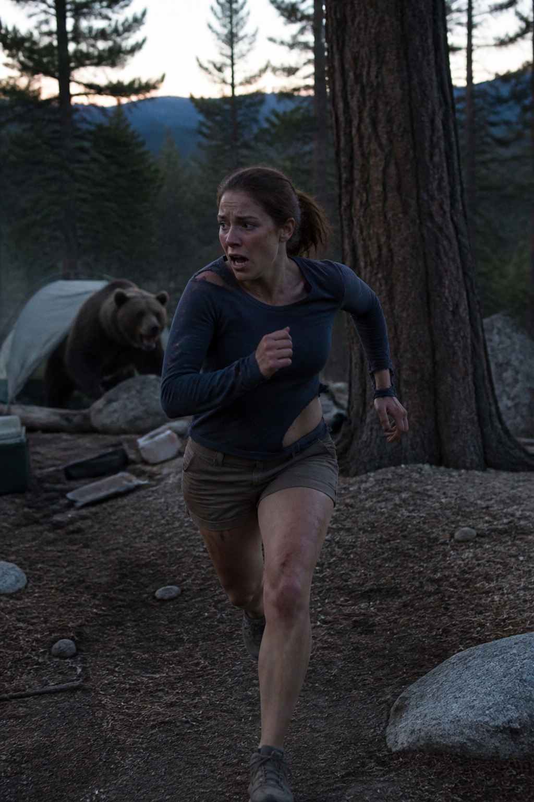</a>

<details>
<summary><b>09. Bear Attack Campsite Action Scene</b> · Survival Thriller / Photorealistic Edit</summary>

```
Generate a highly realistic action scene where this person is running away from a large, realistic brown bear attacking a campsite. The image should look like a real photograph someone could have taken, not an overly enhanced or cinematic movie-poster image. She is centered in the image but looking away from the camera, wearing outdoorsy camping attire, with dirt on her face and tears in her clothing. She is clearly afraid but focused on escaping, running away from the bear as it destroys the campsite behind her. The campsite is in Yosemite National Park, with believable natural details. The time of day is dusk, with natural lighting and realistic colors. Everything should feel grounded, authentic, and unstyled, as if captured in a real moment. Avoid cinematic lighting, dramatic color grading, or stylized composition.
```

*Technique: This is an edit prompt (image+text to image). Use `input_fidelity: "high"` to preserve the subject's identity while changing the entire scene.*

</details>
</td>
<td></td>
</tr>
</table>


---

## Nature & Landscapes

Aerial views, atmospheric scenes, and travel photography

<table><tr>
<td width="50%" valign="top">
<a href="images/03-nature-landscapes/01-waterfall-mist-ethereal.jpg">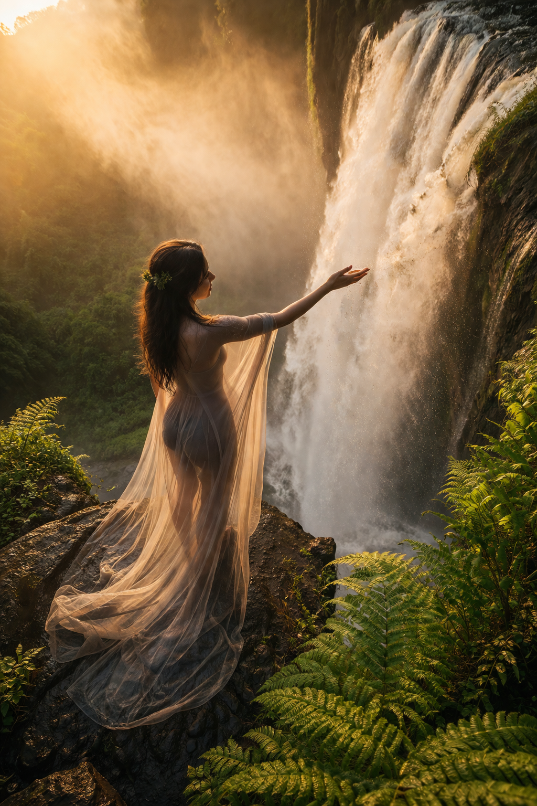</a>

<details>
<summary><b>1. Waterfall Mist Ethereal</b></summary>

```
Ethereal fantasy nature scene. A graceful young woman in a flowing sheer gossamer dress stands at the edge of a towering waterfall cliff. Dense tropical mist swirls around her legs and the translucent fabric. She extends one arm toward the cascade, water droplets catching golden light. Aerial perspective slightly from above showing the dramatic cliff drop. Lush green ferns frame the composition. Golden hour light filtering through the mist. Ultra-realistic 4K cinematic quality.
```

</details>
</td>
<td width="50%" valign="top">
<a href="images/03-nature-landscapes/02-maldives-aerial-float.jpg">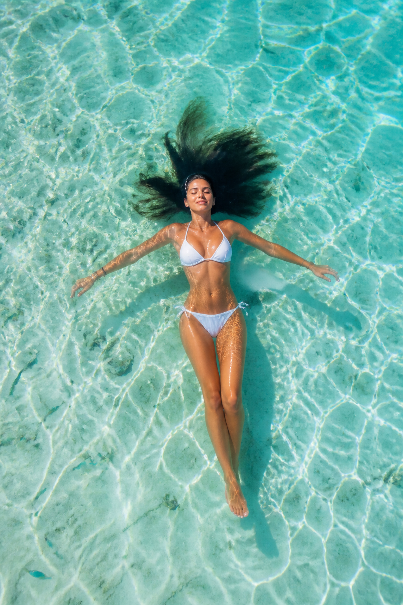</a>

<details>
<summary><b>2. Maldives Aerial Float</b></summary>

```
Overhead drone shot of a beautiful woman in a minimal white bikini floating on her back in crystal-clear turquoise shallow water over white sand in the Maldives. Her long dark hair fans out in the water like a halo. The water is so clear her full body is visible through the translucent surface. Tiny fish swim nearby. Travel photography editorial style. Ultra-realistic 4K aerial quality.
```

</details>
</td>
</tr>
<tr>
<td width="50%" valign="top">
<a href="images/03-nature-landscapes/03-iceland-black-sand-beach.jpg">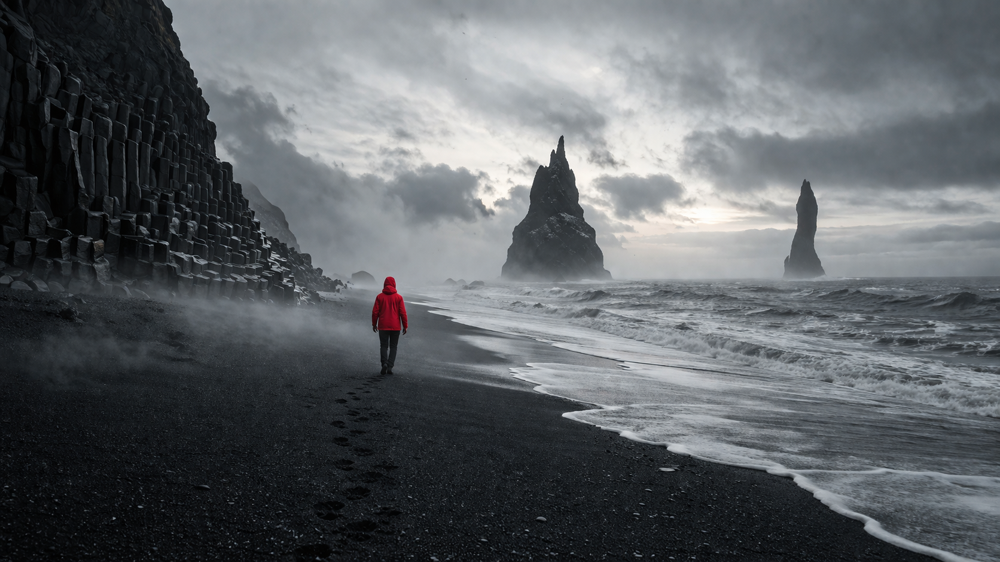</a>

<details>
<summary><b>3. Iceland Black Sand Beach</b></summary>

```
Dramatic wide landscape of Iceland's Reynisfjara black sand beach at dawn. Massive basalt sea stacks rise from the churning North Atlantic. Low fog drifts across the black sand. A single figure in a red rain jacket walks along the shoreline for scale. Moody desaturated color grade — almost monochrome with just the red jacket as accent. 24mm wide lens, f/11 for deep focus. Ultra-detailed 4K.
```

</details>
</td>
<td width="50%" valign="top">
<a href="images/03-nature-landscapes/04-redwood-cathedral-light.jpg">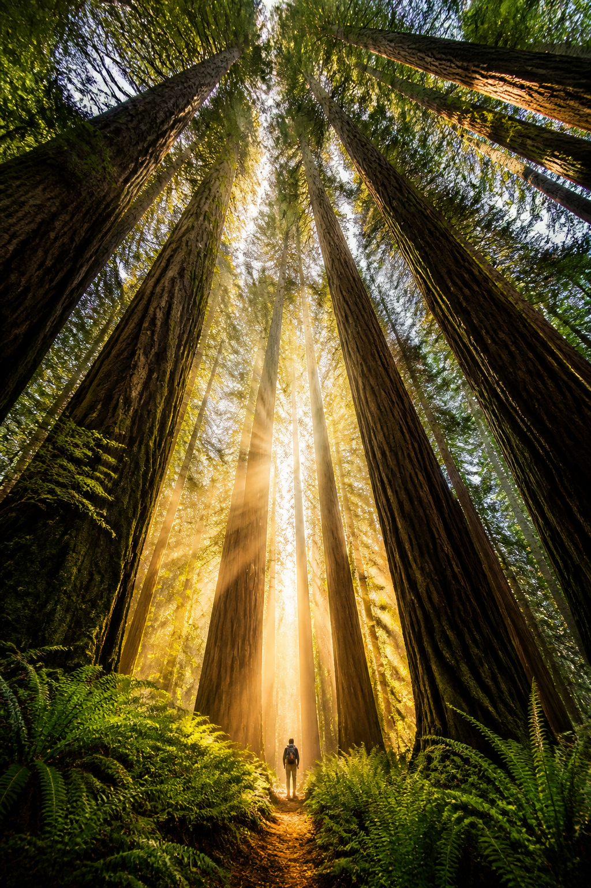</a>

<details>
<summary><b>4. Redwood Cathedral Light</b></summary>

```
Vertical composition looking up through towering California redwood trees. Shafts of golden morning sunlight cut through the fog between the trunks like cathedral light rays. Ferns carpet the forest floor. A tiny hiker in the distance gives scale. Ultra-wide 14mm lens distorting the trunks into a radial pattern toward the sky. Warm green and gold palette. Ultra-realistic 4K nature photography.
```

</details>
</td>
</tr>
<tr>
<td width="50%" valign="top">
<a href="images/03-nature-landscapes/05-patagonia-mountain-reflection.jpg">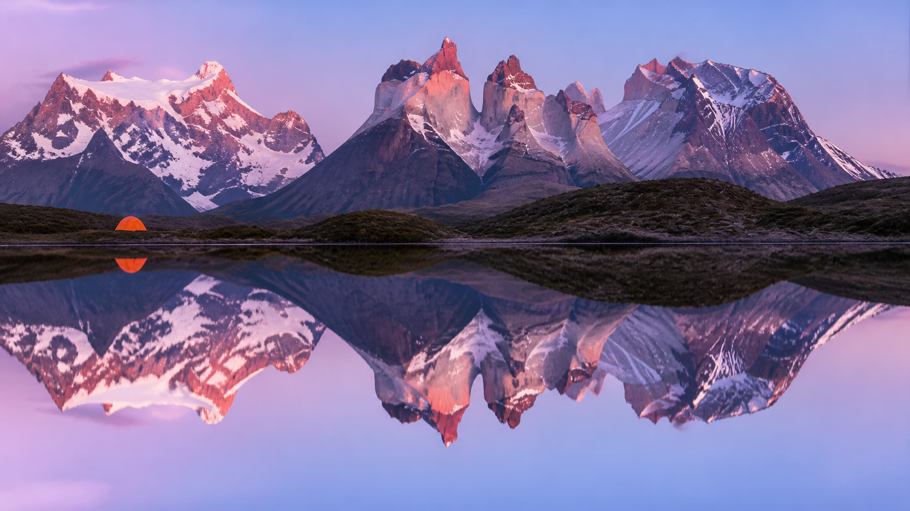</a>

<details>
<summary><b>5. Patagonia Mountain Reflection</b></summary>

```
Perfect mirror reflection of the jagged Torres del Paine peaks in a glass-still Patagonian alpine lake at blue hour. Pink and purple alpenglow on the snow-capped summits. A single orange tent on the near shore as human scale. Complete symmetry — upper and lower half of frame are near-mirror images. 35mm lens, f/11. Ultra-realistic 4K landscape.
```

</details>
</td>
<td width="50%" valign="top">
<a href="images/03-nature-landscapes/06-sahara-dune-storm.jpg">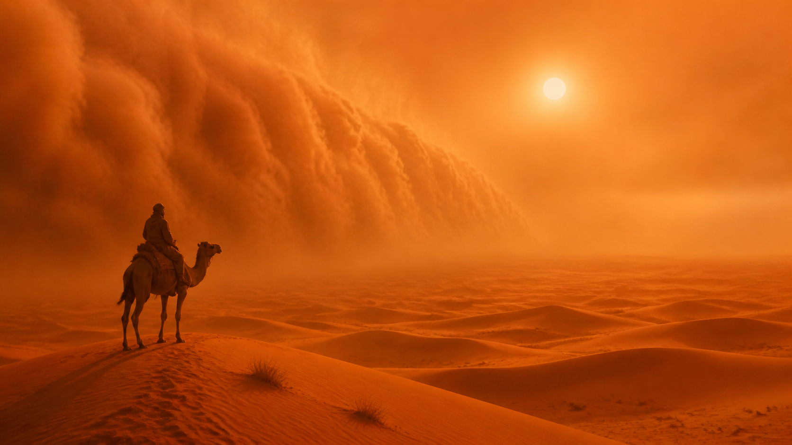</a>

<details>
<summary><b>6. Sahara Dune Storm</b></summary>

```
Vast Sahara desert at the start of a sandstorm. Rolling orange dunes extend to the horizon, with a towering wall of sand approaching from the left. A lone nomadic figure on camelback is silhouetted against the dust cloud. Sun struggles through the haze as a dim orange disc. Cinematic wide-angle, heavy atmospheric haze. Monochromatic warm orange palette. Ultra-detailed 4K.
```

</details>
</td>
</tr>
<tr>
<td width="50%" valign="top">
<a href="images/03-nature-landscapes/07-northern-lights-cabin.jpg">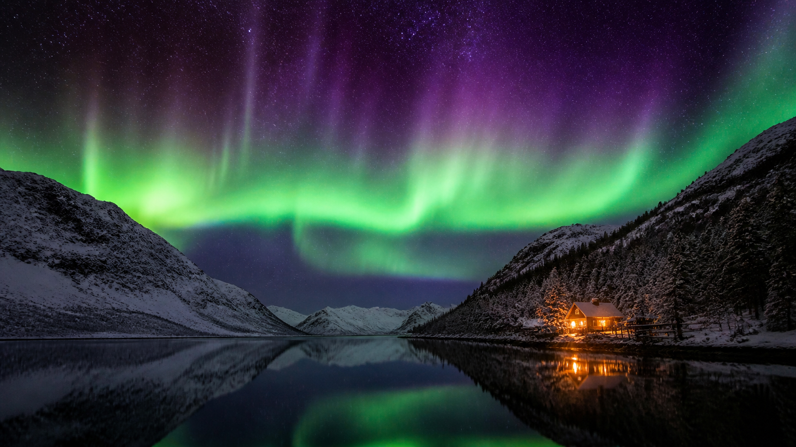</a>

<details>
<summary><b>7. Northern Lights Cabin</b></summary>

```
Wide landscape of a tiny warm-lit wooden cabin in a Norwegian fjord valley at 1am. A spectacular green and purple aurora borealis dances overhead, reflecting in the still black fjord water. Snow-dusted pine trees and mountains frame the scene. The cabin glow is the only warm color in an otherwise cold composition. 20-second long exposure feel. Ultra-realistic 4K astrophotography.
```

</details>
</td>
<td width="50%" valign="top">
<a href="images/03-nature-landscapes/08-african-savanna-sunset.jpg">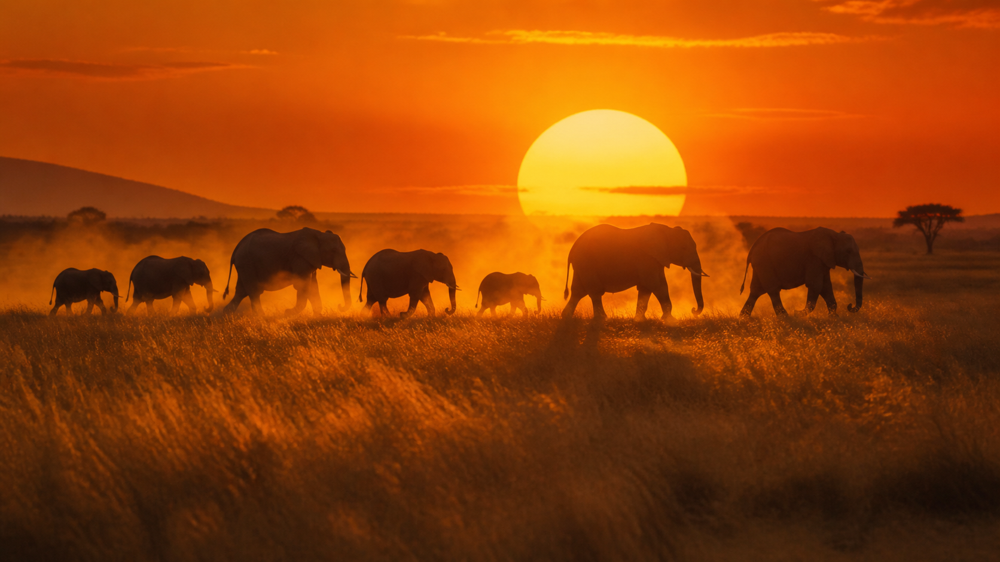</a>

<details>
<summary><b>8. African Savanna Sunset</b></summary>

```
Cinematic wide shot of a family of elephants crossing a golden savanna at sunset in Kenya. The sun is a huge orange disc on the horizon, silhouetting the herd. Long grass ripples in the warm wind. Dust kicked up by the herd diffuses the backlight into warm beams. 200mm telephoto compression. National Geographic editorial style. Ultra-realistic 4K wildlife photography.
```

</details>
</td>
</tr>
<tr>
<td width="50%" valign="top">
<a href="images/03-nature-landscapes/09-cherry-blossom-kyoto.jpg">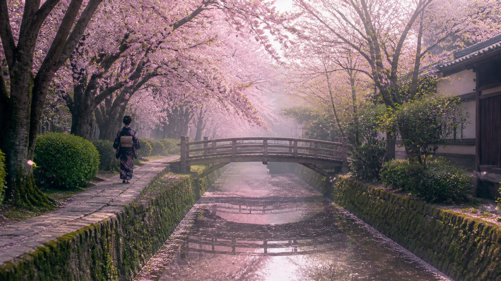</a>

<details>
<summary><b>9. Cherry Blossom Kyoto</b></summary>

```
Serene wide landscape of the Philosopher's Path in Kyoto at peak cherry blossom season. Pink petals float on the narrow canal, with more drifting down from the trees above. Traditional wooden bridges arch over the water. Early morning mist softens the light into diffused pink. A solo figure in a dark kimono walks along the stone path for scale. 50mm lens, f/4, gentle pastel color grade. Ultra-realistic 4K.
```

</details>
</td>
<td width="50%" valign="top">
<a href="images/03-nature-landscapes/10-scottish-highlands-storm.jpg">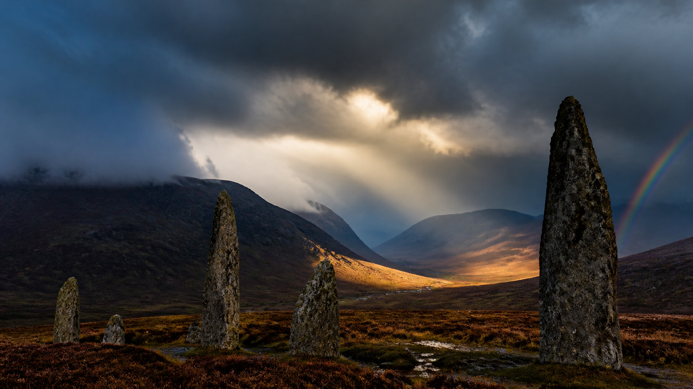</a>

<details>
<summary><b>10. Scottish Highlands Storm</b></summary>

```
Dramatic landscape of the Scottish Highlands during a clearing thunderstorm. Dark churning clouds above a lone glen, with a single shaft of golden sunlight breaking through and lighting one patch of heather-covered hillside. Rainbow arc barely visible at the edge. Ancient standing stones in the foreground. Moody cinematic color grade — steel blue shadows, warm sunlit highlight. 24mm wide, f/11. Ultra-realistic 4K landscape photography.
```

</details>
</td>
</tr>
<tr>
<td width="50%" valign="top">
<a href="images/03-nature-landscapes/11-sketch-to-photoreal-landscape.jpg">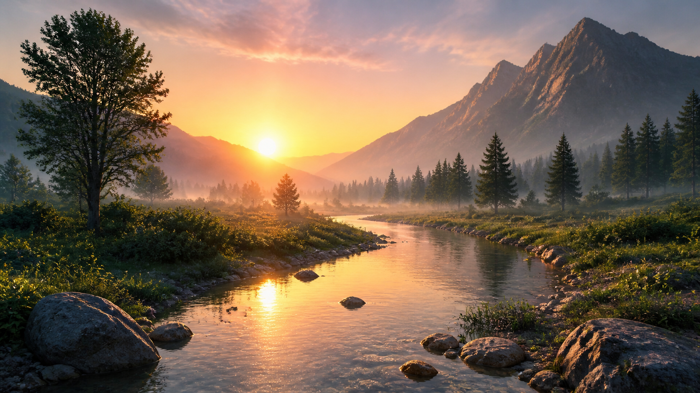</a>

<details>
<summary><b>11. Sketch-to-Photoreal Landscape</b> · Sketch-to-Photo Conversion (Edit Mode)</summary>

```
Turn this drawing into a photorealistic landscape image.
Preserve the exact layout, horizon line, river path, mountain placement,
tree placement, and overall perspective.
Use realistic natural materials and sunrise lighting.
Soft morning mist, believable rock texture, natural vegetation,
gentle water reflections.
Do not add people, buildings, animals, or text.
```

*Technique: Tell the model whether the sketch layout is a suggestion or a contract. "Preserve the exact layout" locks geometry before realism is added. This is an edit prompt -- provide the sketch as input.*

</details>
</td>
<td width="50%" valign="top">
<a href="images/03-nature-landscapes/12-interior-object-swap-naturearchitectural.jpg">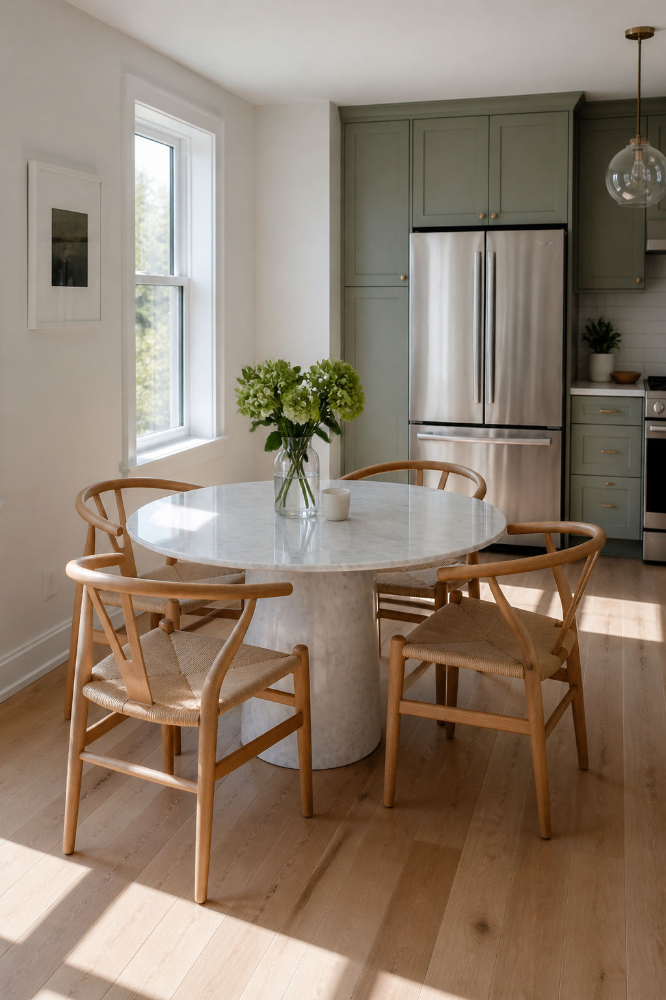</a>

<details>
<summary><b>12. Interior Object Swap (Nature/Architectural)</b> · Object Replacement / Architectural</summary>

```
In this room photo, replace ONLY the white dining chairs with natural oak wooden chairs.
Preserve the camera angle, table shape, window light, floor shadows,
reflections on the table, cabinet geometry, refrigerator reflections,
and all surrounding objects.
Keep the room otherwise unchanged.
Photorealistic contact shadows and believable wood grain.
```

*Technique: This is an edit prompt. The preserve list carries the edit: camera angle, table, window light, floor shadows, reflections, surrounding objects. Inventory what must stay and the edit stays in scope.*

</details>
</td>
</tr>
<tr>
<td width="50%" valign="top">
<a href="images/03-nature-landscapes/13-weather-edit----winter-evening.jpg">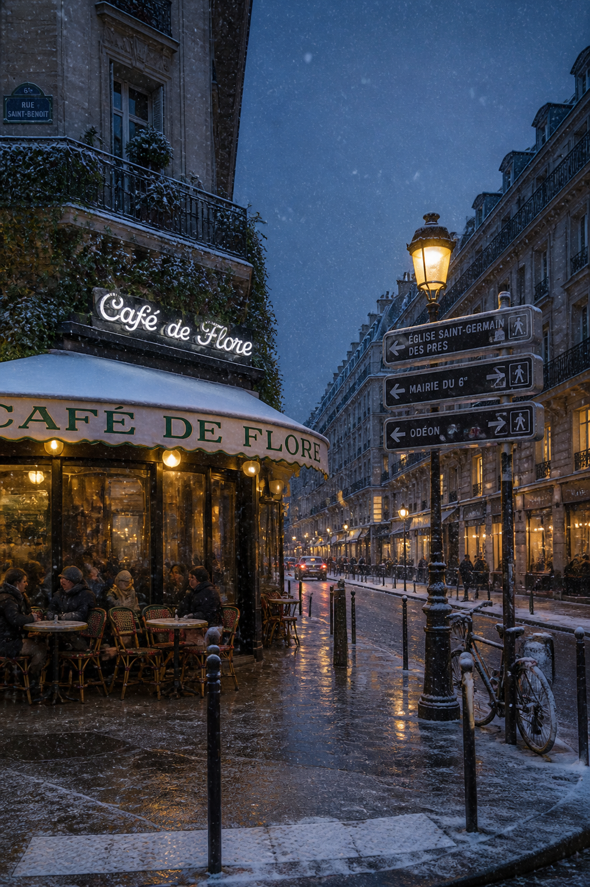</a>

<details>
<summary><b>13. Weather Edit -- Winter Evening</b> · Weather/Lighting Edit (Edit Mode)</summary>

```
Change only the weather and lighting.
Make the scene look like a winter evening with light snowfall.
Preserve identity, geometry, camera angle, object placement, and composition.
Keep all signs, buildings, and people in the same positions.
```

*Technique: The same edit pattern works for any environmental change: state what changes (weather/lighting), then preserve identity, geometry, camera angle, and object placement.*

</details>
</td>
<td></td>
</tr>
</table>


---

## Fantasy & Illustration

Anime, cyberpunk, Ghibli, concept art, and illustration

<table><tr>
<td width="50%" valign="top">
<a href="images/04-fantasy-illustration/01-ufotable-anime-warrior.jpg">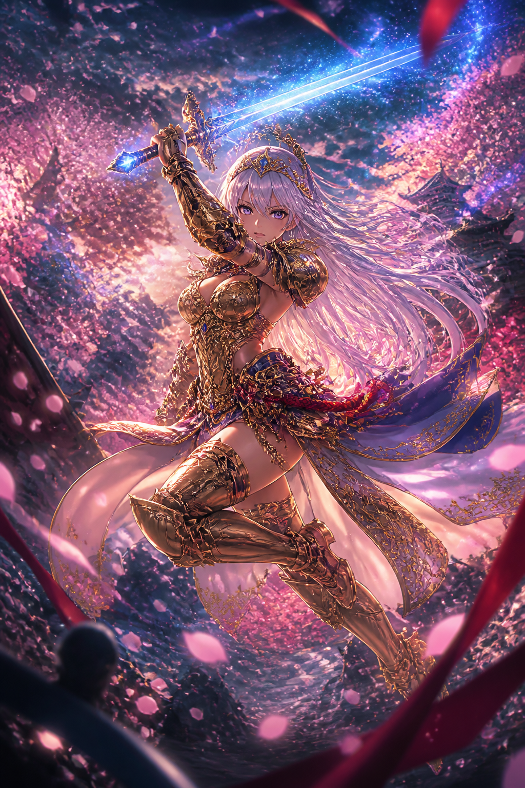</a>

<details>
<summary><b>01. Ufotable Anime Warrior</b> · Anime / Epic Fantasy</summary>

```
Epic anime-inspired fantasy warrior princess with flowing silver-white hair that reaches her waist, wearing ornate golden battle armor that hugs her figure with intricate engravings. She holds a glowing magical sword aloft, emitting bright blue energy. Cherry blossom petals and magical sparkles swirl in a violent storm around her. Her expression is fierce and determined. Dynamic action pose mid-battle leap. Ultra-detailed anime with CGI-quality lighting -- Ufotable production quality. Rich colors, dramatic volumetric lighting. 4K quality.
```

*Technique: Naming the studio (Ufotable) is doing more work than any adjective.*

</details>
</td>
<td width="50%" valign="top">
<a href="images/04-fantasy-illustration/02-dark-elf-sorceress.jpg">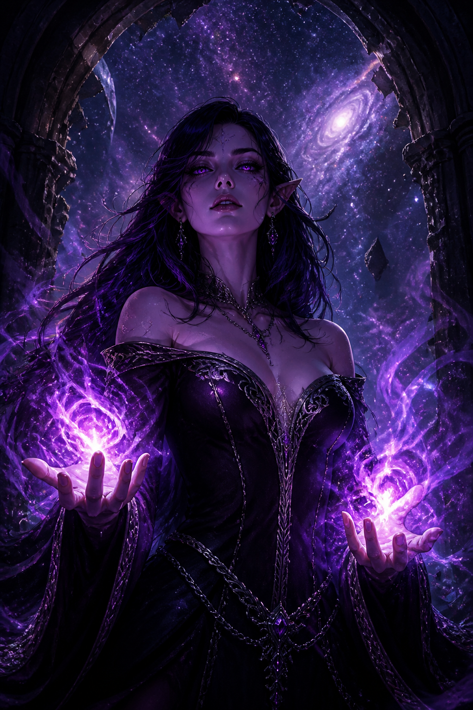</a>

<details>
<summary><b>02. Dark Elf Sorceress</b> · Dark Fantasy / Semi-Realistic</summary>

```
Dark fantasy dark elf sorceress with long flowing midnight-purple hair, pointed ears, and luminous violet eyes. She wears an elegant off-shoulder dark robe with intricate silver embroidery that reveals her collarbones and shoulders. Purple arcane energy spirals from her outstretched hands, illuminating her face from below. A vast star field and nebula visible in the background through a shattered stone archway. Semi-realistic fantasy illustration style with cinematic lighting. Ultra-detailed 4K.
```

</details>
</td>
</tr>
<tr>
<td width="50%" valign="top">
<a href="images/04-fantasy-illustration/03-ghibli-forest-spirit.jpg">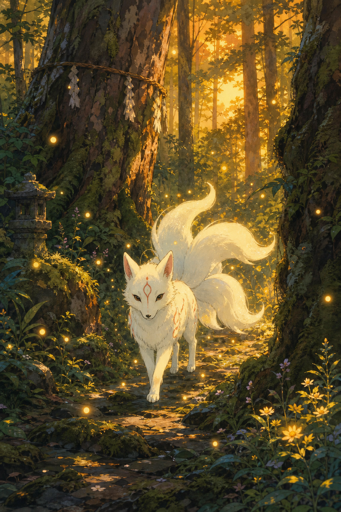</a>

<details>
<summary><b>03. Ghibli Forest Spirit</b> · Studio Ghibli / Painterly</summary>

```
Studio Ghibli style painterly scene. A small forest spirit that looks like a glowing white fox with three tails walks through a mossy enchanted forest at dusk. Fireflies dance around it. Soft painterly brushstrokes, warm honey-gold light filtering through massive ancient trees. Hayao Miyazaki watercolor aesthetic. Ultra-detailed animation cel quality.
```

</details>
</td>
<td width="50%" valign="top">
<a href="images/04-fantasy-illustration/04-arcane-league-style.jpg">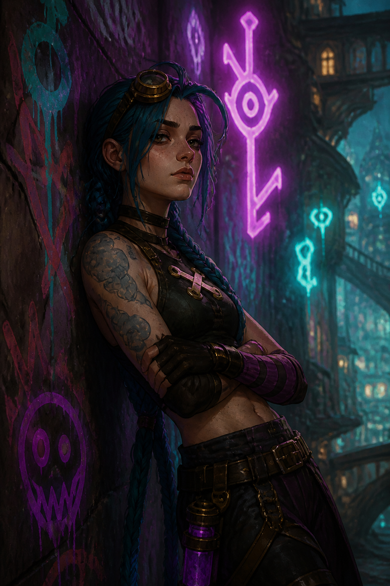</a>

<details>
<summary><b>04. Arcane League Style</b> · Arcane / Steampunk Illustration</summary>

```
Arcane Netflix animated series style illustration. A young woman with blue-tipped braided hair and steampunk goggles leans against a graffitied alley wall in the undercity of Piltover. Neon magical rune-signs glow behind her. Textured painterly brushstrokes visible, 2D illustration with 3D depth, saturated purple and teal color story. Fortiche animation studio aesthetic. Ultra-detailed 4K.
```

</details>
</td>
</tr>
<tr>
<td width="50%" valign="top">
<a href="images/04-fantasy-illustration/05-magic-the-gathering-dragon.jpg">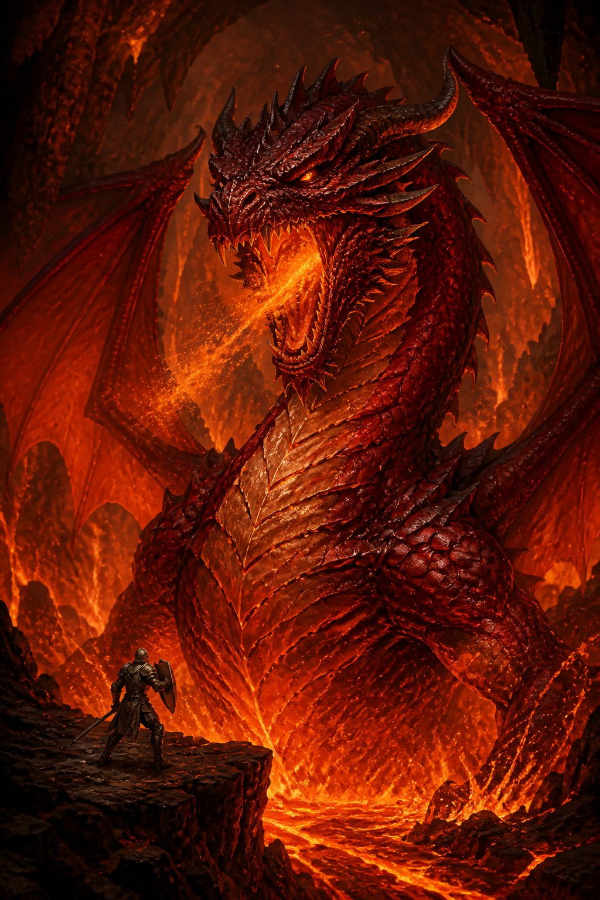</a>

<details>
<summary><b>05. Magic the Gathering Dragon</b> · Fantasy Card Art / Oil Painting</summary>

```
Fantasy illustration in the style of a Magic The Gathering card. A colossal red dragon emerges from molten lava in an underground cavern, wings half-spread, mouth roaring with fire breath forming. A tiny knight in silver armor stands at the cavern's edge for scale, raising a shield. Dramatic low-angle hero composition. Rich oil-painting texture. Ultra-detailed 4K fantasy art.
```

</details>
</td>
<td width="50%" valign="top">
<a href="images/04-fantasy-illustration/06-cyberpunk-samurai.jpg">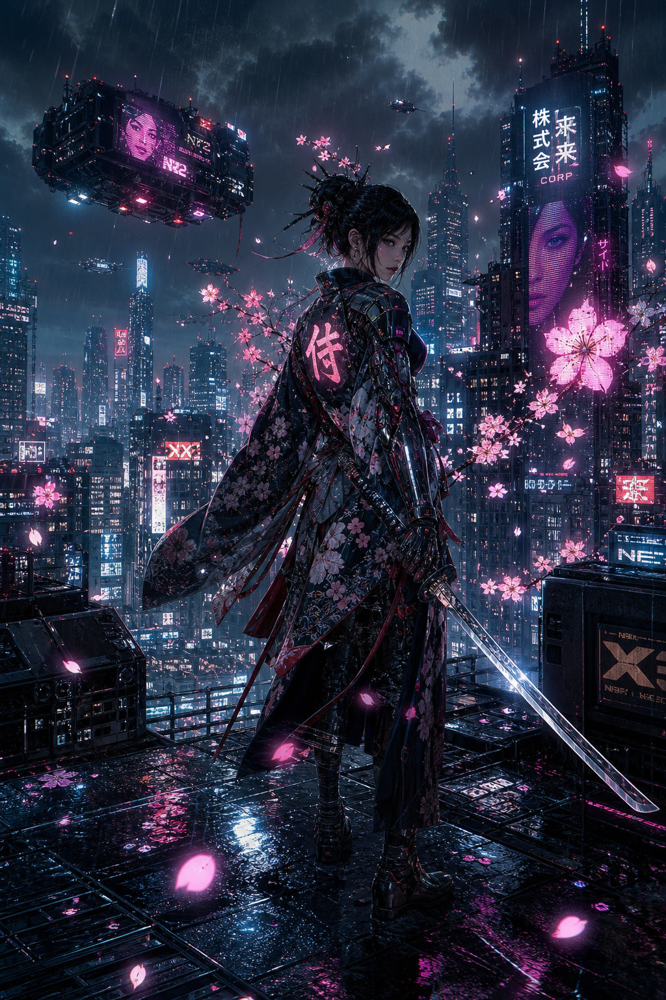</a>

<details>
<summary><b>06. Cyberpunk Samurai</b> · Cyberpunk / Neo-Tokyo</summary>

```
Cyberpunk fantasy fusion. A female samurai with a chrome katana stands on the rain-slicked rooftop of a neo-Tokyo megacorp tower at night. She wears a fusion of traditional kimono and carbon-fiber combat armor. Holographic cherry blossoms drift around her. Neon reflections on the wet rooftop, flying ad-drones in the background. Illustrated in the style of Katsuhiro Otomo meets modern 3D concept art. Ultra-detailed 4K.
```

</details>
</td>
</tr>
<tr>
<td width="50%" valign="top">
<a href="images/04-fantasy-illustration/07-underwater-mermaid.jpg">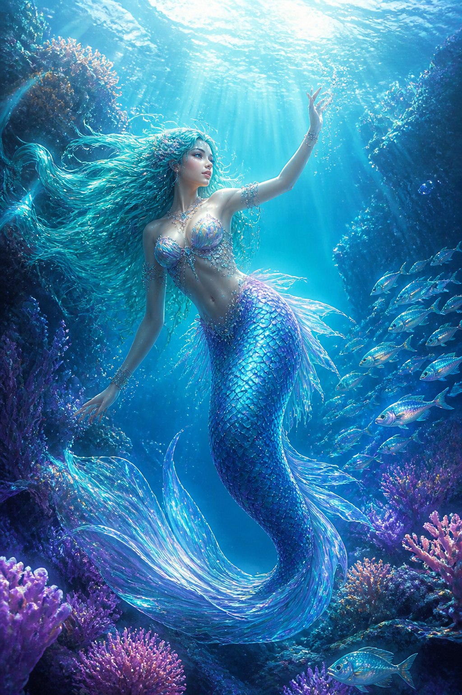</a>

<details>
<summary><b>07. Underwater Mermaid</b> · Ethereal Underwater Fantasy</summary>

```
Ethereal underwater fantasy. A graceful mermaid with iridescent teal and violet scales swims through a coral reef illuminated by shafts of sunlight piercing the water surface above. Her long turquoise hair flows weightlessly. Bubbles trail from her fingertips. School of small silver fish swim past. Dreamlike painterly quality. Ultra-detailed 4K fantasy art.
```

</details>
</td>
<td width="50%" valign="top">
<a href="images/04-fantasy-illustration/08-steampunk-airship-captain.jpg">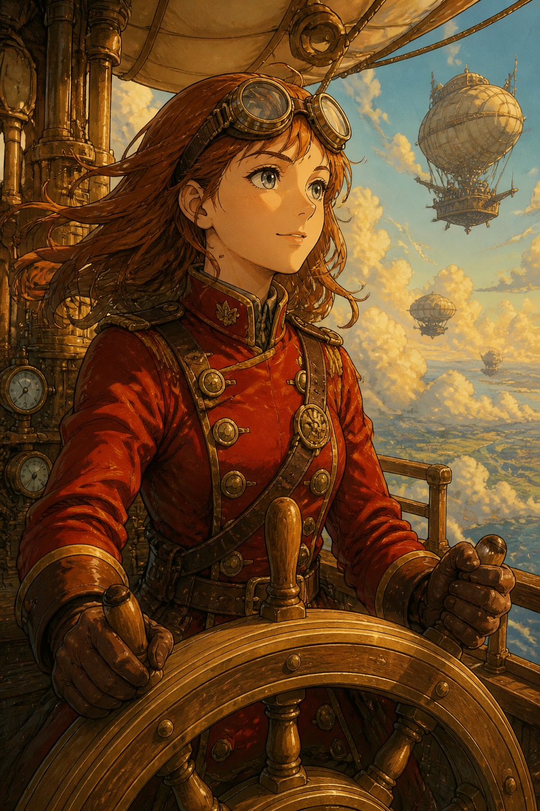</a>

<details>
<summary><b>08. Steampunk Airship Captain</b> · Steampunk / Illustrated Portrait</summary>

```
Illustrated steampunk fantasy portrait. A young female airship captain in a brass-buttoned red military coat, goggles pushed up on her forehead, stands at the wheel of a wooden airship. Visible brass gears and copper pipes. Behind her, clouds and other distant airships. Warm golden hour lighting. Illustration style inspired by Nausicaa and Howl's Moving Castle. Ultra-detailed 4K.
```

</details>
</td>
</tr>
<tr>
<td width="50%" valign="top">
<a href="images/04-fantasy-illustration/09-gothic-cathedral-interior.jpg">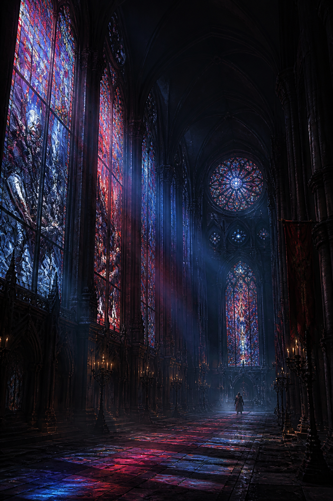</a>

<details>
<summary><b>09. Gothic Cathedral Interior</b> · Dark Fantasy / Environment Concept</summary>

```
Dark fantasy interior of a vast gothic cathedral at night. Colored light streams through enormous stained glass windows depicting battle scenes, casting ruby and sapphire patterns on the stone floor. Rows of stone pillars recede into darkness. A single cloaked figure stands tiny at the far end for scale. Inspired by Dark Souls environment design. Atmospheric fog, god rays through the windows. Ultra-detailed 4K concept art.
```

</details>
</td>
<td width="50%" valign="top">
<a href="images/04-fantasy-illustration/10-bioluminescent-forest.jpg">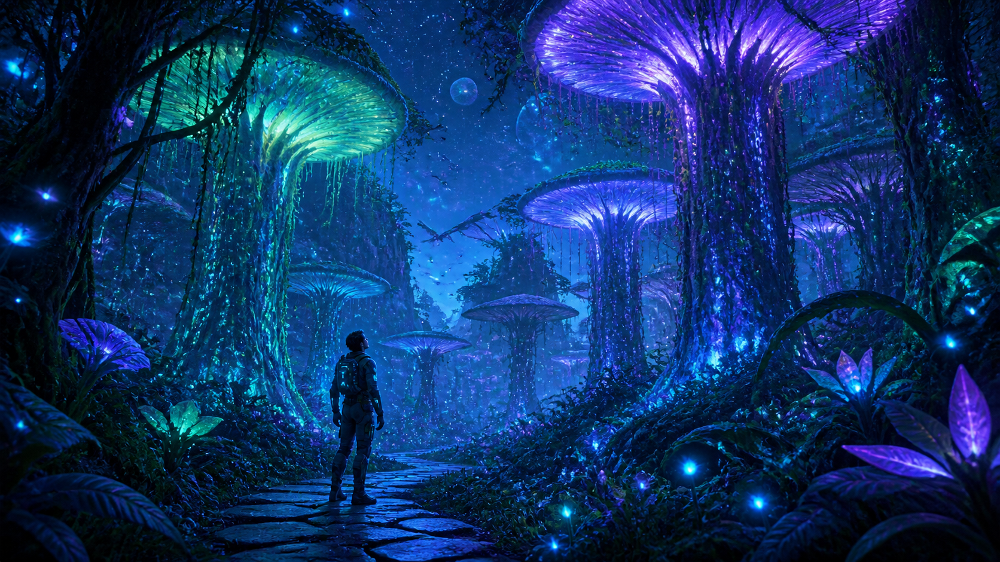</a>

<details>
<summary><b>10. Bioluminescent Forest</b> · Sci-Fi Fantasy / Alien Landscape</summary>

```
Fantasy landscape of an alien bioluminescent forest at night. Giant mushroom-like trees glow in neon blue, green, and purple. Floating luminous spores drift through the air like fireflies. A narrow stone path winds through the forest. A lone explorer in a glowing suit stands looking up at the canopy. Avatar Pandora aesthetic with Studio Ghibli softness. Ultra-detailed 4K concept art.
```

</details>
</td>
</tr>
<tr>
<td width="50%" valign="top">
<a href="images/04-fantasy-illustration/11-mecha-girl-sea-city-key-visual.jpg">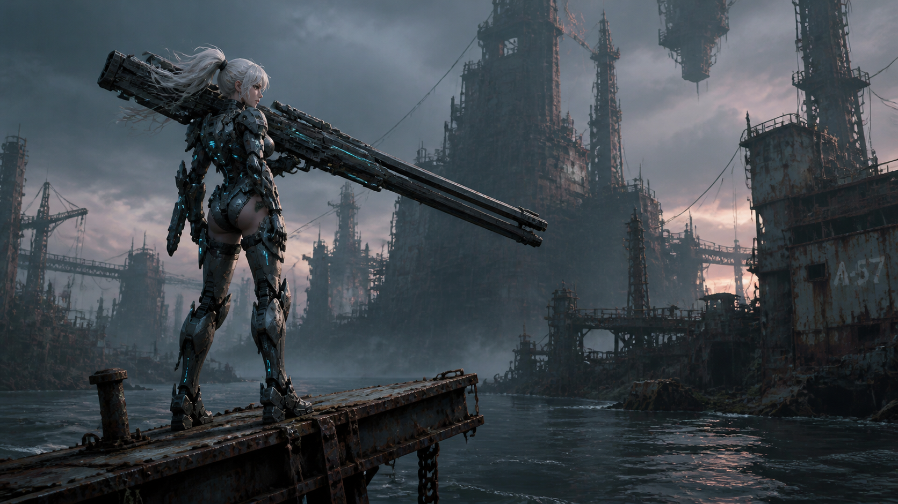</a>

<details>
<summary><b>11. Mecha Girl Sea-City Key Visual</b> · Mecha / Concept Art / Cinematic</summary>

```
Create a moody key visual of a mecha girl standing on the rusted edge of a tilted steel platform over dark water. She has pale skin, ash-white hair in a high ponytail, matte gunmetal exoskeleton armor, glowing cyan coolant lines, and a massive rail cannon on her shoulder. Behind her, a vast derelict sea-city rises from the ocean in colossal silhouettes, with fog, dead cables, rusted towers, and bruised dusk light. Use cinematic concept-art lighting and a medium-wide shot.
```

</details>
</td>
<td width="50%" valign="top">
<a href="images/04-fantasy-illustration/12-double-exposure-silhouette.jpg">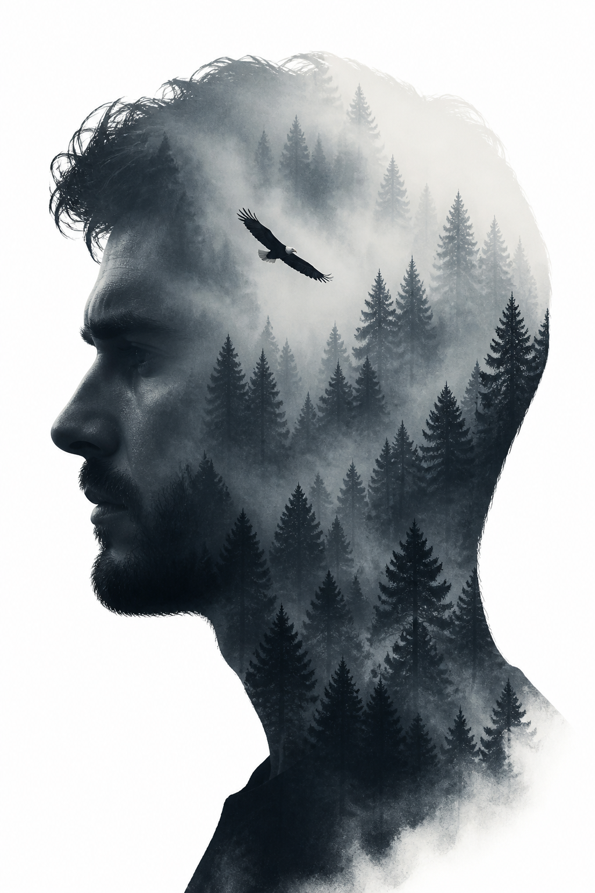</a>

<details>
<summary><b>12. Double Exposure Silhouette</b> · Surreal / Fine Art</summary>

```
A double exposure silhouette of a man's head. Inside the silhouette is a dense, foggy pine forest with a soaring eagle. White background, artistic fine art style.
```

</details>
</td>
</tr>
<tr>
<td width="50%" valign="top">
<a href="images/04-fantasy-illustration/13-knitted-world-macro.jpg">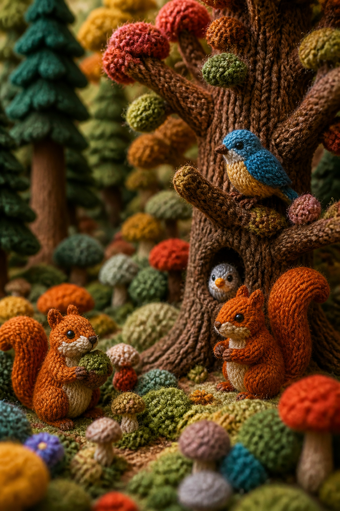</a>

<details>
<summary><b>13. Knitted World Macro</b> · Tactile / Macro Photography / Surreal</summary>

```
A macro shot of a tiny forest made entirely out of colorful knitted wool. Knitted squirrels and birds. Soft, tactile texture, macro photography style.
```

</details>
</td>
<td width="50%" valign="top">
<a href="images/04-fantasy-illustration/14-retro-8-bit-pixel-landscape.jpg">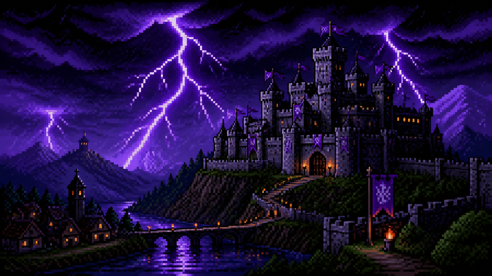</a>

<details>
<summary><b>14. Retro 8-Bit Pixel Landscape</b> · Pixel Art / Retro Game</summary>

```
A sprawling 8-bit pixel art landscape of a medieval castle during a thunderstorm. Purple lightning bolts. Retro video game aesthetic.
```

</details>
</td>
</tr>
<tr>
<td width="50%" valign="top">
<a href="images/04-fantasy-illustration/15-giant-whale-floating-above-desert.jpg">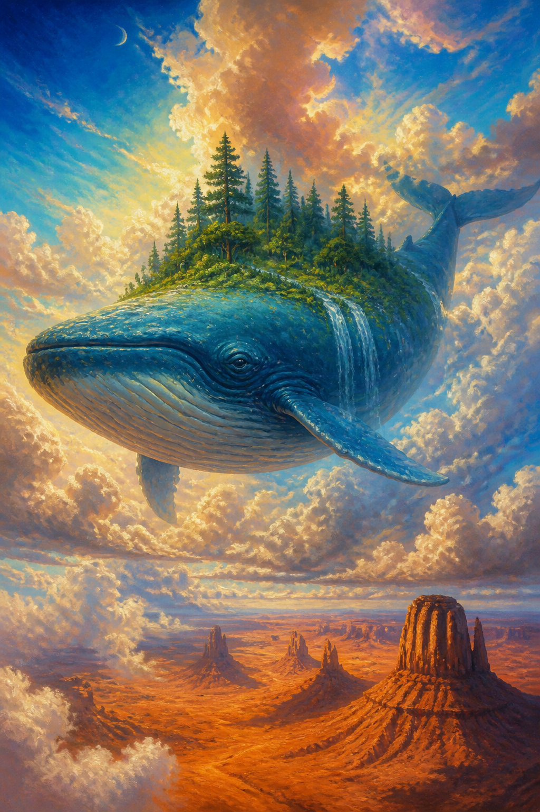</a>

<details>
<summary><b>15. Giant Whale Floating Above Desert</b> · Surrealism / Oil Painting</summary>

```
A giant whale floating through a sea of clouds above a desert. The whale's back carries a small, lush forest. Surrealist oil painting style, vibrant colors, dreamlike lighting.
```

</details>
</td>
<td width="50%" valign="top">
<a href="images/04-fantasy-illustration/16-style-transfer---pixel-art-to-new-scene.jpg">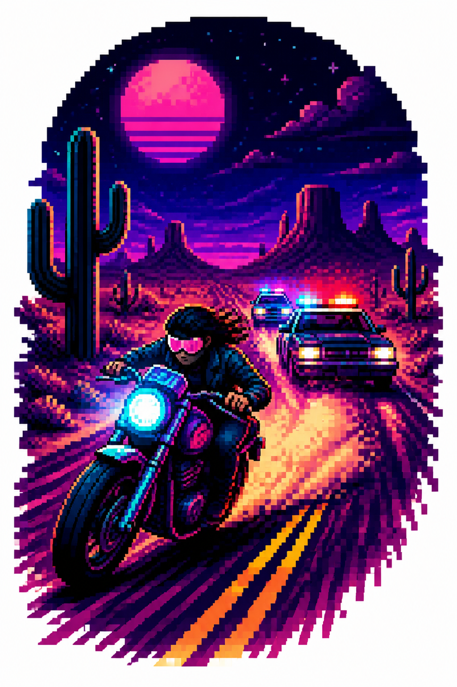</a>

<details>
<summary><b>16. Style Transfer - Pixel Art to New Scene</b> · Pixel Art / Style Transfer (Edit Mode)</summary>

```
Use the same visual language as the input image:
chunky pixel forms, limited arcade palette, bright glow accents,
clean silhouette edges, playful 1980s poster energy.
Generate a new scene of a motorcycle chase through a neon desert at night.
White background. No watermark.
```

*Technique: Describe the visual language concretely (palette, edge treatment, silhouette language) rather than just saying "same style."*

</details>
</td>
</tr>
</table>


---

## Product & Commercial

Product shots, advertising, brand imagery, packaging

<table><tr>
<td width="50%" valign="top">
<a href="images/05-product-commercial/01-luxury-perfume-bottle.jpg">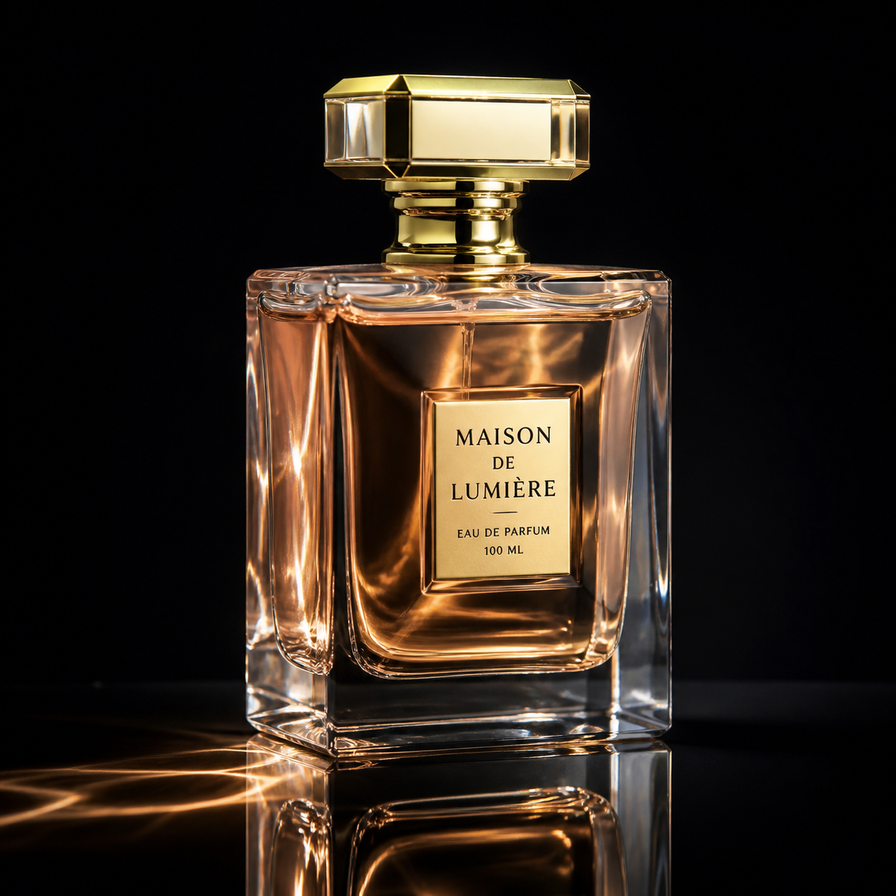</a>

<details>
<summary><b>01. Luxury Perfume Bottle</b> · Luxury Product Photography</summary>

```
High-end product photography of a luxury perfume bottle on a polished black glass surface. The bottle is crystal-clear with gold cap and rose-gold liquid inside. Single hard spotlight from above-left creates a sharp reflection on the surface and a glowing caustic pattern through the liquid. Soft fill from the right. Ultra-clean background -- deep black gradient. Shot on 100mm macro lens, f/8, focus stacked. Editorial luxury ad quality. Ultra-realistic 4K.
```

</details>
</td>
<td width="50%" valign="top">
<a href="images/05-product-commercial/02-sneaker-floating-display.jpg"></a>

<details>
<summary><b>02. Sneaker Floating Display</b> · Athletic Product / Floating</summary>

```
Product photograph of a limited-edition basketball sneaker floating in mid-air against a gradient background transitioning from deep navy to bright orange. Dramatic side-lighting reveals texture of the mesh upper. Small LED accent light from below creates a subtle glow on the outsole. Particle effects -- tiny dust motes floating around the shoe. Clean, modern, Nike-advertising energy. 85mm lens, f/5.6. Ultra-realistic 4K.
```

</details>
</td>
</tr>
<tr>
<td width="50%" valign="top">
<a href="images/05-product-commercial/03-coffee-splash.jpg"></a>

<details>
<summary><b>03. Coffee Splash</b> · Food & Beverage Commercial</summary>

```
Commercial product shot of a ceramic coffee cup on a white marble counter. A splash of coffee is frozen mid-air -- drops and rivulets arcing above the cup rim. Two coffee beans rest on the counter surface. Morning window light from the left creates soft shadows. Minimal composition, lots of negative space. Shot on 100mm macro, f/4. Clean, bright, lifestyle editorial. Ultra-realistic 4K.
```

</details>
</td>
<td width="50%" valign="top">
<a href="images/05-product-commercial/04-skincare-flat-lay.jpg"></a>

<details>
<summary><b>04. Skincare Flat Lay</b> · Beauty Product / Flat Lay</summary>

```
Overhead flat-lay product photograph of a luxury skincare collection arranged on a white marble surface. Products include a frosted glass serum bottle, a cream jar with gold lid, and a stone facial roller. Scattered eucalyptus leaves and a single white orchid petal around the products. Soft diffused daylight. Minimal, clean, editorial aesthetic. Shot from directly above, 50mm lens, f/8. Ultra-realistic 4K.
```

</details>
</td>
</tr>
<tr>
<td width="50%" valign="top">
<a href="images/05-product-commercial/05-watch-hero-shot.jpg"></a>

<details>
<summary><b>05. Watch Hero Shot</b> · Macro Luxury / Dark Moody</summary>

```
Macro hero shot of a luxury Swiss chronograph watch on a dark gray slate surface. The watch face catches a single hard beam of light from above, illuminating the dial details and sapphire crystal reflection. Watch strap falls in a natural curve. Tiny dust particles visible in the light beam. Shot on 100mm macro, f/11, focus stacked. Dark, moody, high-end advertising. Ultra-detailed 4K.
```

</details>
</td>
<td width="50%" valign="top">
<a href="images/05-product-commercial/06-food-photography----dessert.jpg"></a>

<details>
<summary><b>06. Food Photography -- Dessert</b> · Editorial Food Photography</summary>

```
Editorial food photography of a layered chocolate mousse cake on a matte black ceramic plate. A fork has just cut into one slice, revealing the layers. A drizzle of raspberry sauce on the plate. Dark moody lighting -- single overhead softbox, warm tungsten key light. Shallow depth of field -- plate sharp, dark wood table background blurred. Bon Appetit magazine quality. Ultra-realistic 4K.
```

</details>
</td>
</tr>
<tr>
<td width="50%" valign="top">
<a href="images/05-product-commercial/07-wireless-earbuds-in-stone-museum-archive.jpg"></a>

<details>
<summary><b>07. Wireless Earbuds in Stone (Museum Archive)</b> · Conceptual Product / Deadpan</summary>

```
Create a museum archive photograph of two perfectly recognizable wireless earbuds carved from worn gray stone and placed on neutral conservation foam under soft overhead museum light. Accession card next to the pieces reads ACC. 2126.04 - EARLY 21C PERSONAL ACOUSTIC IMPLEMENT. Flat even lighting, no dramatic shadow, neutral beige backdrop, shallow depth of field, the material reads as carved stone not plastic. No watermark, no brand logos.
```

*Technique: Museum archive framing, accession card, conservation foam, flat lighting. The deadpan holds because every element in the prompt reinforces it.*

</details>
</td>
<td width="50%" valign="top">
<a href="images/05-product-commercial/08-matte-white-electric-kettle.jpg"></a>

<details>
<summary><b>08. Matte White Electric Kettle</b> · Minimalist Product / Lifestyle</summary>

```
A premium matte white electric kettle on a light oak wooden stand. Simple grey background. Studio lighting with a crisp drop shadow. High-end lifestyle photography.
```

</details>
</td>
</tr>
<tr>
<td width="50%" valign="top">
<a href="images/05-product-commercial/09-perfume-bottle-underwater.jpg"></a>

<details>
<summary><b>09. Perfume Bottle Underwater</b> · Luxury Beauty / Dramatic</summary>

```
A clear glass perfume bottle filled with light pink liquid. Submerged in clear water with small air bubbles. Dramatic refraction of light. No text. Luxury advertising style.
```

</details>
</td>
<td width="50%" valign="top">
<a href="images/05-product-commercial/10-coffee-packaging-mockup.jpg"></a>

<details>
<summary><b>10. Coffee Packaging Mockup</b> · Packaging Design / Mockup</summary>

```
A close-up of a brown kraft paper coffee bag standing upright. The label is perfectly legible and says 'MIDNIGHT ROAST' in bold black vintage typography. Small coffee beans scattered around the base. Realistic paper texture.
```

</details>
</td>
</tr>
<tr>
<td width="50%" valign="top">
<a href="images/05-product-commercial/11-strawberry-soft-serve-product-photography.jpg"></a>

<details>
<summary><b>11. Strawberry Soft Serve Product Photography</b> · Food Product / Premium Commercial</summary>

```
Ultra-realistic product photography of a rich strawberry soft-serve ice cream in a crispy waffle cone, styled with a clean, modern premium aesthetic. The soft serve is vibrant natural pink, thick and creamy, sculpted into a smooth swirl with a softly curled peak. The cone has a rustic, crunchy texture with slightly uneven edges for an artisanal feel. The background is soft beige with natural sunlight casting subtle leaf shadows, creating a calm, organic atmosphere. Include softly blurred greenery in the foreground for depth. The composition is minimal, balanced, and uses negative space effectively, similar to high-end American food brand ads. Include modern English typography in a clean, elegant layout. Lighting: soft natural daylight, warm highlights, shallow depth of field, high-end commercial food photography style. Mood: fresh, premium, modern, and inviting.
```

</details>
</td>
<td width="50%" valign="top">
<a href="images/05-product-commercial/12-green-tea-film-kit-product-shot.jpg"></a>

<details>
<summary><b>12. Green Tea Film Kit Product Shot</b> · Skincare Product / E-commerce</summary>

```
CALMING GREEN TEA Film Kit displayed frontally, the open box shows soft sage-green film pouches and translucent ampoules with matte silver caps, product placed centrally with clear branding CALMING GREEN TEA -- 7 Days to Soothed Skin, pastel green background with botanical graphic accents, three minimal icons (leaf, wave, balance) floating around the product to emphasize benefits, photographic, hyper detailed, ultra realistic, lifelike, 8k, high detail, soft professional lighting.
```

</details>
</td>
</tr>
<tr>
<td width="50%" valign="top">
<a href="images/05-product-commercial/13-product-cutout-with-clean-background.jpg"></a>

<details>
<summary><b>13. Product Cutout with Clean Background</b> · Product Extraction / E-commerce Prep</summary>

```
Extract the product from the input image and place it on a plain white opaque background.
Output: centered product, crisp silhouette, no halos/fringing.
Preserve product geometry and label legibility exactly.
Add only light polishing and a subtle realistic contact shadow.
Do not restyle the product; only remove background and lightly polish.
```

*Technique: This is an edit prompt. Keep the output background opaque and use a downstream background-removal step if you need transparent assets.*

</details>
</td>
<td width="50%" valign="top">
<a href="images/05-product-commercial/14-billboard-mockup-with-product.jpg"></a>

<details>
<summary><b>14. Billboard Mockup with Product</b> · Advertising Mockup / In-Context</summary>

```
Create a realistic roadside billboard at sunset using the product from the input image.

Headline (EXACT TEXT):
"Fresh and clean"

Typography:
Bold sans serif, high contrast, centered vertically in the left half,
clean kerning, readable from a distance.

Layout:
Product on the right, headline on the left, lots of empty space.

Constraints:
Render the text verbatim.
No extra words.
No duplicate text.
No watermark.
No extra logos.
```

</details>
</td>
</tr>
<tr>
<td width="50%" valign="top">
<a href="images/05-product-commercial/15-brand-logo-generation.jpg"></a>

<details>
<summary><b>15. Brand Logo Generation</b> · Logo Design / Brand Identity</summary>

```
Create an original, non-infringing logo for a company called Field & Flour, a local bakery.
The logo should feel warm, simple, and timeless. Use clean, vector-like shapes, a strong silhouette, and balanced negative space.
Favor simplicity over detail so it reads clearly at small and large sizes. Flat design, minimal strokes, no gradients unless essential.
Plain background. Deliver a single centered logo with generous padding. No watermark.
```

*Technique: Use parameter `n=4` to generate 4 logo variations in a single API call.*

</details>
</td>
<td width="50%" valign="top">
<a href="images/05-product-commercial/16-fashion-campaign-ad.jpg"></a>

<details>
<summary><b>16. Fashion Campaign Ad</b> · Fashion Advertising / Campaign</summary>

```
Give me a cool in culture ad / fashion shot for a brand called Thread.
It's a hip young street brand. The ad shows a group of friends hanging out together with the tagline "Yours to Create."
Make it feel like a polished campaign image for a youth streetwear audience: stylish, contemporary, energetic, and tasteful.
Use clean composition, strong color direction, natural poses, and premium fashion photography cues.
Render the tagline exactly once, clearly and legibly, integrated into the ad layout.
No extra text, no watermarks, no unrelated logos.
```

*Technique: Write the prompt like a creative brief rather than a technical image spec. Include brand positioning, audience, vibe, scene, and tagline.*

</details>
</td>
</tr>
<tr>
<td width="50%" valign="top">
<a href="images/05-product-commercial/17-christmas-collectible-toy-packaging.jpg"></a>

<details>
<summary><b>17. Christmas Collectible Toy Packaging</b> · Merchandise / Premium Toy Photography</summary>

```
Create a collectible action figure of a vintage-style toy propeller airplane with rounded wings, a front-mounted spinning propeller, slightly worn paint edges, classic childhood proportions, designed as a nostalgic holiday collectible, in blister packaging.

Concept:
A nostalgic holiday collectible inspired by the simple toy airplanes children used to play with during winter holidays. Evokes warmth, imagination, and childhood wonder.

Style:
Premium toy photography, realistic plastic and painted metal textures, studio lighting, shallow depth of field, sharp label printing, high-end retail presentation.

Constraints:
- Original design only
- No trademarks
- No watermarks
- No logos

Include ONLY this packaging text (verbatim):
"Christmas Memories Edition"
```

</details>
</td>
<td width="50%" valign="top">
<a href="images/05-product-commercial/18-christmas-holiday-card.jpg"></a>

<details>
<summary><b>18. Christmas Holiday Card</b> · Greeting Card / Premium Photography</summary>

```
Create a Christmas holiday card illustration.

Scene:
a cozy Christmas scene with an old teddy bear sitting inside a keepsake box, slightly worn fur, soft stitching repairs, placed near a window with falling snow outside. The scene suggests the child has grown up, but the memories remain.

Mood:
Warm, nostalgic, gentle, emotional.

Style:
Premium holiday card photography, soft cinematic lighting,
realistic textures, shallow depth of field,
tasteful bokeh lights, high print-quality composition.

Constraints:
- Original artwork only
- No trademarks
- No watermarks
- No logos

Include ONLY this card text (verbatim):
"Merry Christmas -- some memories never fade."
```

</details>
</td>
</tr>
</table>


---

## UI/UX Design

App mockups, landing pages, dashboard designs

<table><tr>
<td width="50%" valign="top">
<a href="images/06-ui-ux-design/01-saas-dashboard-dark-mode.jpg"></a>

<details>
<summary><b>01. SaaS Dashboard Dark Mode</b> · Dashboard / Dark Mode</summary>

```
UI design of a modern SaaS analytics dashboard in dark mode. Left sidebar with navigation icons (home, analytics, users, settings). Main content area shows a large area chart with gradient fill, four KPI cards at the top (revenue, users, conversion, churn), and a recent activity table below. Color scheme: dark charcoal background (#1a1a2e), electric blue accents (#4361ee), white text. Clean sans-serif typography. Figma-quality UI design. Dribbble-worthy.
```

</details>
</td>
<td width="50%" valign="top">
<a href="images/06-ui-ux-design/02-mobile-banking-app.jpg"></a>

<details>
<summary><b>02. Mobile Banking App</b> · Mobile App / Finance</summary>

```
Mobile app UI design for a premium banking application. Single screen showing the main account view. Top section has a sleek debit card visualization with gradient purple-to-blue. Below: account balance in large bold type, recent transactions list with merchant icons, and a bottom navigation bar with home, payments, cards, and profile tabs. Minimal, clean, premium feel. iOS design language. Light mode. Dribbble-quality UI design.
```

</details>
</td>
</tr>
<tr>
<td width="50%" valign="top">
<a href="images/06-ui-ux-design/03-e-commerce-landing-page.jpg"></a>

<details>
<summary><b>03. E-commerce Landing Page</b> · Web Design / Landing Page</summary>

```
Web landing page design for a luxury furniture brand. Hero section with a large lifestyle photograph of a modern living room, overlaid with minimal headline text "Design Your Space" and a white CTA button. Below: product grid with three featured items, each with image, name, and price. Clean white background, black typography, warm accent color. Scrollable layout. Modern, editorial web design. Desktop viewport. Dribbble-quality.
```

</details>
</td>
<td width="50%" valign="top">
<a href="images/06-ui-ux-design/04-fitness-app-workout-screen.jpg">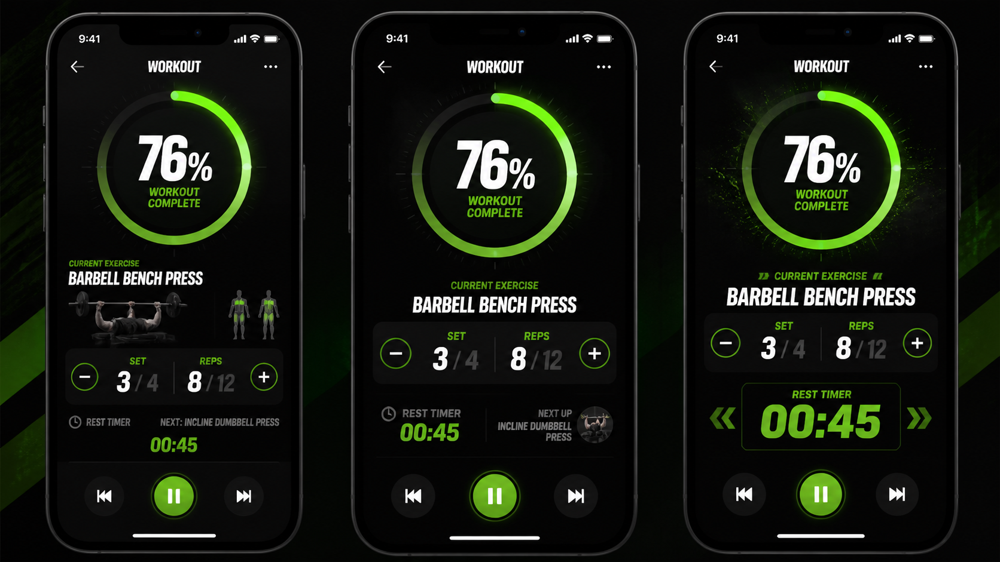</a>

<details>
<summary><b>04. Fitness App Workout Screen</b> · Mobile App / Health & Fitness</summary>

```
Mobile fitness app UI design showing an active workout tracking screen. Large circular progress ring at top showing workout completion percentage. Below: current exercise name, set/rep counter with +/- buttons, and a rest timer. Bottom has play/pause and skip controls. Color scheme: dark background, vibrant green accent, white text. Sporty, energetic typography. iOS design language. Dribbble-quality.
```

</details>
</td>
</tr>
<tr>
<td width="50%" valign="top">
<a href="images/06-ui-ux-design/05-music-player-interface.jpg">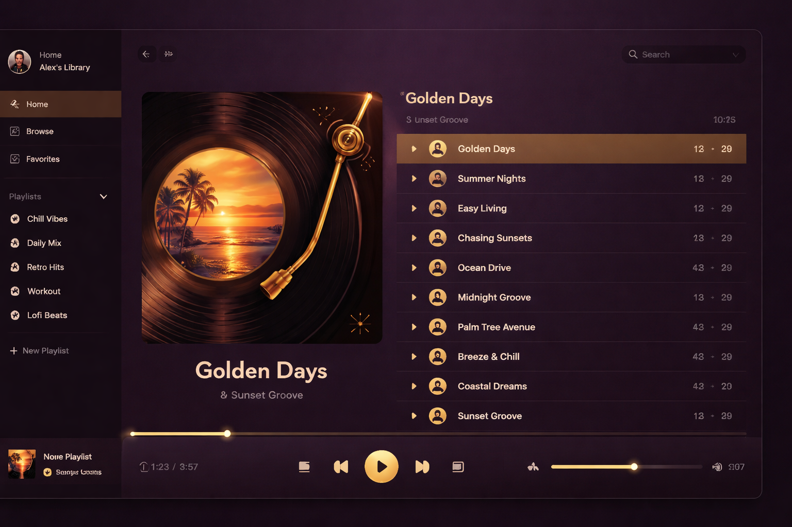</a>

<details>
<summary><b>05. Music Player Interface</b> · Desktop App / Media</summary>

```
Desktop music player application UI in dark mode. Left sidebar with playlist library. Main area shows album artwork large on the left, track list on the right. Bottom bar has playback controls, progress bar, and volume slider. Vinyl record aesthetic blended with modern UI. Color scheme: deep purple background, amber/gold accents, cream text. Spotify-quality design. Dribbble-worthy.
```

</details>
</td>
<td width="50%" valign="top">
<a href="images/06-ui-ux-design/06-crypto-wallet-mobile-app.jpg"></a>

<details>
<summary><b>06. Crypto Wallet Mobile App</b> · Mobile App / Fintech</summary>

```
A high-fidelity mobile app UI for a crypto wallet. Showing a 'Total Balance' card with '$12,450.00' and a green 'Up 5%' trend line. Dark mode, neon green accents. Minimalist glassmorphism style.
```

</details>
</td>
</tr>
<tr>
<td width="50%" valign="top">
<a href="images/06-ui-ux-design/07-farmers-market-app.jpg">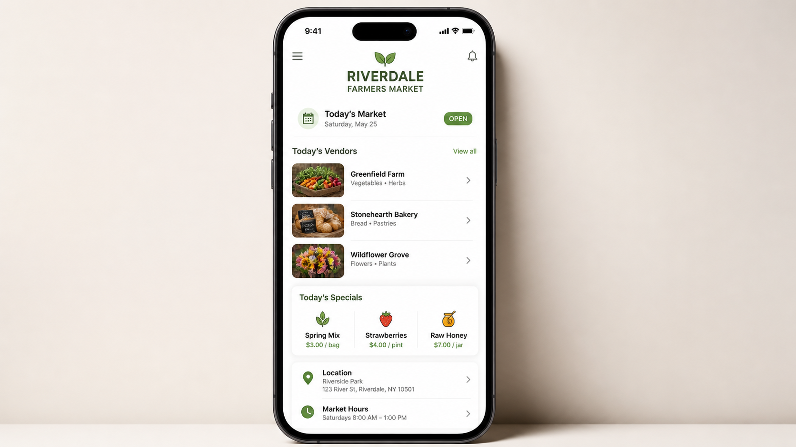</a>

<details>
<summary><b>07. Farmers Market App</b> · Mobile App / Local Commerce</summary>

```
Create a realistic mobile app UI mockup for a local farmers market.
Show today's market with a simple header, a short list of vendors with small photos and categories, a small "Today's specials" section, and basic information for location and hours.
Design it to be practical, and easy to use. White background, subtle natural accent colors, clear typography, and minimal decoration.
It should look like a real, well-designed, beautiful app for a small local market.
Place the UI mockup in an iPhone frame.
```

*Technique: Describe the product as if it already exists. Focus on layout, hierarchy, spacing, and real interface elements. Avoid concept art language.*

</details>
</td>
<td width="50%" valign="top">
<a href="images/06-ui-ux-design/08-to-do-app-screenshot-daybreak.jpg"></a>

<details>
<summary><b>08. To-Do App Screenshot (DAYBREAK)</b> · Mobile App / Productivity</summary>

```
Create a clean mobile app screenshot for a minimalist to-do app called DAYBREAK.
Top status bar reads 9:41 AM.
Title: DAYBREAK.
Subtitle: Tuesday, 23 April.
Four tasks listed:
- Review quarterly notes
- Call mom
- Ship the image update
- Pick up bread
One task is checked off.
Muted cream background, deep navy accent color, rounded sans serif, soft card shadows, perfect legibility, generous spacing.
No watermark. No real app branding.
```

*Technique: The model gets dramatically better once the screen type, copy, hierarchy, and spacing are all explicit.*

</details>
</td>
</tr>
<tr>
<td width="50%" valign="top">
<a href="images/06-ui-ux-design/09-game-hud-screenshot-block-survival.jpg">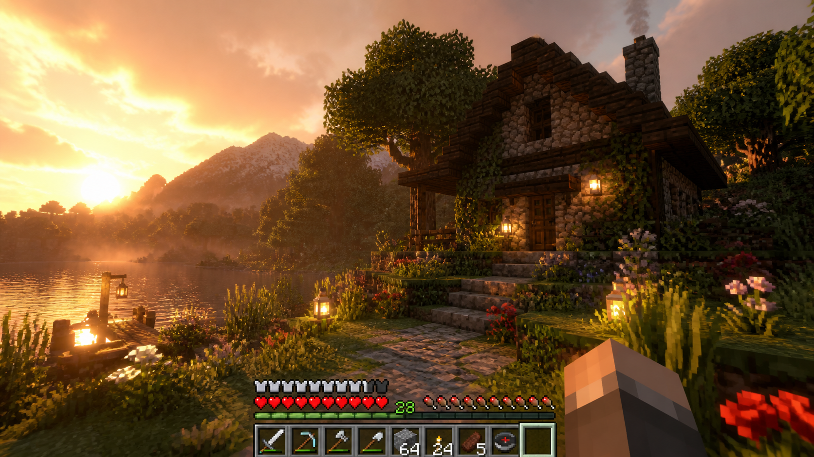</a>

<details>
<summary><b>09. Game HUD Screenshot (Block Survival)</b> · In-Game Screenshot / UI</summary>

```
Create a first-person gameplay screenshot of a cozy lakeside stone cottage in a lush block-built survival world at golden hour. Premium game-engine realism, ray-traced global illumination, detailed grass and flowers, soft atmospheric haze, subtle player hand in the lower right, clean survival HUD along the bottom, believable UI spacing. No logos, no watermark, no exact brand references.
```

*Technique: "Clean survival HUD along the bottom, believable UI spacing" does the layout work. Remove those two clauses and the HUD collapses into noise.*

</details>
</td>
<td width="50%" valign="top">
<a href="images/06-ui-ux-design/10-mobile-onboarding-screen-nesting.jpg">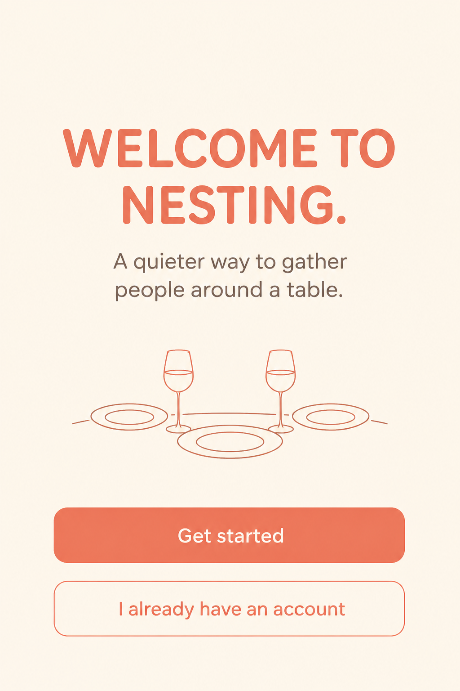</a>

<details>
<summary><b>10. Mobile Onboarding Screen (NESTING)</b> · Mobile App / Onboarding Flow</summary>

```
Create a vertical mobile onboarding screen for a fictional app called NESTING.
Headline: WELCOME TO NESTING.
Supporting line: A quieter way to gather people around a table.
Buttons: Get started, I already have an account.
Small line illustration of three plates and two wine glasses.
Warm cream background, coral primary button, rounded sans serif,
clean spacing, exact readable copy.
No watermark. No real app branding.
```

</details>
</td>
</tr>
<tr>
<td width="50%" valign="top">
<a href="images/06-ui-ux-design/11-social-dating-app-match-screen.jpg">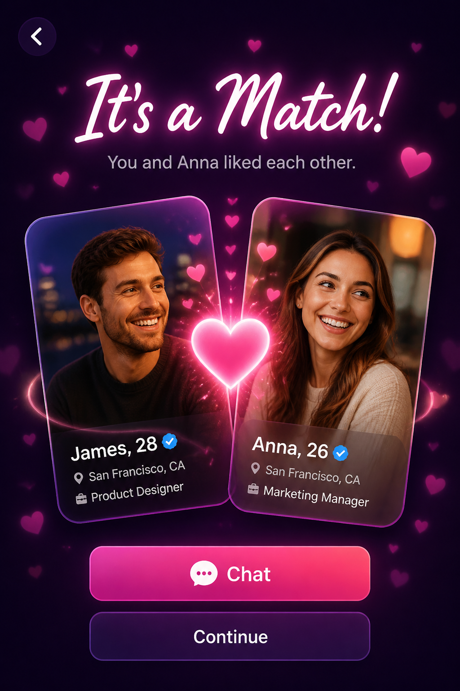</a>

<details>
<summary><b>11. Social Dating App Match Screen</b> · Mobile App / Social / Dark Mode</summary>

```
A social dating app match success screen mockup. Two user profile cards colliding in the center with a glowing heart effect between them. The headline reads "It's a Match!" with a subtitle below. Each card shows a profile photo, name, age, location, and job title. Below the cards, two action buttons: a primary pink "Chat" button and a secondary "Continue" button. Dark purple gradient background with floating pink heart particles and sparkle effects. Clean, modern mobile UI design, 9:16 vertical aspect ratio, realistic app screenshot aesthetic, polished shadows, and glass-morphism card edges.
```

</details>
</td>
<td width="50%" valign="top">
<a href="images/06-ui-ux-design/12-pitch-deck-slide-market-opportunity.jpg">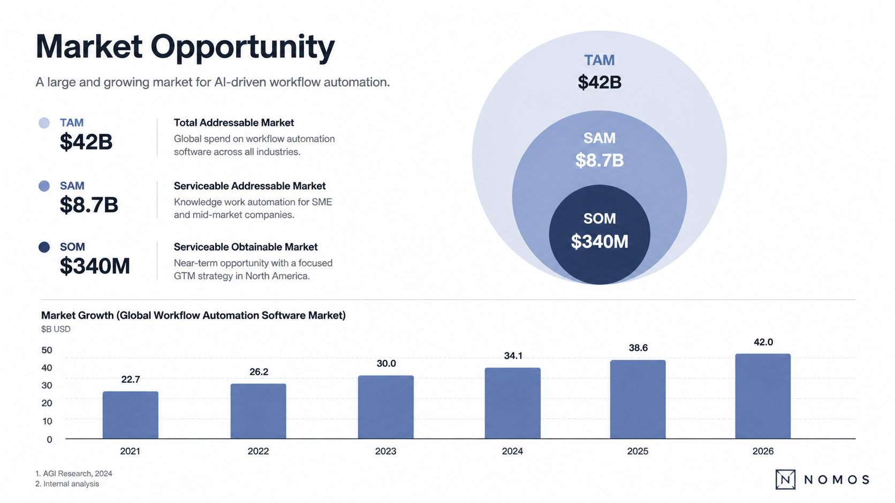</a>

<details>
<summary><b>12. Pitch Deck Slide (Market Opportunity)</b> · Presentation / Startup Pitch</summary>

```
Create one pitch-deck slide titled "Market Opportunity" that feels like a real Series A fundraising slide from a YC-backed startup.

Use a clean white background, modern sans-serif typography like Inter, and a crisp, minimal layout. The slide should include:

* A TAM/SAM/SOM concentric-circle diagram in muted blues and grays
* Specific, believable market sizing numbers:
  * TAM: $42B
  * SAM: $8.7B
  * SOM: $340M
* A clean bar chart below showing market growth from 2021 to 2026, with a subtle upward trend
* Small footnotes: "AGI Research, 2024" and "Internal analysis"
* A company logo placeholder in the bottom-right corner

The design should look like it belongs in a deck that actually raised money: highly readable text, clear data hierarchy, polished spacing, and professional startup-style visual language.

Avoid clip art, stock photography, gradients, shadows, decorative elements, or anything that feels generic or overdesigned.
```

*Technique: Name the exact deliverable (slide), define canvas and hierarchy, provide real data, describe the visual language. Use `quality="high"` for slides with small text.*

</details>
</td>
</tr>
<tr>
<td width="50%" valign="top">
<a href="images/06-ui-ux-design/13-saas-dashboard-laptop-mockup.jpg"></a>

<details>
<summary><b>13. SaaS Dashboard Laptop Mockup</b> · Product Mockup / In-Context</summary>

```
A hyper-realistic UI/UX mockup displayed on a slim modern laptop placed on a minimal wooden desk with soft natural daylight. The screen shows a clean SaaS dashboard with elegant typography, glassmorphism cards, smooth gradients, subtle drop shadows, and neatly spaced components. Visible charts, analytics panels, sidebar navigation, and micro-interactions. Realistic macOS-style window frame, soft reflections on the screen, shallow depth of field, cozy workspace atmosphere, shot in photorealistic product photography style, ultra-detailed.
```

</details>
</td>
<td></td>
</tr>
</table>


---

## Game Assets

Character sprites, environments, in-game screenshots, items

<table><tr>
<td width="50%" valign="top">
<a href="images/07-game-assets/01-rpg-character-portrait.jpg">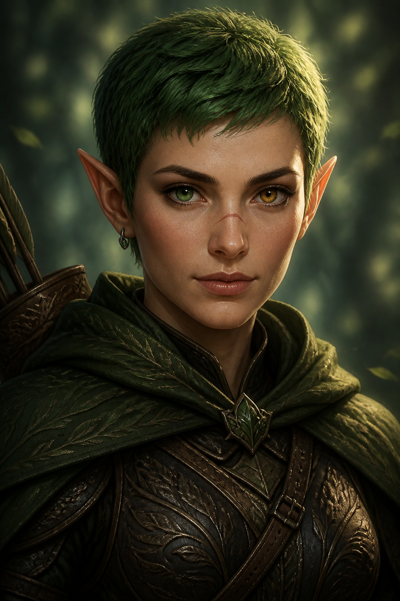</a>

<details>
<summary><b>01. RPG Character Portrait</b> · RPG Portrait Icon</summary>

```
RPG character portrait icon. A female elven ranger with short cropped green hair, one green eye and one amber eye, wearing dark leather armor with leaf-pattern embossing. She has a small scar across her nose. Forest green cloak clasp at her neck. Expression: calm confidence. Fantasy RPG art style, semi-realistic, painted digitally. Square format, clean edges, suitable for game UI portrait frame. Ultra-detailed 4K.
```

</details>
</td>
<td width="50%" valign="top">
<a href="images/07-game-assets/02-isometric-game-environment.jpg">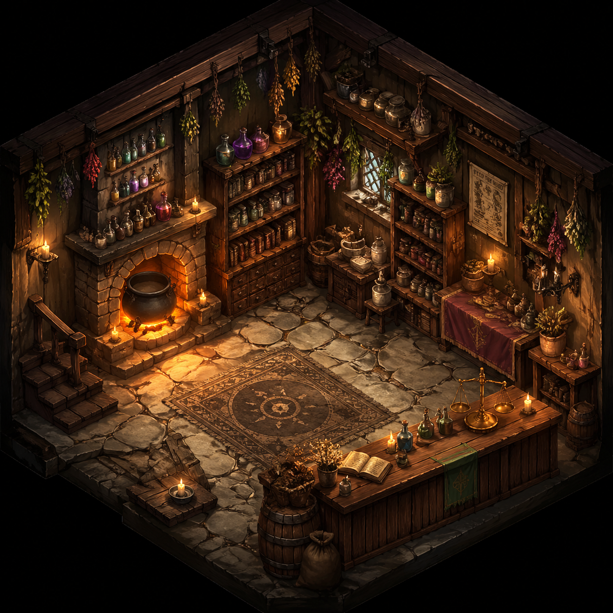</a>

<details>
<summary><b>02. Isometric Game Environment</b> · Isometric / 2.5D Interior</summary>

```
Isometric game environment tile of a cozy fantasy alchemist shop interior. Wooden shelves line the walls with colorful potion bottles, dried herbs hanging from the ceiling, a stone hearth with a cauldron, and a wooden counter with a brass scale. Warm candlelight glow. The floor is worn stone. Style: hand-painted 2.5D isometric game art, similar to Hades or Disco Elysium environment art. Rich detail, warm color palette. Ultra-detailed 4K.
```

</details>
</td>
</tr>
<tr>
<td width="50%" valign="top">
<a href="images/07-game-assets/03-pixel-art-character-sprite.jpg">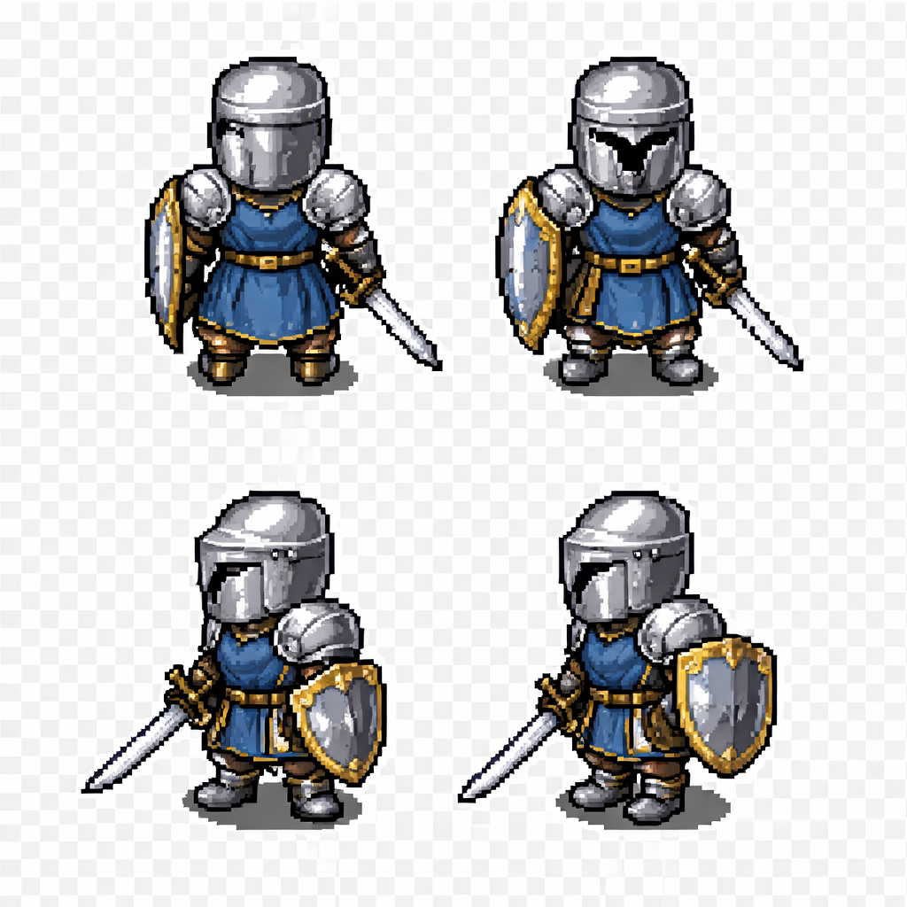</a>

<details>
<summary><b>03. Pixel Art Character Sprite</b> · 16-bit Pixel Art / Sprite Sheet</summary>

```
16-bit pixel art character sprite sheet of a knight character. Four directional views (up, down, left, right) arranged in a grid. The knight wears silver plate armor with a blue tabard, a bucket helm with a T-shaped visor slit, and carries a sword and shield. Clean pixel lines, limited color palette (16 colors maximum). Style inspired by SNES-era RPG sprites like Final Fantasy VI. Transparent background.
```

</details>
</td>
<td width="50%" valign="top">
<a href="images/07-game-assets/04-game-item-icons-set.jpg"></a>

<details>
<summary><b>04. Game Item Icons Set</b> · Item Icons / Grid</summary>

```
Set of 6 game item icons arranged in a grid. Each icon is a square with rounded corners on a subtle dark gradient background. Items: a glowing blue health potion, a golden coin with a crown stamp, a silver longsword, a wooden shield with iron bands, a scroll with red seal, and a ruby ring. Each item is centered in its cell with a soft drop shadow. Icon art style similar to Diablo or World of Warcraft item icons. Detailed, colorful, game-ready.
```

</details>
</td>
</tr>
<tr>
<td width="50%" valign="top">
<a href="images/07-game-assets/05-game-background----forest-path.jpg">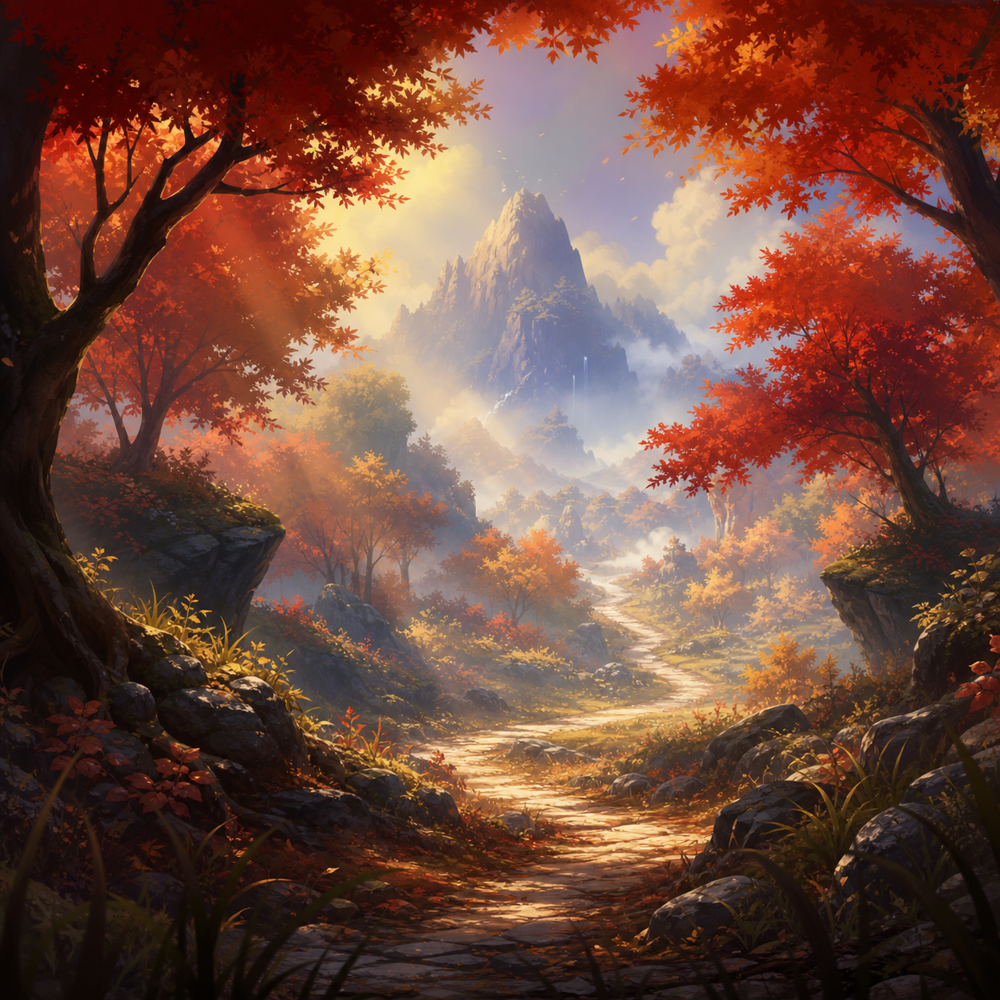</a>

<details>
<summary><b>05. Game Background -- Forest Path</b> · 2D Background / Parallax</summary>

```
2D game background of a fantasy forest path at autumn. The path winds from bottom-center toward a distant mountain peak. Maple trees with orange and red leaves frame both sides. Soft light rays filter through the canopy. Parallax-ready layers -- foreground grass and rocks, midground trees, distant mountains with atmospheric haze. Hand-painted style similar to Ori and the Blind Forest. Warm autumn palette. Ultra-detailed 4K.
```

</details>
</td>
<td width="50%" valign="top">
<a href="images/07-game-assets/06-boss-monster-design.jpg">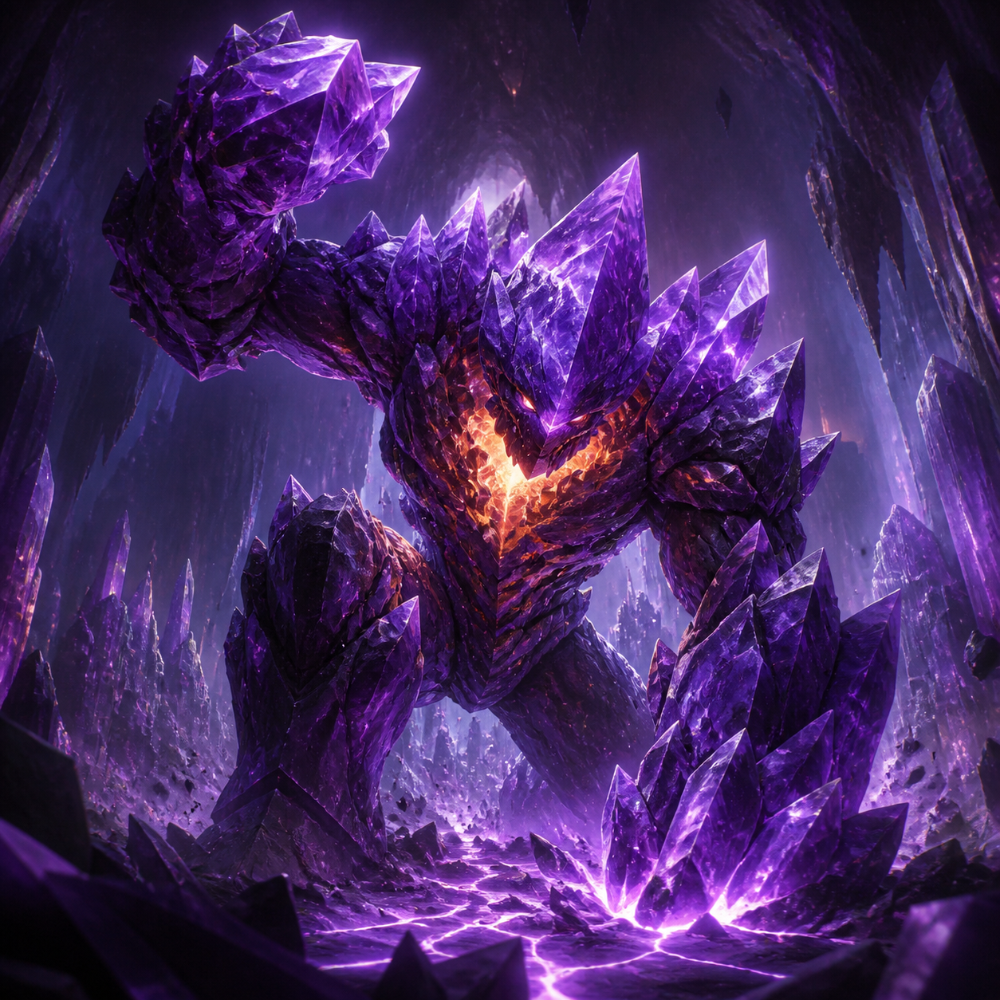</a>

<details>
<summary><b>06. Boss Monster Design</b> · Boss Design / Dark Fantasy</summary>

```
Game boss monster concept art. A massive crystal golem creature made of jagged purple amethyst formations in a humanoid shape. Glowing orange core visible between the crystal plates where its heart would be. Ground cracks beneath its weight with purple energy leaking out. One arm is raised, about to slam down. Environment: underground crystal cavern. Dark fantasy boss design, League of Legends splash art quality. Ultra-detailed 4K.
```

</details>
</td>
</tr>
<tr>
<td width="50%" valign="top">
<a href="images/07-game-assets/07-first-person-block-survival-screenshot.jpg">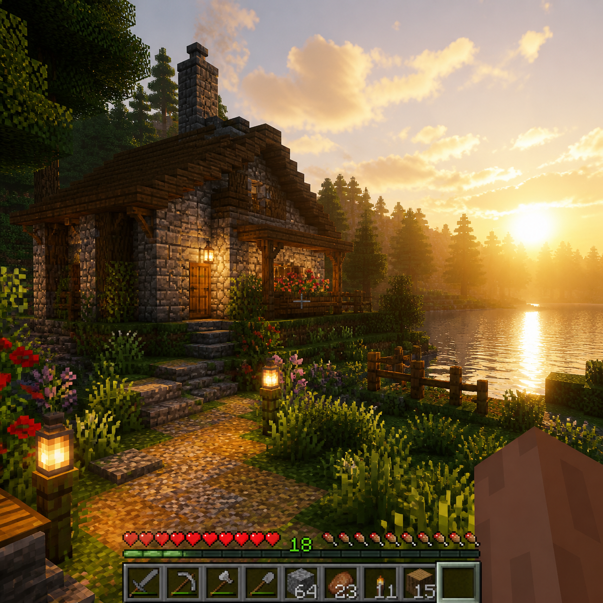</a>

<details>
<summary><b>07. First-Person Block Survival Screenshot</b> · In-Game Screenshot / Survival Game</summary>

```
Create a first-person gameplay screenshot of a cozy lakeside stone cottage in a lush block-built survival world at golden hour. Premium game-engine realism, ray-traced global illumination, detailed grass and flowers, soft atmospheric haze, subtle player hand in the lower right, clean survival HUD along the bottom, believable UI spacing. No logos, no watermark, no exact brand references.
```

*Technique: "Clean survival HUD along the bottom, believable UI spacing" does the layout work. Without those constraints the HUD collapses into noise.*

</details>
</td>
<td width="50%" valign="top">
<a href="images/07-game-assets/08-retro-crt-terminal-bbs.jpg">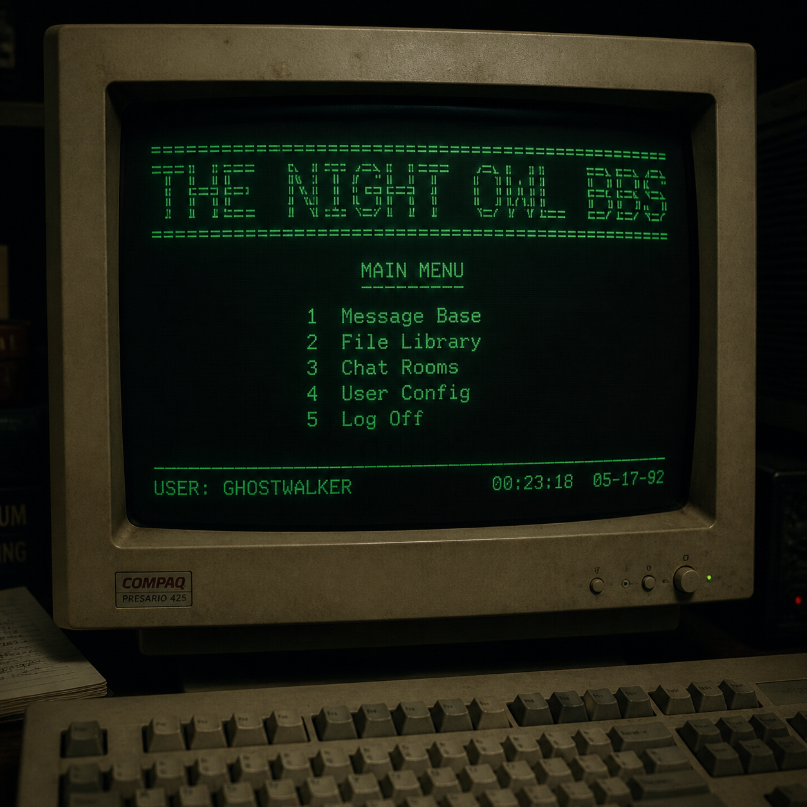</a>

<details>
<summary><b>08. Retro CRT Terminal (BBS)</b> · Retro Computing / In-Game UI</summary>

```
Create a photograph of a 1992-era CRT monitor displaying a bulletin board system terminal.
Phosphor green text on black.
ASCII banner: THE NIGHT OWL BBS.
Main menu items:
1 Message Base
2 File Library
3 Chat Rooms
4 User Config
5 Log Off
Status line at bottom: user handle GHOSTWALKER.
Subtle scanline glow, dusty monitor bezel, keyboard slightly out of focus.
No modern UI elements. No watermark.
```

*Technique: This is a stress test for small text, old-screen glow, and physical monitor detail all at once.*

</details>
</td>
</tr>
<tr>
<td width="50%" valign="top">
<a href="images/07-game-assets/09-counter-strike-x-terraria-mashup.jpg">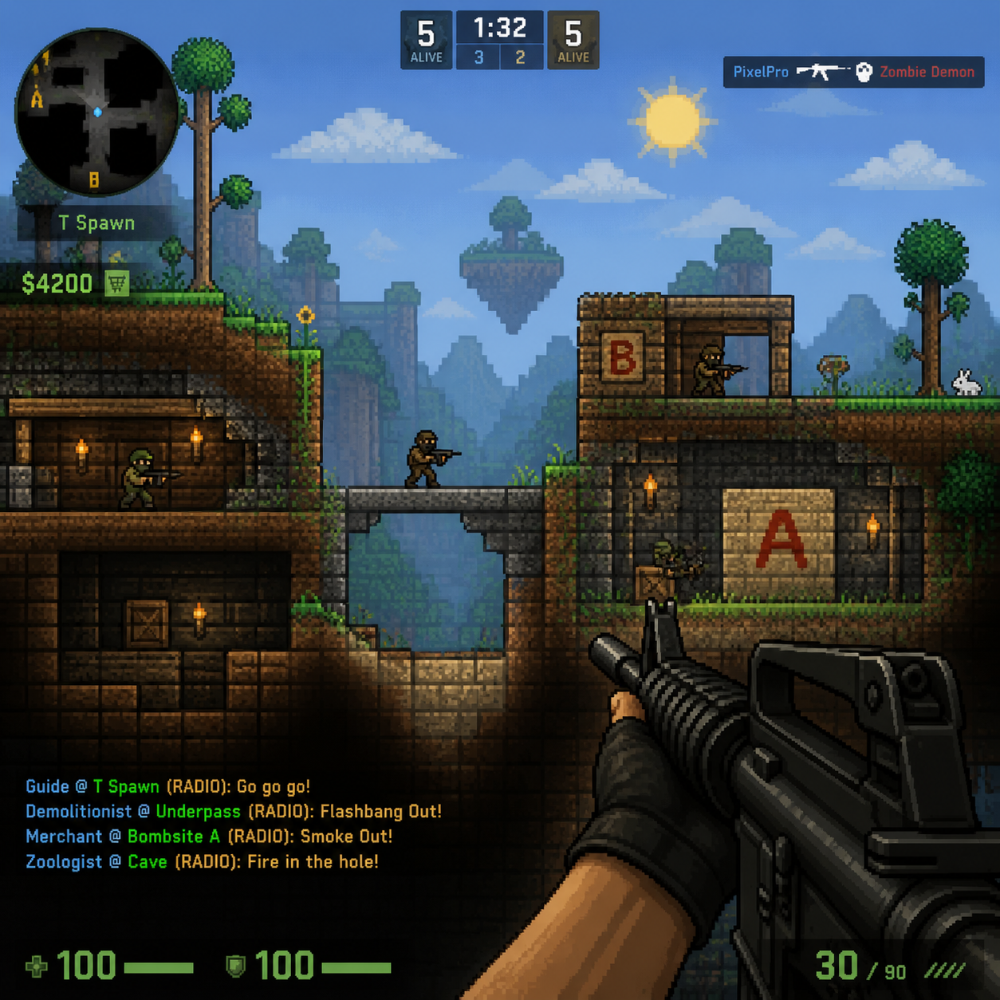</a>

<details>
<summary><b>09. Counter-Strike x Terraria Mashup</b> · Game Mashup / Crossover</summary>

```
Counter-Strike in-game screenshot, mixed with Terraria. Combine the first-person shooter perspective and tactical gameplay elements of Counter-Strike with the 2D pixel art, block-based world, and colorful aesthetic of Terraria. Create a hybrid visual that feels like both games merged into one scene.
```

</details>
</td>
<td width="50%" valign="top">
<a href="images/07-game-assets/10-minecraft-japanese-research-lab.jpg">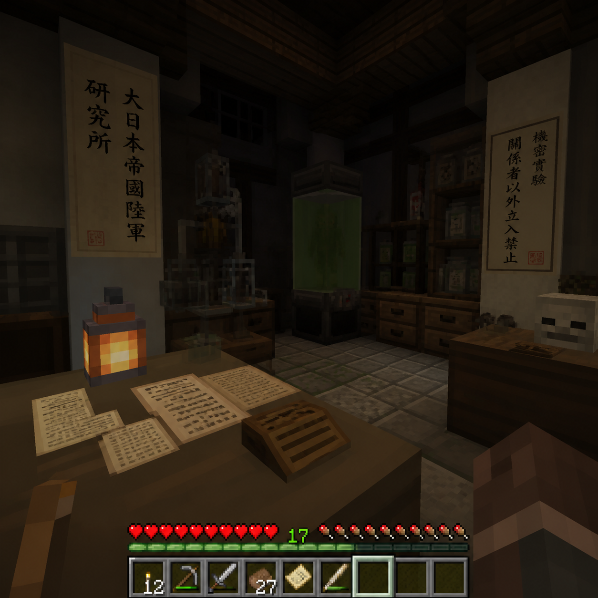</a>

<details>
<summary><b>10. Minecraft Japanese Research Lab</b> · In-Game Screenshot / Atmospheric</summary>

```
Create a Minecraft in-game screenshot image of exploring a mysterious pre-war Japanese research laboratory. The scene should combine Minecraft's block-based aesthetic with eerie, atmospheric elements of an abandoned 1930s-1940s Japanese lab -- dim lighting, strange equipment, research notes, and a sense of discovery and unease. Maintain authentic Minecraft visual style with block textures and characteristic lighting.
```

</details>
</td>
</tr>
<tr>
<td width="50%" valign="top">
<a href="images/07-game-assets/11-rust-in-game-screenshot.jpg">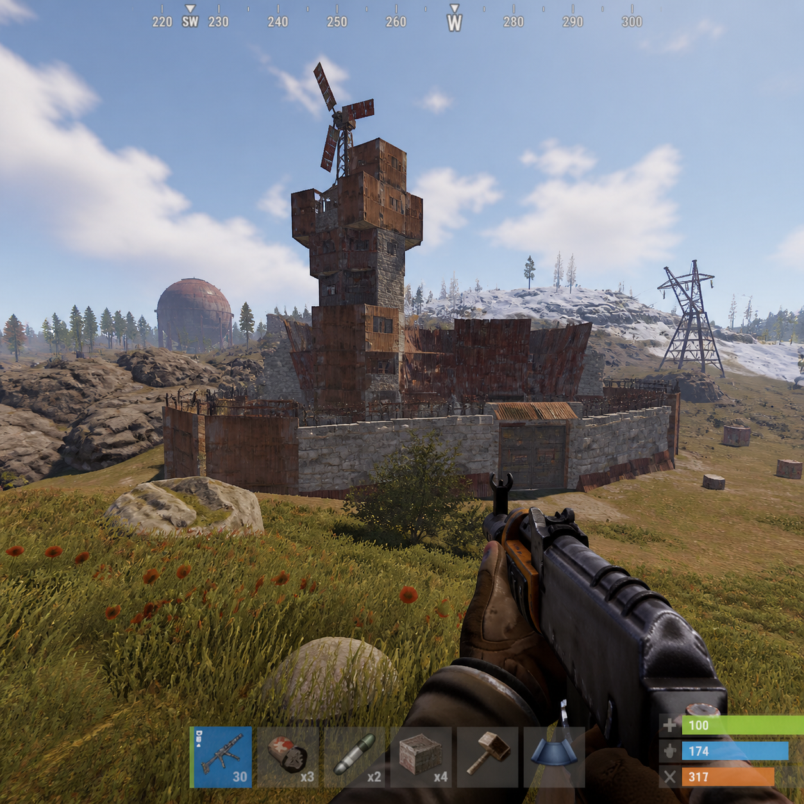</a>

<details>
<summary><b>11. Rust In-Game Screenshot</b> · In-Game Screenshot / Survival</summary>

```
An in-game screenshot of Rust. Capture the survival game's distinctive visual style with its harsh environment, makeshift structures, rugged terrain, and characteristic lighting. Include typical gameplay elements like base buildings, resource gathering areas, and the game's signature post-apocalyptic wilderness atmosphere.
```

</details>
</td>
<td width="50%" valign="top">
<a href="images/07-game-assets/12-among-us-realistic-screenshot.jpg">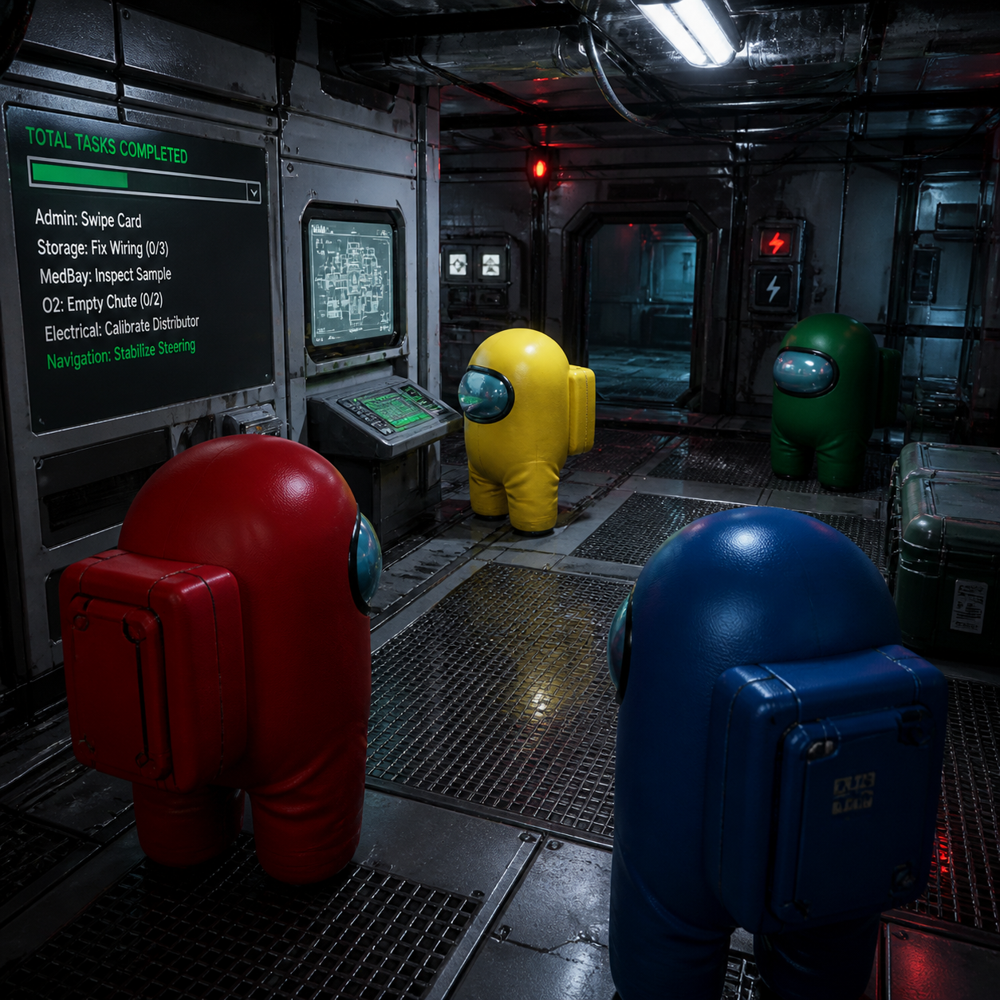</a>

<details>
<summary><b>12. Among Us Realistic Screenshot</b> · Realistic Game Render / Social Deduction</summary>

```
Generate a precise realistic in-game image of Among Us. Maintain the game's distinctive character design (bean-shaped astronauts, colored spacesuits, visors) but render everything with realistic textures, lighting, and materials. Include typical game elements like the spaceship interior, task stations, and the characteristic atmosphere of suspicion and teamwork.
```

</details>
</td>
</tr>
</table>


---

## Character Design

Character sheets, turnarounds, expression boards

<table><tr>
<td width="50%" valign="top">
<a href="images/08-character-design/01-fantasy-character-sheet.jpg">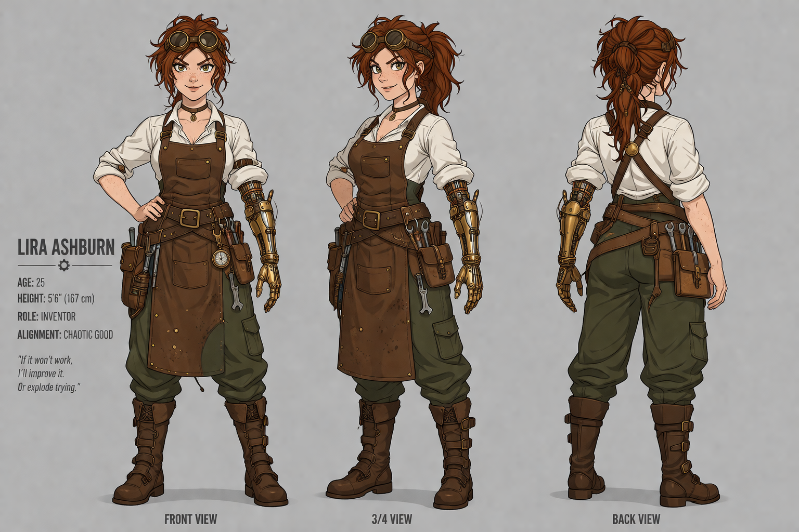</a>

<details>
<summary><b>01. Fantasy Character Sheet</b> · Steampunk / Full Turnaround</summary>

```
Character design sheet of a female steampunk inventor. Three views: front view, 3/4 view, and back view, arranged side by side on a neutral gray background. She is 25 years old with messy auburn hair tied back with a leather cord, goggles pushed up on her forehead, a brown leather apron over a white blouse, utility belt with tools, and high leather boots. One mechanical arm from the elbow down (brass and copper). Confident, slightly mischievous expression. Clean line art with flat color fills. Professional character design sheet format.
```

</details>
</td>
<td width="50%" valign="top">
<a href="images/08-character-design/02-anime-character-expressions.jpg">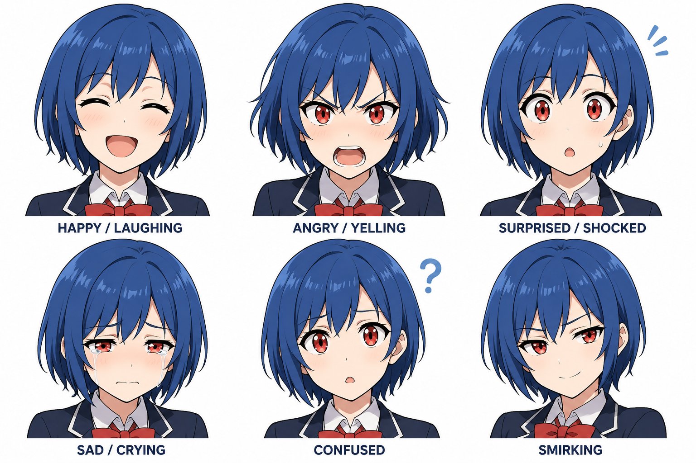</a>

<details>
<summary><b>02. Anime Character Expressions</b> · Anime / Expression Sheet</summary>

```
Anime character expression sheet showing the same female character in 6 different emotion states: happy/laughing, angry/yelling, surprised/shocked, sad/crying, confused, and smirking. The character has short blue hair, red eyes, and wears a school uniform. Each expression is a bust shot (shoulders up) arranged in a 2x3 grid. Clean anime line art with cel shading. Professional character design reference sheet.
```

</details>
</td>
</tr>
<tr>
<td width="50%" valign="top">
<a href="images/08-character-design/03-sci-fi-soldier-turnaround.jpg">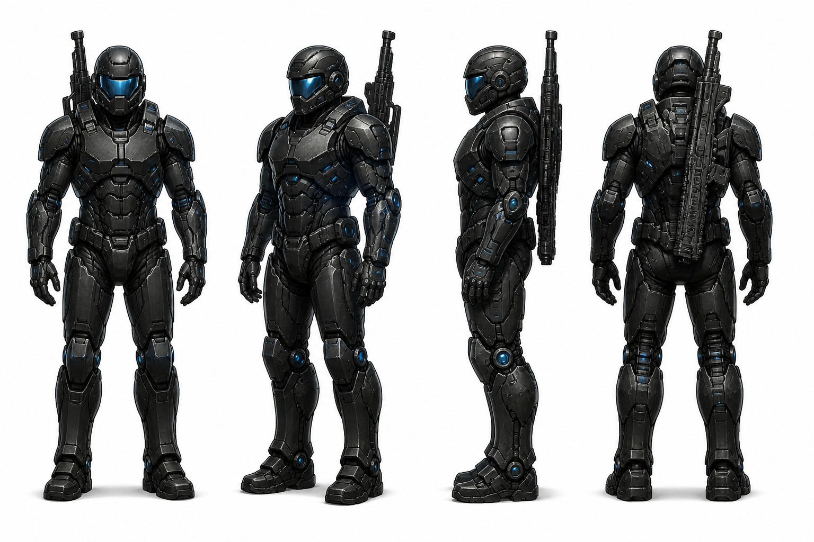</a>

<details>
<summary><b>03. Sci-Fi Soldier Turnaround</b> · Sci-Fi / Power Armor Turnaround</summary>

```
Character turnaround sheet of a sci-fi space marine. Four views arranged horizontally: front, left 3/4, side, and back. Full body. The soldier wears matte black power armor with glowing blue accents at the joints, a helmet with a reflective visor, and carries a futuristic rifle on the back. Build: athletic, imposing. No face visible behind the visor. Clean concept art style with subtle gray shading. Professional character turnaround format on white background.
```

</details>
</td>
<td width="50%" valign="top">
<a href="images/08-character-design/04-cartoon-mascot-design.jpg"></a>

<details>
<summary><b>04. Cartoon Mascot Design</b> · Mascot / Brand Character</summary>

```
Character design of a friendly cartoon mascot for a tech startup. A round, chubby robot character with a single large screen for a face showing a simple smiley expression. Body is white plastic with rounded edges. Small stubby arms and legs. A small antenna on top with a glowing blue tip. Friendly, approachable, minimalist. Shown in a casual standing pose. Clean vector-style illustration with soft gradients. Suitable for logo and brand use.
```

</details>
</td>
</tr>
<tr>
<td width="50%" valign="top">
<a href="images/08-character-design/05-monster-design-sheet.jpg">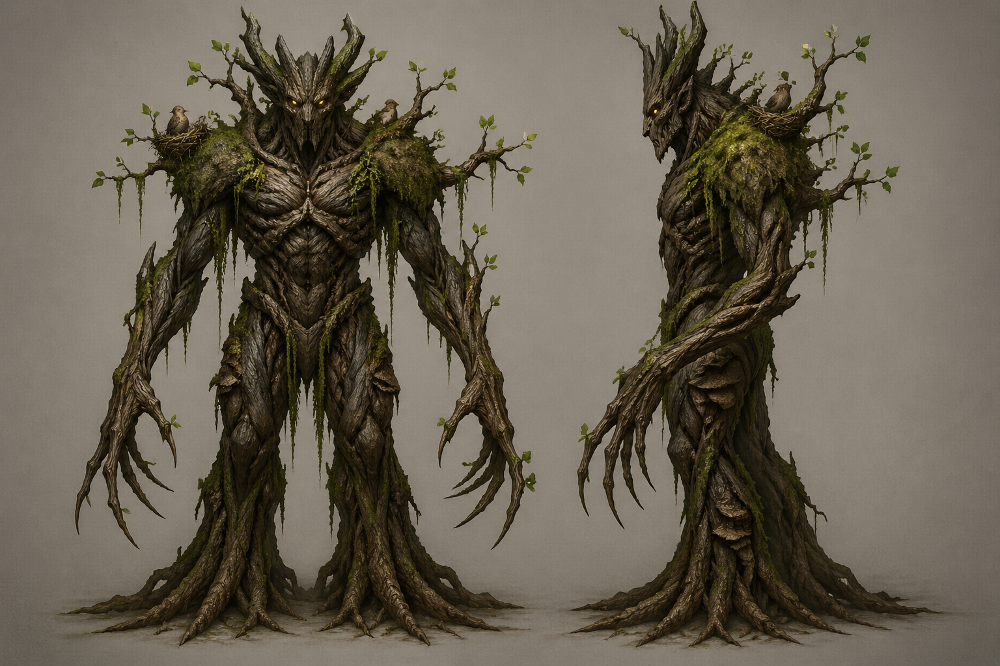</a>

<details>
<summary><b>05. Monster Design Sheet</b> · Creature / Dark Fantasy</summary>

```
Creature design sheet of a forest guardian monster. Two views: front facing and side profile. The creature is a humanoid tree-being with bark-like skin, moss growing on its shoulders, glowing yellow eyes deep within a wooden face, and long branch-like fingers with leaves. Roots form its feet, planted into the ground. A small bird nests in its shoulder branches. Dark fantasy creature design. Detailed digital painting style on neutral background.
```

</details>
</td>
<td width="50%" valign="top">
<a href="images/08-character-design/06-childrens-book-character-anchor.jpg">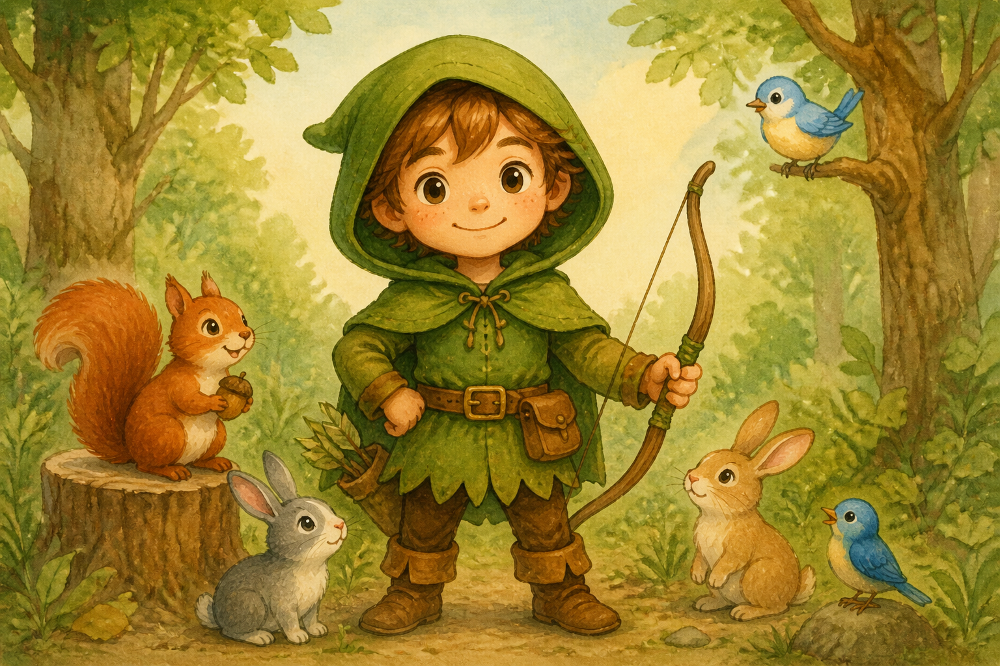</a>

<details>
<summary><b>06. Children's Book Character Anchor</b> · Storybook / Character Consistency</summary>

```
Create a children's book illustration introducing a main character.

Character:
A young, storybook-style hero inspired by a little forest outlaw,
wearing a simple green hooded tunic, soft brown boots, and a small belt pouch.
The character has a kind expression, gentle eyes, and a brave but warm demeanor.
Carries a small wooden bow used only for helping, never harming.

Theme:
The character protects and rescues small forest animals like squirrels, birds, and rabbits.

Style:
Children's book illustration, hand-painted watercolor look,
soft outlines, warm earthy colors, whimsical and friendly.
Proportions suitable for picture books (slightly oversized head, expressive face).

Constraints:
- Original character (no copyrighted characters)
- No text
- No watermarks
- Plain forest background to clearly showcase the character
```

*Technique: This is the "character anchor" pattern. Generate this first, then use the image as a reference in subsequent prompts for character consistency across scenes.*

</details>
</td>
</tr>
<tr>
<td width="50%" valign="top">
<a href="images/08-character-design/07-character-consistency----story-continuation.jpg">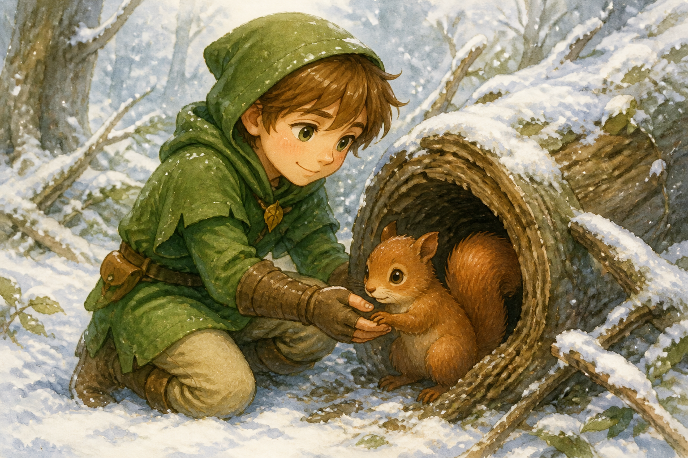</a>

<details>
<summary><b>07. Character Consistency -- Story Continuation</b> · Storybook / Consistency Edit</summary>

```
Continue the children's book story using the same character.

Scene:
The same young forest hero is gently helping a frightened squirrel
out of a fallen tree after a winter storm.
The character kneels beside the squirrel, offering reassurance.

Character Consistency:
- Same green hooded tunic
- Same facial features, proportions, and color palette
- Same gentle, heroic personality

Style:
Children's book watercolor illustration,
soft lighting, snowy forest environment,
warm and comforting mood.

Constraints:
- Do not redesign the character
- No text
- No watermarks
```

*Technique: Use the image from prompt #06 as a reference input. Re-state all character details on each iteration to prevent drift.*

</details>
</td>
<td width="50%" valign="top">
<a href="images/08-character-design/08-adventure-character-design-sheet-advanced.jpg">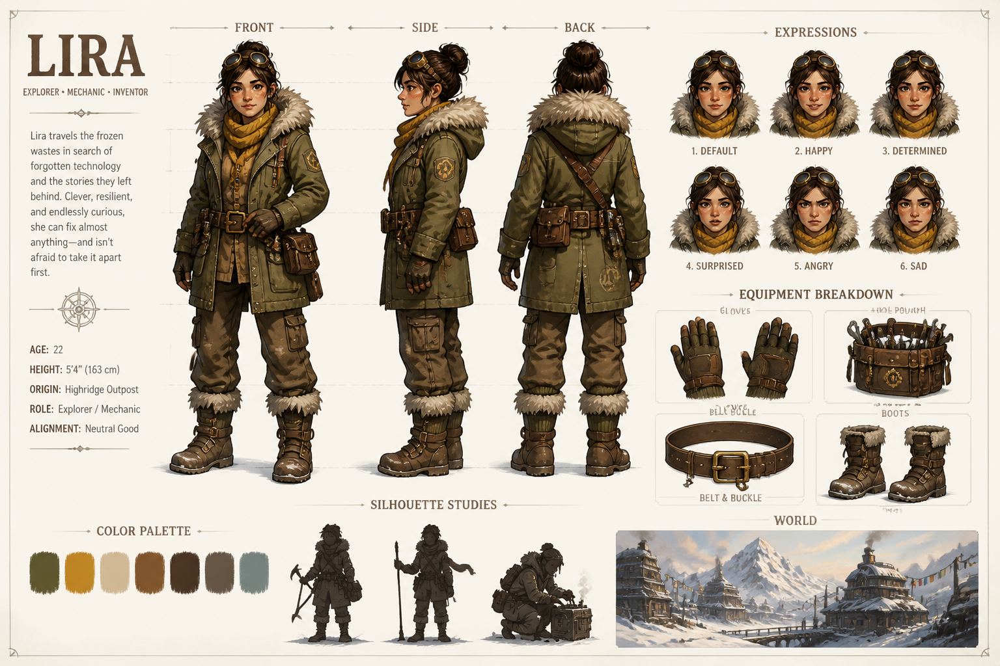</a>

<details>
<summary><b>08. Adventure Character Design Sheet (Advanced)</b> · Full Character Sheet / Concept Art</summary>

```
Create a detailed character design sheet for "Lira", a young female explorer-mechanic-inventor who travels across frozen lands in search of forgotten technology. Include front, side, and back turnaround views showing her full outfit: olive-green fur-lined parka with hood, golden knit scarf, brown utility belt with brass buckle, cargo pants, and insulated boots. Add a row of six facial expressions (default, happy, determined, surprised, angry, sad). Include an equipment breakdown section showing gloves, tool pouch, belt and buckle, and boots as separate items. Add a warm earth-tone color palette strip, three silhouette poses, and a small "World" thumbnail showing a snowy mountain village. Clean off-white background, thin layout guides, semi-realistic painterly illustration style with soft lighting and visible brushwork.
```

</details>
</td>
</tr>
<tr>
<td width="50%" valign="top">
<a href="images/08-character-design/09-anime-snapshot-conversion.jpg">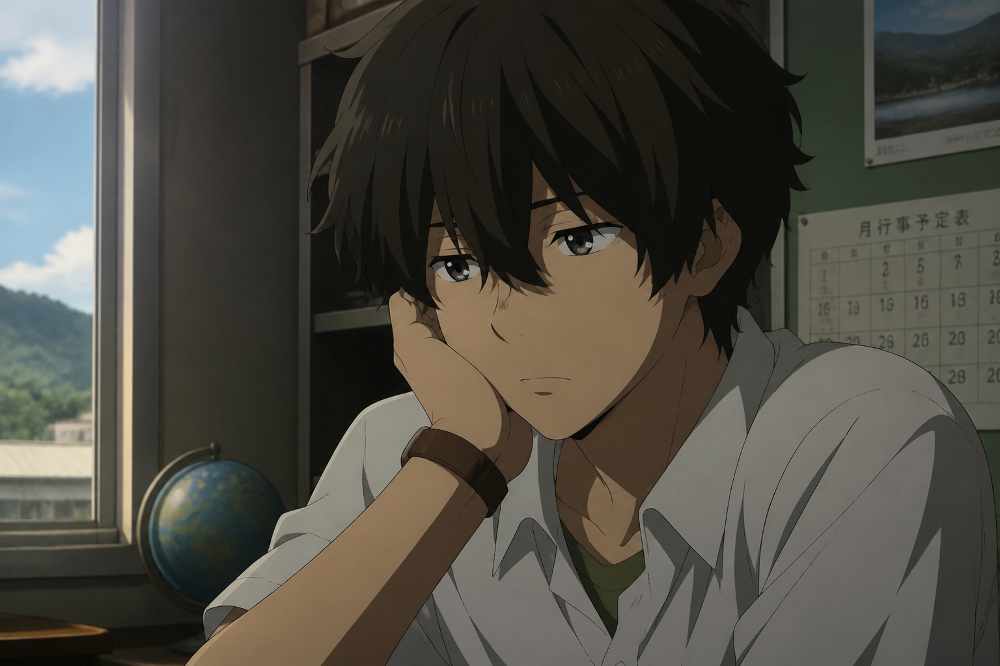</a>

<details>
<summary><b>09. Anime Snapshot Conversion</b> · Photo to Anime Conversion</summary>

```
Show me the attached image as a snapshot from an actual anime. Keep the scene readable and cinematic, with authentic anime lighting, stylized line treatment, clean color blocking, and the feeling of a real frame from a polished TV or film production.
```

</details>
</td>
<td width="50%" valign="top">
<a href="images/08-character-design/10-persona-style-character-reference-card.jpg">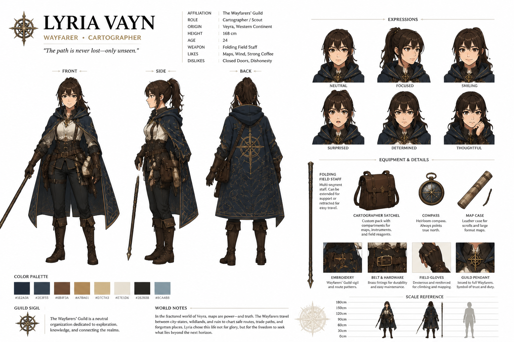</a>

<details>
<summary><b>10. Persona-Style Character Reference Card</b> · Game Character Card / Reference</summary>

```
Based on the character and background reference, create a polished official-style character reference card. Include front, side, and back views, a few expression variations, callouts for clothing and equipment details, a compact color palette, and a short worldbuilding note. Use an organized white-background layout with illustration-style panels, high-resolution concept-art quality, and a presentation that feels like a professional game or animation design document.
```

</details>
</td>
</tr>
<tr>
<td width="50%" valign="top">
<a href="images/08-character-design/11-gal-game-character-introduction-page.jpg">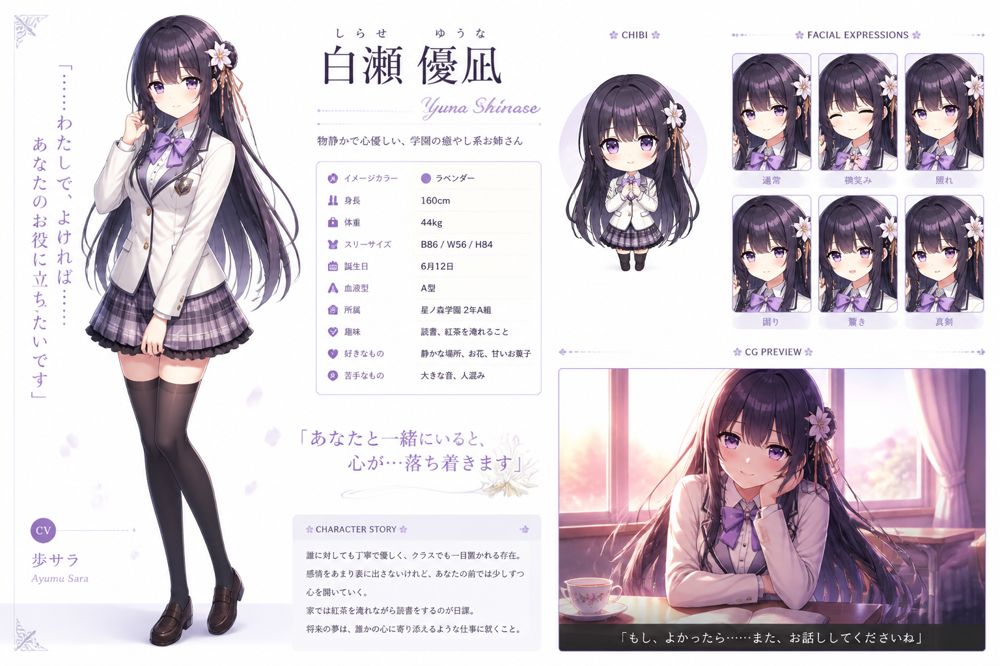</a>

<details>
<summary><b>11. Gal Game Character Introduction Page</b> · Visual Novel / Character Page</summary>

```
Create a high-quality character introduction page in the style of a Japanese visual novel (gal game). Include the full standing illustration, a chibi character variant, facial expression variations, and a CG illustration preview. Add a character profile section with name, image color, height, weight, and a signature quote. The layout should look like a real game website character page -- polished enough to use as-is. Clean white background, organized grid layout, anime illustration style.
```

</details>
</td>
<td width="50%" valign="top">
<a href="images/08-character-design/12-saint-seiya-gold-saints-card-grid.jpg">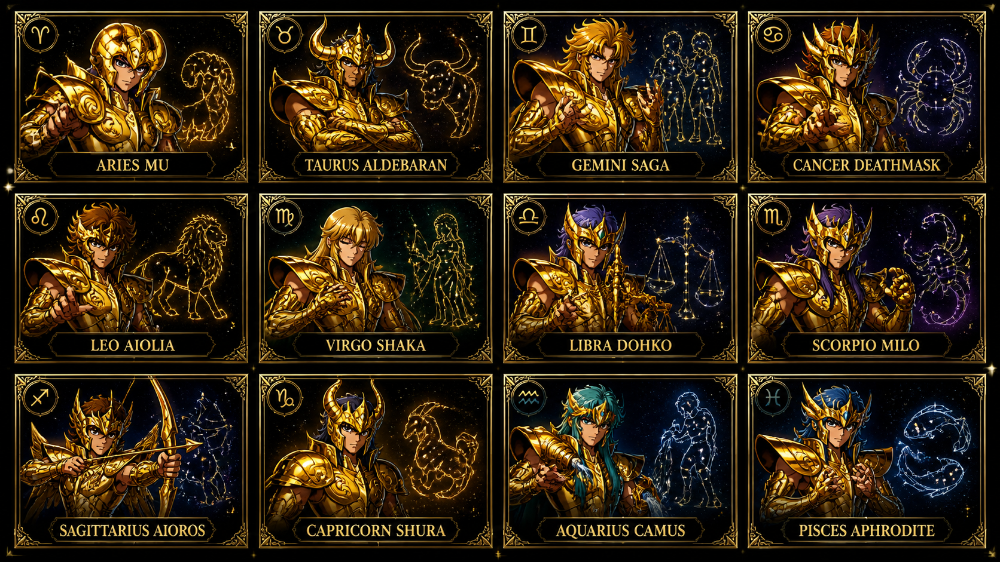</a>

<details>
<summary><b>12. Saint Seiya Gold Saints Card Grid</b> · Collectible Card / Anime Grid</summary>

```
Generate a 12-cell card grid image of the 12 Gold Saints from Saint Seiya, with each card displaying the corresponding character name. Arrange 4 cards per row, 16:9 aspect ratio. Each card has its own individual border, and the character wears an ornate Gold Cloth armor. The background of each card features the starry constellation pattern matching that Saint's zodiac sign. The overall style is that of a high-quality collectible game card set.
```

</details>
</td>
</tr>
</table>


---

## Poster & Graphic Design

Movie posters, flyers, album covers, infographics, logos

<table><tr>
<td width="50%" valign="top">
<a href="images/09-poster-graphic/01-sci-fi-movie-poster.jpg">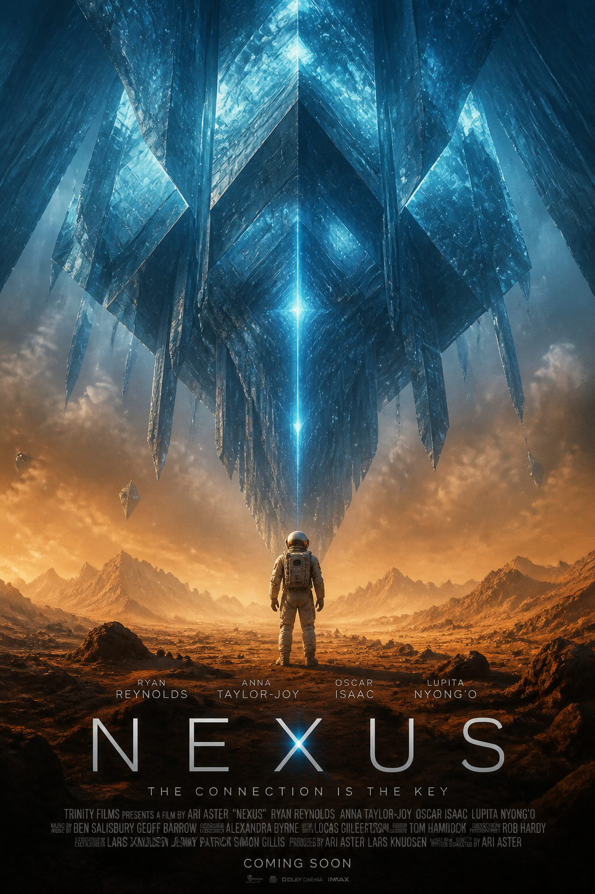</a>

<details>
<summary><b>01. Sci-Fi Movie Poster</b> · Movie Poster / Sci-Fi</summary>

```
Movie poster design for a sci-fi film titled "NEXUS". Composition: a lone astronaut in a white spacesuit stands on a desert planet surface, looking up at a massive floating alien structure that fills the sky -- a geometric crystalline formation emitting cold blue light. Title "NEXUS" in clean modern sans-serif at the bottom. Actor names in small text above the title. Credits block at the very bottom. Dramatic vertical composition, 2:3 poster aspect ratio. Cinematic color grade -- orange desert below, blue structure above. Ultra-detailed 4K.
```

</details>
</td>
<td width="50%" valign="top">
<a href="images/09-poster-graphic/02-music-festival-poster.jpg"></a>

<details>
<summary><b>02. Music Festival Poster</b> · Event Poster / Psychedelic</summary>

```
Music festival poster design for "ECHO FESTIVAL 2026". Psychedelic art style with flowing organic shapes, geometric patterns, and vibrant colors -- electric purple, hot pink, teal, and gold on a dark navy background. Central artwork is an abstract eye surrounded by sound waves morphing into a forest. Festival name in bold distorted typography at the top. Date and location in smaller text at the bottom. Lineup text in the middle. Retro-futuristic psychedelic poster art. Ultra-detailed 4K.
```

</details>
</td>
</tr>
<tr>
<td width="50%" valign="top">
<a href="images/09-poster-graphic/03-minimal-brand-logo.jpg"></a>

<details>
<summary><b>03. Minimal Brand Logo</b> · Logo Design / Minimal</summary>

```
Minimal logo design for a coffee brand called "MORNING". The logo is a simple line-art illustration of a sunrise inside a coffee cup, using a single continuous flowing line in a warm brown color on a cream background. Below the icon, the word "MORNING" in a clean modern serif font, evenly spaced letters. Negative space used cleverly -- the steam from the cup forms the sun rays. Professional logo design, scalable vector aesthetic.
```

</details>
</td>
<td width="50%" valign="top">
<a href="images/09-poster-graphic/04-album-cover-art.jpg"></a>

<details>
<summary><b>04. Album Cover Art</b> · Album Cover / Abstract</summary>

```
Album cover art for an indie electronic music album. Square format. Abstract geometric composition -- overlapping translucent circles and rectangles in soft pastel colors (blush pink, sage green, pale blue, cream) on a warm off-white background. Subtle paper texture visible. Title "WAVELENGTHS" in small elegant sans-serif text at the bottom center. Minimal, sophisticated, modern art gallery aesthetic. 4K quality.
```

</details>
</td>
</tr>
<tr>
<td width="50%" valign="top">
<a href="images/09-poster-graphic/05-retro-travel-poster.jpg"></a>

<details>
<summary><b>05. Retro Travel Poster</b> · Vintage Travel / Art Deco</summary>

```
Vintage travel poster for Tokyo in 1930s Art Deco style. Composition: a stylized Mount Fuji in the background with cherry blossoms framing the scene. In the foreground, a geisha in a vibrant red kimono walks along a bridge. Bold flat colors -- red, black, gold, and cream. "TOKYO" in large Art Deco typography at the top. "JAPAN" in smaller text below. Classic travel poster layout with decorative border. Lithograph print texture.
```

</details>
</td>
<td width="50%" valign="top">
<a href="images/09-poster-graphic/06-sci-fi-movie-teaser-poster-inventor.jpg"></a>

<details>
<summary><b>06. Sci-Fi Movie Teaser Poster (INVENTOR)</b> · Movie Teaser / Sci-Fi Epic</summary>

```
Create a cinematic sci-fi movie teaser poster in 16:9 landscape format. A lone woman stands in silhouette at the center, viewed from behind, facing an enormous cubic chamber filled with thousands of glowing holographic screens and data panels stretching in every direction. The screens display fragments of landscapes, cities, galaxies, and abstract data. A bright golden-white light source emanates from the center of the chamber, casting volumetric rays and lens flare. The title "INVENTOR" is displayed in wide-spaced uppercase serif typography at the bottom center. Below it, the tagline "DISCOVERY IS JUST THE BEGINNING" in smaller caps, and "COMING SOON" at the very bottom. Dark moody atmosphere, deep blues and warm amber highlights, photorealistic lighting, epic sense of scale, no other characters visible.
```

</details>
</td>
</tr>
<tr>
<td width="50%" valign="top">
<a href="images/09-poster-graphic/07-infographic----seed-to-tree-process.jpg"></a>

<details>
<summary><b>07. Infographic -- Seed to Tree Process</b> · Infographic / Educational</summary>

```
A clean infographic showing the 3-step 'Seed to Tree' process. 1. Seed, 2. Sprout, 3. Tree. Simple flat vector icons, pastel colors. Perfectly legible numbers and titles for each stage.
```

</details>
</td>
<td width="50%" valign="top">
<a href="images/09-poster-graphic/08-infographic----coffee-machine-flow.jpg"></a>

<details>
<summary><b>08. Infographic -- Coffee Machine Flow</b> · Technical Infographic / Diagram</summary>

```
Create a detailed Infographic of the functioning and flow of an automatic coffee machine like a Jura.
From bean basket, to grinding, to scale, water tank, boiler, etc.
I'd like to understand technically and visually the flow.
```

*Technique: Use `quality="high"` for dense infographics with lots of labels. Set size to portrait (1024x1536).*

</details>
</td>
</tr>
<tr>
<td width="50%" valign="top">
<a href="images/09-poster-graphic/09-scientific-diagram----cellular-respiration.jpg"></a>

<details>
<summary><b>09. Scientific Diagram -- Cellular Respiration</b> · Educational / Biology Diagram</summary>

```
Create a simple biology diagram titled "Cellular Respiration at a Glance" for high school students.

Show how glucose turns into energy inside a cell. Include glycolysis, the Krebs cycle, and the electron transport chain.
Use arrows to connect the steps, and label the main molecules: glucose, pyruvate, ATP, NADH, FADH2, CO2, O2, and H2O.
Make it look like a clean classroom handout or slide, with a white background, simple icons, clear labels, and easy-to-read text.

Avoid tiny text, extra decoration, or anything that makes the diagram hard to understand.
```

</details>
</td>
<td width="50%" valign="top">
<a href="images/09-poster-graphic/10-volcanic-eruption-cross-section.jpg"></a>

<details>
<summary><b>10. Volcanic Eruption Cross-Section</b> · Educational Diagram / Geology</summary>

```
A cross-section diagram of a volcanic eruption. Labeled parts: 'Magma Chamber', 'Main Vent', and 'Ash Cloud'. Scientific illustration style, clear labels in black sans-serif font.
```

</details>
</td>
</tr>
<tr>
<td width="50%" valign="top">
<a href="images/09-poster-graphic/11-story-to-comic-strip-4-panels.jpg"></a>

<details>
<summary><b>11. Story-to-Comic Strip (4 Panels)</b> · Comic Strip / Sequential Art</summary>

```
Create a short vertical comic-style reel with 4 equal-sized panels.
Panel 1: The owner leaves through the front door. The pet is framed in the window behind them, small against the glass, eyes wide, paws pressed high, the house suddenly quiet.
Panel 2: The door clicks shut. Silence breaks. The pet slowly turns toward the empty house, posture shifting, eyes sharp with possibility.
Panel 3: The house transformed. The pet sprawls across the couch like it owns the place, crumbs nearby, sunlight cutting across the room like a spotlight.
Panel 4: The door opens. The pet is seated perfectly by the entrance, alert and composed, as if nothing happened.
```

*Technique: Define the narrative as a sequence of clear visual beats, one per panel. Keep descriptions concrete and action-focused.*

</details>
</td>
<td width="50%" valign="top">
<a href="images/09-poster-graphic/12-vintage-newspaper-front-page.jpg"></a>

<details>
<summary><b>12. Vintage Newspaper Front Page</b> · Vintage Print / Newspaper Design</summary>

```
Create the most realistic front page design of a vintage newspaper. The layout should be made in the style of a real printed newspaper with a cinematic black-and-white aesthetic. The main photo should be prominently placed in the center, framed like an editorial article header. Create a bold, attention-grabbing headline at the top with a smaller subtitle underneath. Add realistic newspaper elements: columns of small text, a fictitious publication name at the top, date, issue number and location, decorative lines, dividers, and vintage typography, small additional articles or captions. Style: black and white or slightly faded monochrome paper, fine paper texture, grain, and ink defects, small shadows and creases that mimic real printed paper. The aesthetics of a clean but slightly worn vintage newspaper. Aspect ratio: 4:5, high-detail, ultra-realistic hybrid of editorial photography and print design.
```

</details>
</td>
</tr>
<tr>
<td width="50%" valign="top">
<a href="images/09-poster-graphic/13-ink-curve-city-poster-guangzhou-aesthetics.jpg"></a>

<details>
<summary><b>13. Ink-Curve City Poster (Guangzhou Aesthetics)</b> · Chinese Aesthetics / Ink Art</summary>

```
Pure deep black background, a bold and powerful ink calligraphy S-curve sweeping from one end of the canvas to the other, forming the visual backbone and narrative flow of the entire composition. Above the curve floats a translucent oriole bird with traditional architecture reflections and blue-green light streams inside its body. Along the curve, Guangzhou landmarks and classical buildings are arranged in staggered sequence, with white cranes and a lake in the foreground and layered mountain ranges in the distance. The overall piece uses non-linear perspective, cold tones as the dominant palette with warm accent touches, blending Eastern aesthetics with modern imagery, 8K ultra-HD rendering, 9:16 aspect ratio.
```

</details>
</td>
<td width="50%" valign="top">
<a href="images/09-poster-graphic/14-epic-silhouette-world-poster.jpg"></a>

<details>
<summary><b>14. Epic Silhouette World Poster</b> · Narrative Silhouette / Collectible Poster</summary>

```
Collectible epic poster where a character side-profile silhouette contains a complete world and classic scenes growing from within. The overall style blends cinematic movie poster aesthetics with dreamy watercolor illustration, creating an atmosphere that is quiet, grand, sacred, and nostalgic, with paper grain texture, light fog effects, dry-brush strokes, and premium negative space.
```

</details>
</td>
</tr>
<tr>
<td width="50%" valign="top">
<a href="images/09-poster-graphic/15-comparison-chart----old-vs-new.jpg"></a>

<details>
<summary><b>15. Comparison Chart -- Old vs New</b> · Comparison Infographic</summary>

```
A 'Vs' comparison image. Left side: 'OLD TECH' with a chunky grey monitor. Right side: 'NEW TECH' with a thin holographic screen. High contrast, clean layout.
```

</details>
</td>
<td width="50%" valign="top">
<a href="images/09-poster-graphic/16-chengdu-food-map-illustration.jpg"></a>

<details>
<summary><b>16. Chengdu Food Map Illustration</b> · Hand-Drawn Map / Food Illustration</summary>

```
A hand-drawn style city food map themed around Chengdu. The base is a bird's-eye-view hand-drawn simplified city map with major roads and landmarks indicated -- not aiming for precise proportions but rather a charming, hand-drawn feel. Scattered across the map are 12 exquisite hand-drawn mini illustrations of food spots: skewered hot pot (chuanchuan) on Chunxi Road, Sandapao rice balls in Kuanzhai Alley, egg puff cakes (dan hong gao) on Jianshe Road, hot pot on Yulin Road, and more. Each illustration occupies roughly 5% of the map area, with a handwritten-style label next to it showing the shop name and a one-line recommendation. The map edges are framed with hand-drawn vine and chili pepper decorations. A hand-drawn compass and legend sit in the bottom-right corner. The top-left title reads "Chengdu Foodie Walking Map" in plump, rounded hand-lettered art typography adorned with chili peppers. The overall art style is a watercolor-plus-colored-pencil mixed hand-drawn texture, dominated by warm tones, with a 1:1 aspect ratio.
```

</details>
</td>
</tr>
</table>


---

## Text Rendering

Typography, signage, calligraphy, word art

<table><tr>
<td width="50%" valign="top">
<a href="images/10-text-rendering/01-neon-sign-typography.jpg"></a>

<details>
<summary><b>01. Neon Sign Typography</b> · Neon Sign / Dark Brick Wall</summary>

```
A glowing neon sign on a dark brick wall reading "OPEN" in cursive script neon tubing. The neon is warm white with a soft pink-orange glow halo around the letters. A thin chain hangs the sign from a dark metal bracket. Slight reflection of the neon glow on the brick surface below. Photorealistic neon sign photography. Ultra-detailed 4K.
```

</details>
</td>
<td width="50%" valign="top">
<a href="images/10-text-rendering/02-chalkboard-menu-typography.jpg">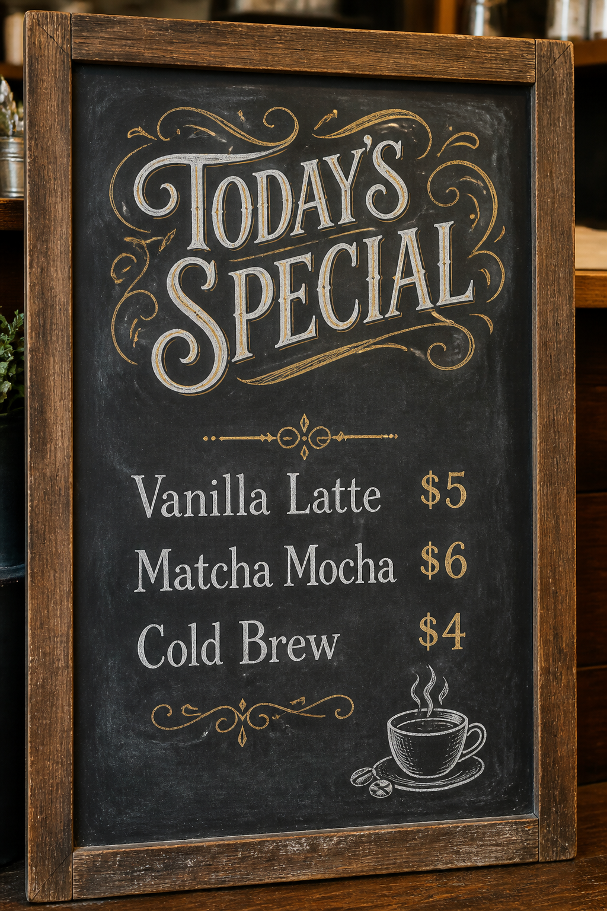</a>

<details>
<summary><b>02. Chalkboard Menu Typography</b> · Chalkboard / Hand-Lettered</summary>

```
A rustic wooden-framed chalkboard menu for a coffee shop. Elegant chalk hand-lettering in white and gold chalk marker. Header reads "TODAY'S SPECIAL" in large ornate script. Below, three items listed: "Vanilla Latte $5", "Matcha Mocha $6", "Cold Brew $4" in neat serif chalk writing. Small decorative flourishes and a coffee cup doodle in the corner. Realistic chalk texture with smudges. Photorealistic.
```

</details>
</td>
</tr>
<tr>
<td width="50%" valign="top">
<a href="images/10-text-rendering/03-gold-foil-calligraphy.jpg">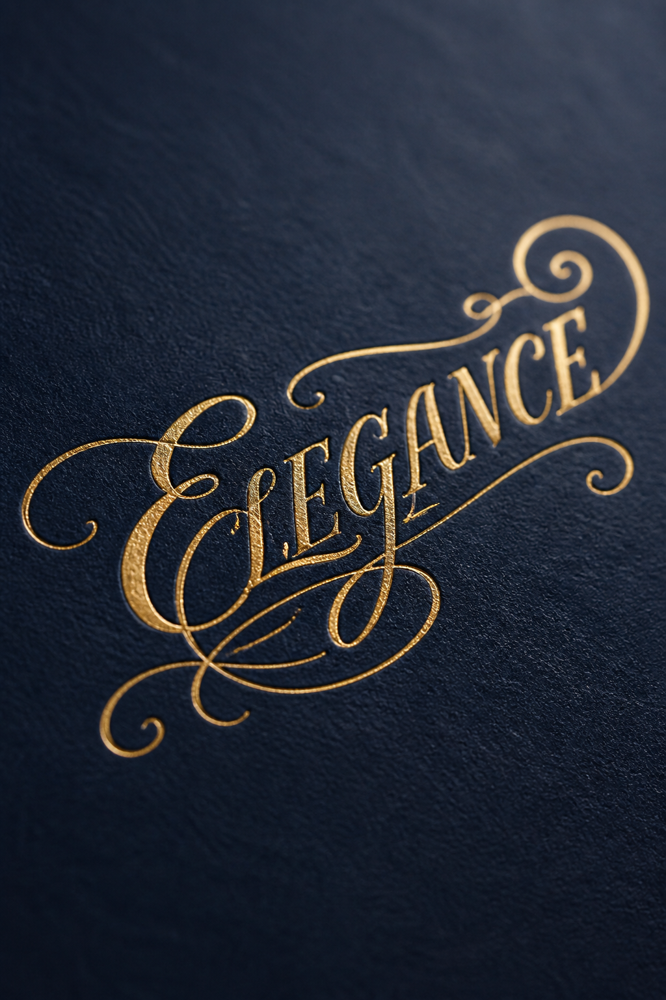</a>

<details>
<summary><b>03. Gold Foil Calligraphy</b> · Luxury Stationery / Gold Foil</summary>

```
Elegant gold foil calligraphy on deep navy blue cardstock. The word "ELEGANCE" is written in flowing Spencerian script with metallic gold foil that catches the light, showing subtle reflections and texture. Small decorative flourishes extend from the first and last letters. Macro close-up showing the foil texture and slight embossing on the paper surface. Luxury stationery photography. Ultra-detailed 4K.
```

</details>
</td>
<td width="50%" valign="top">
<a href="images/10-text-rendering/04-diner-menu-board-at-5-am.jpg">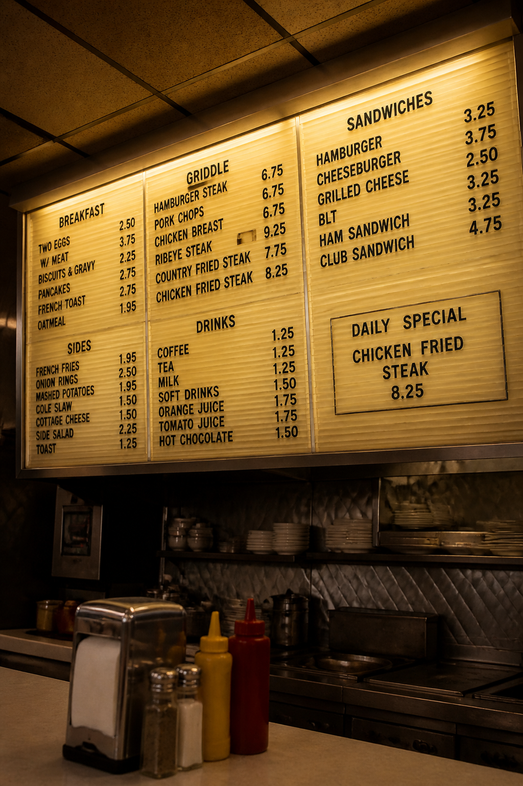</a>

<details>
<summary><b>04. Diner Menu Board at 5 AM</b> · Diner Signage / Documentary</summary>

```
Create a photoreal photograph of a 24 hour diner menu board at 5 in the morning, shot from the counter seat at slight angle. Plastic letter tracks, uneven letter spacing, one missing letter slot, yellowed light from incandescent bulbs, legible prices, categories labeled BREAKFAST, GRIDDLE, SANDWICHES, SIDES, DRINKS, and a daily special that reads CHICKEN FRIED STEAK 8.25. The type must be 100 percent readable and physically believable. No watermark, no brand logos, no text artifacts.
```

*Technique: Category headings in ALL CAPS without quotes. The daily special given as an exact line. "100 percent readable and physically believable" locks the finish.*

</details>
</td>
</tr>
<tr>
<td width="50%" valign="top">
<a href="images/10-text-rendering/05-billboard-with-exact-text.jpg">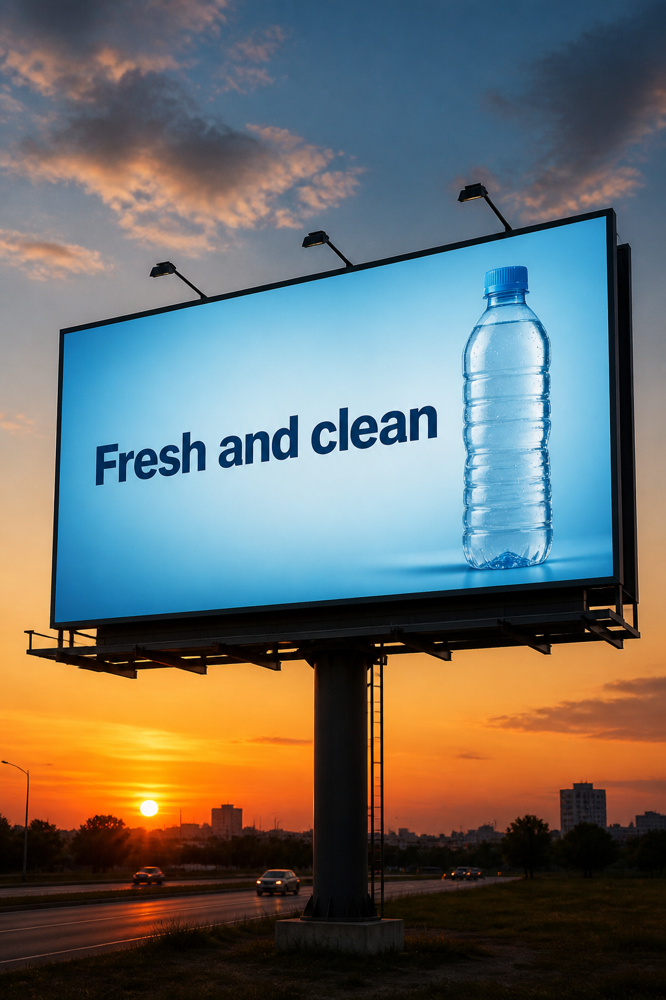</a>

<details>
<summary><b>05. Billboard with Exact Text</b> · Billboard Mockup / Advertising</summary>

```
Create a realistic roadside billboard mockup at sunset.

Billboard headline (EXACT TEXT, one line only):
"Fresh and clean"

Typography:
Bold sans serif, centered, high contrast, clean kerning, easy to read from a distance.

Layout:
Bottle on the right, headline on the left, generous negative space.

Constraints:
Render the text verbatim.
No extra words.
No duplicate text.
No additional logos.
No watermark.
```

*Technique: Mark text as EXACT TEXT, specify font style, size, color, and placement. State "no extra words" and "no duplicate text" to prevent ghosting.*

</details>
</td>
<td width="50%" valign="top">
<a href="images/10-text-rendering/06-protest-sign-in-rain.jpg"></a>

<details>
<summary><b>06. Protest Sign in Rain</b> · Documentary / Handwritten Text</summary>

```
Create a documentary photograph of a handmade cardboard protest sign held in winter rain.
The sign reads, across two lines: FUND THE LIBRARIES.
Wet cardboard edges, black marker bleeding slightly, gloved hand holding it, out-of-focus crowd behind, calm determined tone, overcast natural light.
The text must be legible.
No branding. No watermark.
```

</details>
</td>
</tr>
<tr>
<td width="50%" valign="top">
<a href="images/10-text-rendering/07-vintage-marquee-letters.jpg">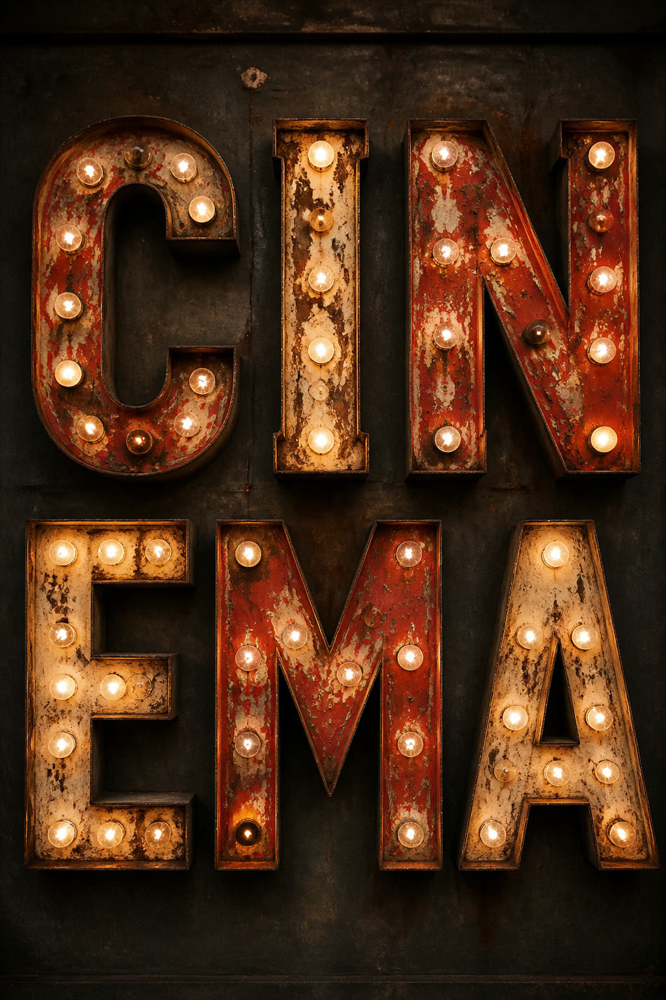</a>

<details>
<summary><b>07. Vintage Marquee Letters</b> · Vintage / Marquee Letters</summary>

```
Vintage marquee letters spelling "CINEMA" on a dark wall. Each letter is a separate metal-frame unit with exposed warm white bulbs, some slightly dimmed for character. The metal frames are rusted and weathered with layers of peeling paint in faded red and cream. Industrial vintage aesthetic. Shot straight-on with shallow depth of field. Ultra-detailed 4K.
```

</details>
</td>
<td width="50%" valign="top">
<a href="images/10-text-rendering/08-graffiti-wall-art.jpg">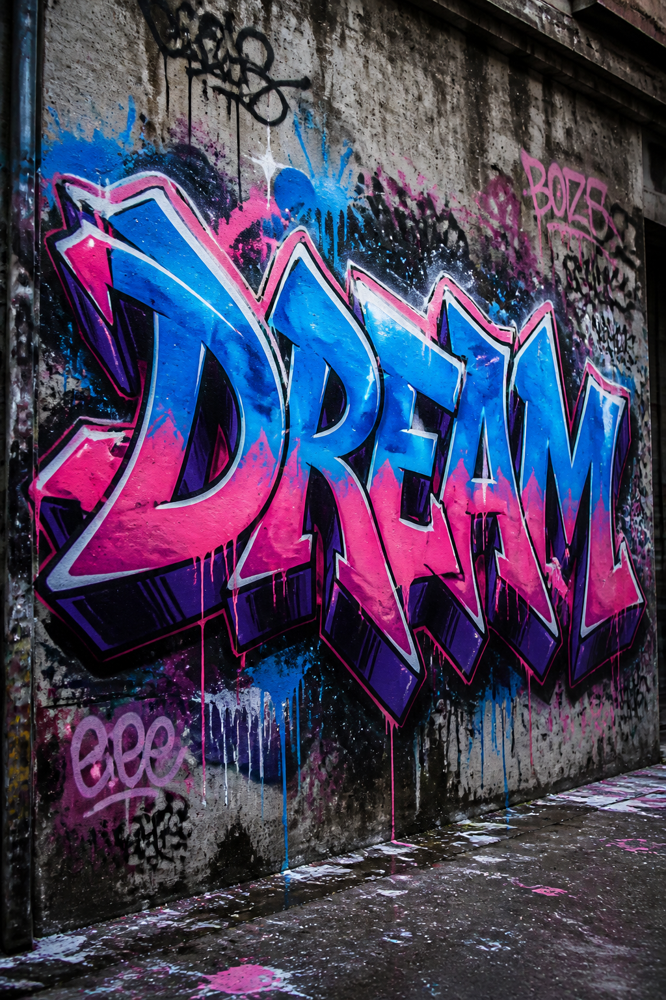</a>

<details>
<summary><b>08. Graffiti Wall Art</b> · Urban Street Art / Spray Paint</summary>

```
Urban graffiti mural on a concrete wall in a city alley. Large bold spray-painted letters reading "DREAM" in wildstyle graffiti with 3D depth effect. Colors: electric blue, hot pink, and white highlights on a dark purple shadow. Drip effects on the bottom of letters. Background has smaller tags and splashes. Raw urban street art photography. Ultra-detailed 4K.
```

</details>
</td>
</tr>
<tr>
<td width="50%" valign="top">
<a href="images/10-text-rendering/09-letterpress-printing.jpg"></a>

<details>
<summary><b>09. Letterpress Printing</b> · Artisan Craft / Macro</summary>

```
Close-up macro shot of letterpress printed text on thick cotton paper. The words "HELLO WORLD" in classic serif type, showing the characteristic deep impression into the paper and the slight ink variation characteristic of letterpress printing. Ink color is a deep rich navy blue. Paper is natural cream with visible fiber texture. Soft natural side-lighting reveals the debossed depth. Artisan craft photography. Ultra-detailed 4K.
```

</details>
</td>
<td width="50%" valign="top">
<a href="images/10-text-rendering/10-marketing-creative-with-exact-text.jpg">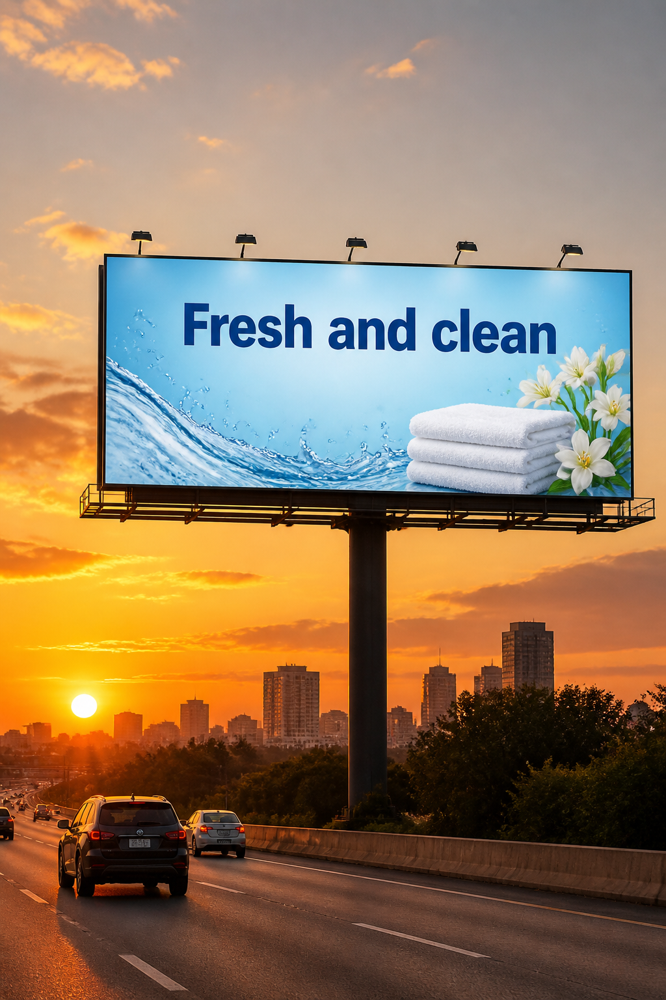</a>

<details>
<summary><b>10. Marketing Creative with Exact Text</b> · Advertising / In-Image Text</summary>

```
Create a realistic billboard mockup of the product on a highway scene during sunset.
Billboard text (EXACT, verbatim, no extra characters):
"Fresh and clean"
Typography: bold sans-serif, high contrast, centered, clean kerning.
Ensure text appears once and is perfectly legible.
No watermarks, no logos.
```

*Technique: Use `quality="medium"` or `quality="high"` for text-heavy images. "medium" works for large text; "high" is better for small or dense text.*

</details>
</td>
</tr>
<tr>
<td width="50%" valign="top">
<a href="images/10-text-rendering/11-thread-brand-campaign-ad.jpg">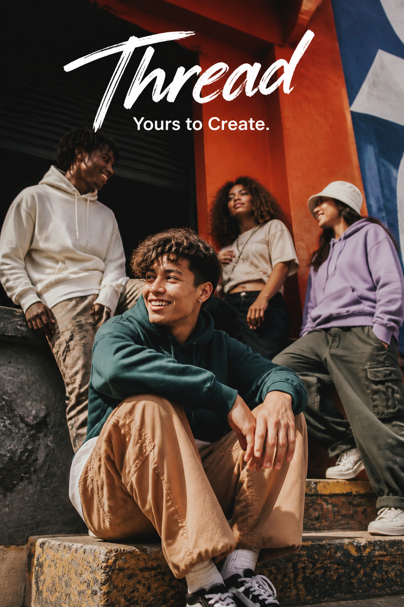</a>

<details>
<summary><b>11. Thread Brand Campaign Ad</b> · Fashion Campaign / Tagline</summary>

```
Give me a cool in culture ad / fashion shot for a brand called Thread.
It's a hip young street brand. The ad shows a group of friends hanging out together with the tagline "Yours to Create."
Make it feel like a polished campaign image for a youth streetwear audience: stylish, contemporary, energetic, and tasteful.
Use clean composition, strong color direction, natural poses, and premium fashion photography cues.
Render the tagline exactly once, clearly and legibly, integrated into the ad layout.
No extra text, no watermarks, no unrelated logos.
```

</details>
</td>
<td width="50%" valign="top">
<a href="images/10-text-rendering/12-skincare-instagram-story-ad.jpg">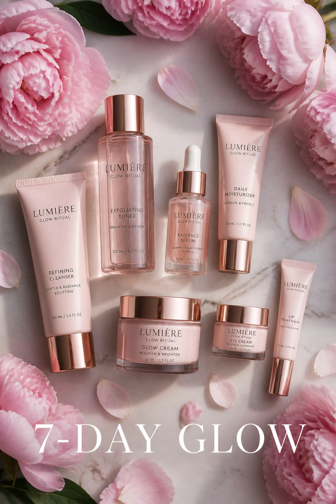</a>

<details>
<summary><b>12. Skincare Instagram Story Ad</b> · Social Media Ad / Flat Lay</summary>

```
A flat-lay photograph of a high-end skincare set on a marble surface. Surrounded by pink peony petals. Soft natural light. Clean white text at the bottom reads '7-DAY GLOW' in a modern serif font.
```

</details>
</td>
</tr>
<tr>
<td width="50%" valign="top">
<a href="images/10-text-rendering/13-viral-social-media-post-ai-is-here.jpg"></a>

<details>
<summary><b>13. Viral Social Media Post (AI IS HERE)</b> · 3D Illustration / Social Media</summary>

```
A 3D isometric illustration of a digital workspace. A glowing laptop in the center with a 3D speech bubble coming out of the screen saying 'AI IS HERE' in bold, clean 3D letters. Vibrant purple and blue color palette. Soft clay-style render, high-quality 3D art.
```

</details>
</td>
<td width="50%" valign="top">
<a href="images/10-text-rendering/14-youtube-thumbnail-the-fix.jpg">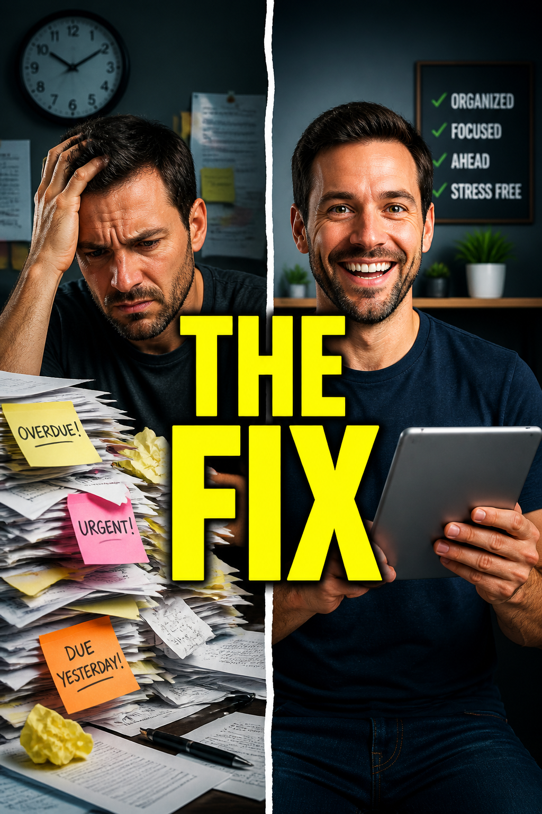</a>

<details>
<summary><b>14. YouTube Thumbnail (THE FIX)</b> · YouTube Thumbnail / Split Screen</summary>

```
A split-screen image. Left side: A frustrated man looking at a messy pile of papers. Right side: The same man smiling, holding a clean tablet. High-contrast colors, expressive facial features. Central text overlay in bright yellow: 'THE FIX'.
```

</details>
</td>
</tr>
<tr>
<td width="50%" valign="top">
<a href="images/10-text-rendering/15-bookstore-window-with-alphabet-poster.jpg">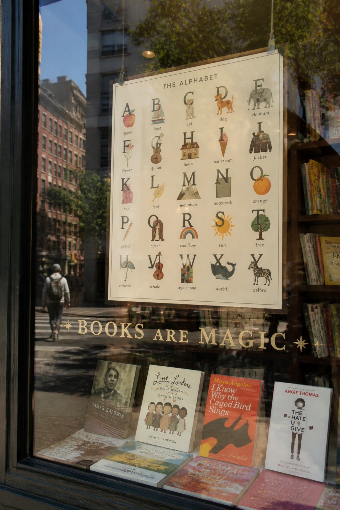</a>

<details>
<summary><b>15. Bookstore Window with Alphabet Poster</b> · Storefront / Window Display / Reflected Text</summary>

```
Create a photograph of a bookstore window with a readable alphabet poster and reflected street scene.
```

*Technique: Once the prompt treats copy as layout, the image can carry real reading load. Bookstore windows are excellent stress tests for text because they combine readable poster text with reflected street text on glass.*

</details>
</td>
<td width="50%" valign="top">
<a href="images/10-text-rendering/16-localization-translation-infographic.jpg">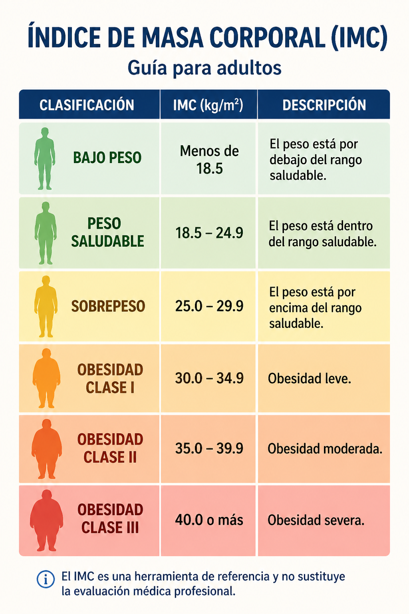</a>

<details>
<summary><b>16. Localization Translation (Infographic)</b> · Translation Edit / Preserve Layout</summary>

```
Translate the text in the infographic to Spanish. Do not change any other aspect of the image.
```

*Technique: This is an edit prompt. Provide the original image and the translation instruction. GPT Image 2 preserves typography style, placement, spacing, and hierarchy while translating verbatim.*

</details>
</td>
</tr>
</table>


---

## Prompt Engineering Guide

### The 8-Slot Formula

For complex scenes, use this structured template (borrowed from film production):

```
# SCENE
[Setting: location, time, weather, historical period]

# CHARACTERS
- Character A: [physical description, wardrobe, pose, expression]
- Background extras: [brief description]

# COMPOSITION
[Framing: wide/medium/close. Camera angle. Lens. Depth of field.]

# LIGHTING
[Source, direction, hardness, color temperature, shadow behavior]

# COLOR
[Palette in 3-4 color terms. Grading direction.]

# STYLE
[One dominant reference. E.g., "Roger Deakins cinematography"]

# TECHNICAL
[Resolution, film grain, aspect ratio, quality markers]

# EXCLUSIONS
[What to avoid: "No text, no logos, no watermarks"]
```

### Anti-Slop Rules

From the [fal.ai Prompting Guide](https://fal.ai/learn/tools/prompting-gpt-image-2):

1. **Visual facts over vague praise** -- Avoid: stunning, incredible, epic, masterpiece. Prefer: overcast daylight, brushed aluminum, chipped paint, 50mm feel.
2. **Style tags need visual targets** -- Instead of "minimalist brutalist luxury", use "Cream background, heavy black condensed sans serif, one hero object, generous negative space."
3. **Say the real thing** -- If the image must show a transit kiosk, say transit kiosk. Mood language buries the brief.
4. **In edits, separate change from preserve** -- Use "change only X" and "keep everything else the same."
5. **Treat text like typography** -- Wrap literal text in quotes, specify font style, size, color, and placement.
6. **One revision per turn** -- Small iterative edits beat one giant rewrite.

### Key Principles

1. **Lighting > Camera > Subject** -- You can get away with a vague subject if you nail the light direction and lens choice. The opposite is not true.
2. **Concrete nouns beat adjectives** -- "A 28-year-old woman with auburn hair in a camel trench coat crossing a Manhattan crosswalk at 6pm on a rainy Thursday" >> "A beautiful woman in a city."
3. **Name the style, not the artist** -- "Ufotable production quality" or "1970s giallo" works better than risking filter blocks on living artist names.
4. **One dominant style anchor** -- Past ~1,200 words, individual adjectives dilute. Pick one anchor style ("film noir") and let everything else support it.
5. **Setting first for complex scenes** -- Start with the environment, then introduce characters. "In a candle-lit 17th-century library..." frames everything that follows.

### Three Prompting Modes

GPT Image 2 supports three distinct workflows:

**1. Generate (text -> image):** Start from scratch with a structured prompt.
```
Scene: [where]
Subject: [who/what]
Important details: [materials, lighting, camera]
Use case: [editorial photo / product mockup / poster]
Constraints: [no watermark / no logos]
```

**2. Edit (text + image -> image):** Modify an existing image.
```
Change: [exactly what should change]
Preserve: [face, identity, pose, lighting, framing, background]
Constraints: [no extra objects, no redesign, no logo drift]
```

**3. Composite (text + multiple images -> image):** Combine elements from multiple inputs.
```
Image 1: base scene to preserve.
Image 2: style/object reference.
Instruction: [how they interact]
Preserve: [what must not drift]
```

### Prompt Length Guide

| Scene complexity | Recommended length |
|-----------------|-------------------|
| Simple portrait | 80-150 words |
| Cinematic wide shot | 150-250 words |
| Multi-character / campaign | 400-800 words |

### Common Failures & Fixes

| Problem | Fix |
|---------|-----|
| Generic, lifeless output | Use concrete nouns and named places |
| Wrong finger count | Give hands something to hold, or crop to shoulders-up |
| Garbled text in image | Keep text very short ("sign reads OPEN") or add "no text, no letters, no words" |
| Lighting direction ignored | Name direction, hardness, and shadow coverage specifically |
| Wrong setting | Move the setting description to the front of the prompt |
| Overcrowded prompt | Keep one dominant style anchor, limit to ~1,200 words |
| Model "plastic" look | Add "visible pores," "fabric weave," "film grain," or "Shot on Sony A7R IV" |
| Edit drifts from original | Re-state the preserve list on every iteration |

## Structured Template

See [templates/structured-prompt-template.md](templates/structured-prompt-template.md) for a copy-paste template you can use for any scene.

## Sources & Credits

### Official
- [OpenAI Official Prompting Guide](https://developers.openai.com/cookbook/examples/multimodal/image-gen-models-prompting-guide) -- The definitive guide with production patterns
- [OpenAI API Documentation](https://platform.openai.com/docs/guides/images) -- API reference
- [Introducing ChatGPT Images 2.0](https://openai.com/index/introducing-chatgpt-images-2-0/) -- Official announcement

### Community & Guides
- [fal.ai GPT Image 2 Prompting Guide](https://fal.ai/learn/tools/prompting-gpt-image-2) -- Structured template, anti-slop rules, copy-paste library
- [EvoLink.ai GPT Image 2 Prompts](https://evolink.ai/gpt-image-2-prompts) -- 100+ curated prompt examples
- [NoteGPT GPT Image 2 Prompt Guide](https://notegpt.io/blog/gpt-image-2-prompt-guide-use-cases) -- 30 real use cases
- [gpt-image2-ai.org Prompt Guide](https://gpt-image2-ai.org/blog/gpt-image-2-prompt-guide) -- 50+ examples with failure fixes
- [r/PromptEngineering](https://reddit.com/r/PromptEngineering) -- Community prompt patterns
- [r/ChatGPT](https://reddit.com/r/ChatGPT) -- Prompt sharing and tips

### Related Repos
- [YouMind-OpenLab/awesome-gpt-image-2](https://github.com/YouMind-OpenLab/awesome-gpt-image-2) -- 2000+ prompts, 16 languages
- [wuyoscar/gpt_image_2_skill](https://github.com/wuyoscar/gpt_image_2_skill) -- Prompt gallery + agentic skill + CLI
- [jamez-bondos/awesome-gpt4o-images](https://github.com/jamez-bondos/awesome-gpt4o-images) -- 106 curated GPT-4o image cases
- [f/awesome-chatgpt-prompts](https://github.com/f/awesome-chatgpt-prompts) -- 143k stars, general ChatGPT prompts
- [dair-ai/Prompt-Engineering-Guide](https://github.com/dair-ai/Prompt-Engineering-Guide) -- Comprehensive PE guide
- [willwulfken/MidJourney-Styles-and-Keywords-Reference](https://github.com/willwulfken/MidJourney-Styles-and-Keywords-Reference) -- Midjourney style reference

## Contributing

We welcome contributions! See [CONTRIBUTING.md](CONTRIBUTING.md) for guidelines.

## License

This project is licensed under the MIT License - see [LICENSE](LICENSE) for details.

---

<p align="center">
  Made with care for the AI image generation community
</p>
