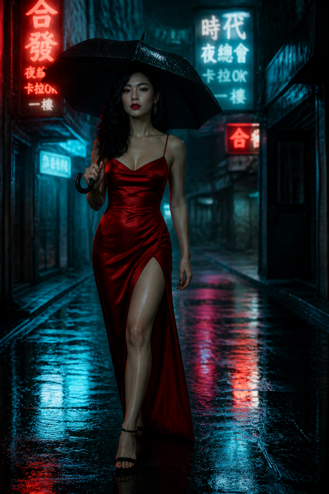
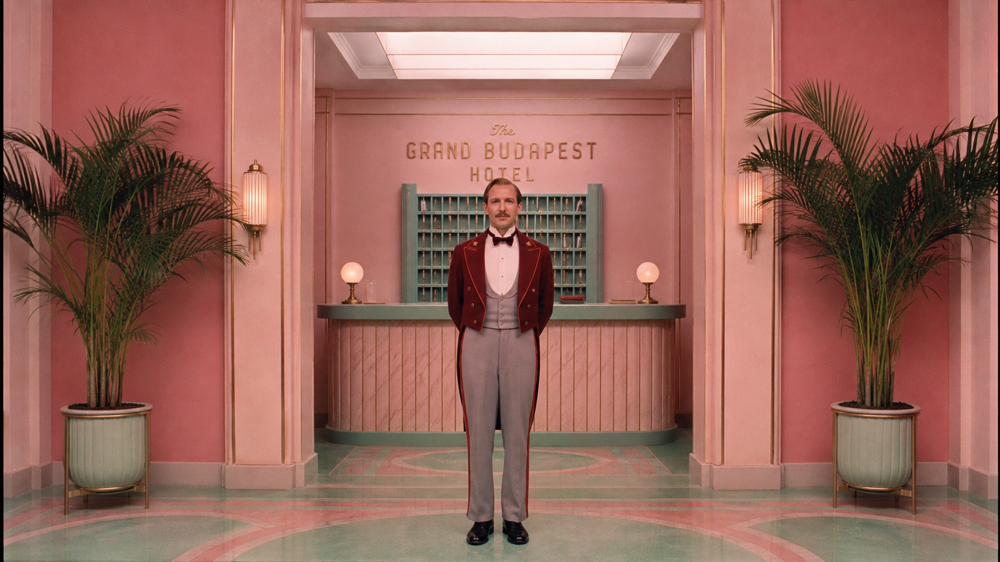

# Cinematic Portraits

Film stills, editorial headshots, moody portraits, and dramatic character photography.

---

## 01. Neo-Noir Hong Kong Alley

**Style:** Film Noir / Cinematic
**Source:** [gpt-image2-ai.org](https://gpt-image2-ai.org/blog/gpt-image-2-prompt-guide)

```
Film noir cinematic shot. A dangerously beautiful femme fatale in a curve-hugging red silk dress with a thigh-high slit, walking through a rain-soaked Hong Kong back alley at night. Neon signs in Chinese characters reflect red and blue on the wet cobblestones. She carries a black umbrella over one shoulder, her red-painted lips the only warm color against the cold teal lighting. Smoke wisps from a nearby vent. Anamorphic lens, shallow depth of field, cinematic grain. Ultra-realistic 4K noir film frame.
```



**Technique:** The color story (red against teal) is explicit, the camera is named (anamorphic), and the era (film noir) gives the model a stylistic anchor.

---

## 02. Jazz Bar Rembrandt Lighting

**Style:** Film Noir / Moody Interior
**Source:** [gpt-image2-ai.org](https://gpt-image2-ai.org/blog/gpt-image-2-prompt-guide)

```
Moody jazz bar interior. A mysterious woman in a sheer black lace dress sits on a velvet barstool, one leg crossed showing stiletto heels. Cigarette smoke curls around her silhouette. Warm amber spotlight from above illuminates her face and exposed collarbones while the rest fades into deep shadow. A saxophone player is a blurred silhouette in the background. Film noir meets modern luxury aesthetic. Dramatic Rembrandt lighting, 35mm film look. Ultra-realistic 4K.
```


---

## 03. Blade Runner Rooftop

**Style:** Cyberpunk / Cinematic
**Source:** [gpt-image2-ai.org](https://gpt-image2-ai.org/blog/gpt-image-2-prompt-guide)

```
Cyberpunk cinematic wide shot. A lone detective in a wet black trench coat stands on a neon-drenched Tokyo rooftop at 3am. Giant holographic advertisements of a geisha float across the skyline behind him, casting shifting pink and cyan light on his face. Light rain catches the glow. Flying cars streak past as horizontal light trails. Shot on anamorphic lens, 2.39:1 aspect, shallow depth of field. Blade Runner 2049 color grade -- teal shadows, orange highlights. Ultra-realistic 4K cinematic frame.
```


---

## 04. Wes Anderson Symmetrical Hotel Lobby

**Style:** Symmetrical / Pastel Cinematic
**Source:** [gpt-image2-ai.org](https://gpt-image2-ai.org/blog/gpt-image-2-prompt-guide)

```
Wes Anderson style cinematic composition. A 1960s hotel concierge in a burgundy uniform stands dead-center in a pastel-pink Art Deco lobby, flanked by perfectly symmetrical potted palms and brass sconces. Flat front-on framing, everything on center axis. Soft fluorescent overhead lighting. Pastel pink and mint green color palette. 35mm film look. Ultra-detailed 4K.
```



---

## 05. Korean Thriller Kitchen Standoff

**Style:** Crime Thriller / Tension
**Source:** [gpt-image2-ai.org](https://gpt-image2-ai.org/blog/gpt-image-2-prompt-guide)

```
Cinematic still from a modern Korean crime thriller. Two men face each other across a small Seoul apartment kitchen at 2am, both holding knives but frozen in a tense moment. Single fluorescent tube overhead casts hard green-tinted light and harsh shadows. Steam rises from an abandoned pot on the stove. Tight composition, 40mm lens, handheld feel. Bong Joon-ho style. Ultra-realistic 4K.
```


---

## 06. French New Wave Cafe

**Style:** Black & White / Vintage Cinematic
**Source:** [gpt-image2-ai.org](https://gpt-image2-ai.org/blog/gpt-image-2-prompt-guide)

```
Black and white French New Wave cinematic still. A young woman in a striped Breton shirt and dark bob haircut smokes at a Paris cafe table in 1962. She looks off-camera with soft intensity. Natural window light, high contrast, slightly overexposed highlights. Film grain visible. Godard aesthetic. 35mm monochrome, 50mm lens. Ultra-detailed.
```


---

## 07. Miami Vice Neon Drive

**Style:** 1980s Retro / Neon Cinematic
**Source:** [gpt-image2-ai.org](https://gpt-image2-ai.org/blog/gpt-image-2-prompt-guide)

```
1980s Miami Vice cinematic shot. A woman in a white linen blazer drives a red convertible at night through downtown Miami. Palm trees and neon motel signs blur past. She looks at the camera with sunglasses reflecting the pink and turquoise glow of the city. Lens flare, soft film grain. Teal and magenta color grade. Ultra-realistic 4K.
```


---

## 08. Studio Ghibli Live-Action Adaptation

**Style:** Live-Action Anime / Pastoral
**Source:** [gpt-image2-ai.org](https://gpt-image2-ai.org/blog/gpt-image-2-prompt-guide)

```
Cinematic still styled as a live-action Studio Ghibli adaptation. A young woman in a simple blue linen dress stands in a vast green hillside field, wind blowing her hair and skirt. Fluffy white clouds race overhead. Soft golden hour light. Warm, painterly color grading with gentle film grain. Wide lens, low-angle composition making her heroic against the sky. Ultra-detailed 4K.
```


---

## 09. Candid Elderly Sailor

**Style:** Documentary / Photorealistic
**Source:** [OpenAI Official Cookbook](https://developers.openai.com/cookbook/examples/multimodal/image-gen-models-prompting-guide)

```
Create a photorealistic candid photograph of an elderly sailor standing on a small fishing boat. He has weathered skin with visible wrinkles, pores, and sun texture, and a few faded traditional sailor tattoos on his arms. He is calmly adjusting a net while his dog sits nearby on the deck. Shot like a 35mm film photograph, medium close-up at eye level, using a 50mm lens. Soft coastal daylight, shallow depth of field, subtle film grain, natural color balance. The image should feel honest and unposed, with real skin texture, worn materials, and everyday detail. No glamorization, no heavy retouching.
```


---

## 10. Reflection Self-Portrait in Night Train

**Style:** Intimate / Cinematic Travel
**Source:** [fal.ai Prompting Guide](https://fal.ai/learn/tools/prompting-gpt-image-2)

```
Create a reflection self portrait in a night train window showing a young traveler with headphones and a tired expression, while the landscape outside blurs past at speed. Cool overhead train light mixed with warm town lights outside, ghosted double reflection on the glass, condensation at the edge, a thermos and a book on the tray table. Cinematic but believable. No watermark.
```


---

## 11. Professional LinkedIn Headshot

**Style:** Studio Portrait / Professional
**Source:** [NoteGPT](https://notegpt.io/blog/gpt-image-2-prompt-guide-use-cases)

```
A professional medium-shot portrait of a confident woman in her 30s wearing a tailored navy blue blazer. Neutral grey studio background. Soft three-point lighting. Realistic skin texture, visible pores, and natural hair strands. 8k resolution, shot on 85mm lens.
```


---

## 12. Quiet Still Life - Elderly Hands

**Style:** Documentary / Intimate Portrait
**Source:** [fal.ai Prompting Guide](https://fal.ai/learn/tools/prompting-gpt-image-2)

```
Create a tight medium format portrait of an elderly woman's hands peeling garlic at a worn wooden kitchen table. Window light from camera left, faded floral housedress sleeves, a chipped porcelain bowl half full of peeled cloves, papery garlic skins scattered. Every wrinkle and nail imperfection visible, warm color palette, no stylization. No watermark.
```


**Technique:** Medium format feel, north-window light, wrinkles, nail imperfection. Restraint is the aesthetic -- specify visible imperfections to avoid plastic-looking results.

---

## 13. Convenience Store Neon Portrait

**Style:** Editorial / Neon Street Photography
**Source:** [EvoLink.ai](https://evolink.ai/gpt-image-2-prompts)

```
35mm film photography with harsh convenience store fluorescent lighting mixed with colorful neon signs from outside, authentic film grain, high contrast, cinematic street editorial style, intimate medium shot, late-night convenience store atmosphere, realistic reflections on glass, natural skin texture, oversized white shirt, black mini skirt, messy high ponytail, seductive but grounded urban portrait energy, no watermark, no text.
```


---

## 14. Soft Black Mist Idol Portrait

**Style:** Korean Idol / Soft Editorial
**Source:** [EvoLink.ai](https://evolink.ai/gpt-image-2-prompts)

```
9:16 vertical -- Korean idol portrait photography, single subject. Soft black mist filter effect, lowered contrast, gentle highlight bloom, subtle glow, soft diffusion, slightly faded blacks. Minimal indoor setting near window, white curtains, clean light-toned background. Young Korean female idol, natural minimal makeup, dewy realistic skin texture, subtle imperfections. Outfit: oversized white button-up shirt with short bottoms, slightly loose fit, soft and casual styling. Hair: long dark hair, slightly messy, natural volume, softly flowing. Pose: relaxed standing or slight lean, body subtly angled, one leg slightly forward, shoulders relaxed. Expression: soft cute smile, slightly playful eyes, direct or slightly off-camera gaze. Camera: close to mid-body framing, eye-level, intimate distance. Lighting: diffused natural daylight, soft shadows, gentle light wrapping around face and body. Mood: cute yet subtly sensual, intimate, everyday softness. Quality: ultra-realistic, fine film grain, slight softness at edges, natural imperfections, dreamy understated tone.
```


---

## 15. Villeneuve Desert Epic

**Style:** Epic Cinematic / Landscape-Scale
**Source:** [gpt-image2-ai.org](https://gpt-image2-ai.org/blog/gpt-image-2-prompt-guide)

```
Epic cinematic wide shot in Denis Villeneuve style. A lone hooded figure in flowing desert robes walks across a vast orange sand dune at sunset. The sun is enormous on the horizon, casting elongated shadows. Scale is extreme -- the figure is tiny, the landscape overwhelming. Dust kicks up in the wind. Warm amber palette with deep violet shadows. Shot on 65mm, ultra-wide aspect. Ultra-realistic 4K cinematic quality.
```


---

## 16. Fenty Beauty Macro Portrait

**Style:** Beauty Editorial / Macro Photography
**Source:** [gpt-image2-ai.org](https://gpt-image2-ai.org/blog/gpt-image-2-prompt-guide)

```
Extreme close-up beauty portrait. A stunning model with wet dewy skin and tousled damp hair, bare shoulders glistening. Water droplets on her face and neck catch the light of a ring light. Flawless skin texture in macro detail -- every pore, every water droplet razor sharp. Smoky eye makeup with subtle gold shimmer. Lips slightly parted, intense gaze at camera. Dark background. Fenty Beauty campaign aesthetic. 85mm macro lens, f/1.4, ultra-shallow depth of field. Ultra-realistic 4K.
```


---

## 17. Golden Hour Romantic Portrait

**Style:** Romantic / Golden Hour Photography
**Source:** [gpt-image2-ai.org](https://gpt-image2-ai.org/blog/gpt-image-2-prompt-guide)

```
Sun-drenched golden hour portrait. A woman in a flowing cream linen dress stands in a wheat field at 7pm on a summer evening. The sun is low behind her, creating a halo of golden backlight through her hair and the sheer fabric. Lens flare across the frame. Her eyes are closed, face tilted up to the warmth. 135mm telephoto lens, f/2, compressed background. Warm honey color grade. Ultra-realistic 4K.
```


---

## 18. Dark Academia Library Portrait

**Style:** Editorial / Dark Academia
**Source:** [gpt-image2-ai.org](https://gpt-image2-ai.org/blog/gpt-image-2-prompt-guide)

```
Dark academia editorial portrait. A young woman with auburn hair in a loose braid wears a wool cardigan over a white collared shirt in an old university library. She holds an open leather-bound book, reading by the light of a green banker's lamp. Towering bookshelves around her fade into shadow. Warm tungsten light, deep navy and olive color palette. 50mm lens, f/2.8. Ultra-realistic 4K.
```


---

## 19. Art Deco Penthouse Fashion Editorial

**Style:** Luxury Fashion / Editorial
**Source:** [gpt-image2-ai.org](https://gpt-image2-ai.org/blog/gpt-image-2-prompt-guide)

```
A breathtaking young woman with flowing auburn hair stands in a luxurious Art Deco penthouse at golden hour. She wears a champagne-colored satin slip dress that catches the warm light. Floor-to-ceiling windows behind her show a panoramic city sunset. Dramatic side lighting creates deep shadows and golden highlights on her face and bare arms. The composition follows the rule of thirds. Cinematic depth of field with gorgeous city bokeh. Fashion editorial quality. Ultra-realistic 4K.
```


**Technique:** Same subject as "A woman standing in a room" but every ambiguity has been resolved for the model.

---

## 20. 35mm Flash Editorial Portrait

**Style:** 35mm Film / Flash Photography / Fashion
**Source:** [EvoLink.ai](https://evolink.ai/gpt-image-2-prompts)

```
35mm color film photography with harsh direct on-camera flash, specular highlights on skin and clothing, strong catchlights in eyes, high contrast flash illumination, authentic film grain and color shift, high fashion fresh innocent basketball court editorial style, intimate first-person low-angle POV shot from below, early 20s East Asian female with delicate refined features, seductive almond-shaped eyes with natural double eyelids, flawless realistic porcelain skin with cool ivory undertone and visible flash specular highlights, fine skin texture with subtle pores and natural dewy glow under flash, fresh natural sporty makeup, subtle natural flush on cheeks, natural pink lips slightly parted, long dark brown hair tied in a high playful ponytail with loose strands framing the face, wearing a loose white tank top and white high-waisted basketball shorts, white knee-high sports socks, leaning pose against basketball hoop pole on outdoor court at dusk, harsh direct on-camera flash creating sharp specular highlights and strong catchlights, blurred basketball court and hoop under dusk sky, authentic 35mm direct flash film color grading, no watermark, no text.
```


---

## 21. Vertical Wuxia Heroine Portrait

**Style:** Wuxia / Eastern Fantasy / Cinematic
**Source:** [EvoLink.ai](https://evolink.ai/gpt-image-2-prompts)

```
9:16 vertical, ultimate wuxia style, a stunning young Eastern swordswoman, cold and sharp phoenix eyes, porcelain skin, long straight black hair wet and windswept. Wearing a soaked dark black martial arts outfit with a wide-sleeved dark robe, blown dramatically by the wind. A soft sword belt at the waist, long boots, right hand holding an ancient sword emitting a faint blue sword qi glow. Dynamic pose: body slightly turned, looking back over shoulder, robes billowing. Background: moonlit rain-mist-covered bamboo forest path, giant full moon, stone path, ancient lanterns, thin mist and rain. Dramatic cold moonlight combined with blue sword qi, wet-surface water reflections, ultra-dynamic feel with detailed fabric folds, hair strand movement, and realistic water droplet reflections. Cinematic lighting, 8K, masterpiece, ultra realistic, dramatic atmosphere.
```


---

## 22. Moody Monochrome Portrait

**Style:** Black & White / Dramatic
**Source:** [gpt-image2-ai.org](https://gpt-image2-ai.org/blog/gpt-image-2-prompt-guide)

```
Dramatic black and white portrait. A man with a short salt-and-pepper beard and intense dark eyes stares into the lens. Only half his face is lit -- hard side light from camera right, pure black shadow on the other side. Textured gray background fades to black. Shot on medium format film aesthetic, 80mm lens. Film grain. Peter Lindbergh style monochrome. Ultra-detailed.
```


---

## 23. Soft Airy 35mm Portrait

**Style:** Analog Film / Japanese Aesthetic
**Source:** [EvoLink.ai](https://evolink.ai/gpt-image-2-prompts)

```
Analog 35mm film photography, soft airy Japanese-style aesthetic, gentle diffused natural window light, slight overexposure, pastel tones, low contrast, soft highlights, minimal indoor setting near a window with white curtains, clean light-colored wall, natural composition, eye-level, slightly closer full-body framing (mid-thigh to head), young East Asian woman, natural minimal makeup, soft realistic skin texture, long slightly messy dark hair, oversized white button-up shirt, light casual shorts, barefoot, simple and relaxed styling, standing naturally with relaxed posture, arms loosely at sides, facing camera, gentle soft smile, subtle stillness, focus on light, air, and quiet everyday mood, soft film grain, dreamy and understated atmosphere.
```


---

## 24. Woodstock Crowd Scene (World Knowledge)

**Style:** Documentary / Historical
**Source:** [OpenAI Official Cookbook](https://developers.openai.com/cookbook/examples/multimodal/image-gen-models-prompting-guide)

```
Create a realistic outdoor crowd scene in Bethel, New York on August 16, 1969.
Photorealistic, period-accurate clothing, staging, and environment.
```


**Technique:** GPT Image 2 leverages world knowledge -- it infers Woodstock from the date/location without being explicitly told.

---

## 25. Fishmonger at Dawn

**Style:** Documentary / Reportage
**Source:** [fal.ai Prompting Guide](https://fal.ai/learn/tools/prompting-gpt-image-2)

```
Create a color documentary photograph of a fishmonger unpacking crates of mackerel onto crushed ice at a small coastal market just after dawn. Steam from breath in the cold air, rubber boots, wet concrete floor, incandescent work lamp spilling warm light, a paper ledger with handwritten prices clipped to a wooden post. Realistic skin texture and fish scales, shallow depth of field, 35mm feel. No commercial styling, no watermark.
```


**Technique:** Cold air, wet floor, a named lamp, a named lens. The image reads as a real photograph because each detail was specified.
