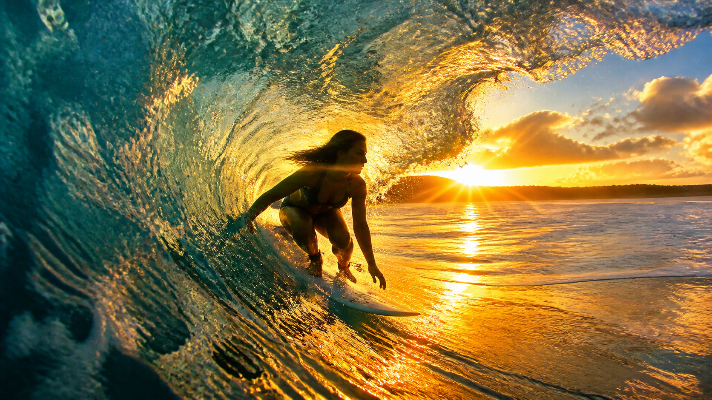

# Action & Sports

Frozen motion, dynamic scenes, athletic photography, and high-speed capture.

---

## 01. Nike Training Freeze-Frame

**Style:** Sports / Frozen Motion
**Source:** [gpt-image2-ai.org](https://gpt-image2-ai.org/blog/gpt-image-2-prompt-guide)

```
Dynamic action freeze-frame. An athletic woman in a fitted sports bra and high-waisted compression shorts executes a powerful spinning roundhouse kick. Water splashes frozen in mid-air around her legs and feet in a dramatic spray pattern. Her toned abs and defined muscles visible. Dramatic single-source rim lighting from behind creates a glowing silhouette edge. Dark studio background. Nike Training campaign energy. High-speed photography feel -- ultra-sharp subject, motion blur on water droplets. Ultra-realistic 4K.
```


**Technique:** Rim light from behind is what sculpts the silhouette against a chaotic background.

---

## 02. Big-Wave Surfer Barrel

**Style:** Surf Photography / Epic Action
**Source:** [gpt-image2-ai.org](https://gpt-image2-ai.org/blog/gpt-image-2-prompt-guide)

```
Epic wide-angle shot of a female surfer riding inside a massive crystal-clear barrel wave at golden hour. Her silhouette and athletic body visible through the translucent turquoise water of the wave tube. Golden sunlight creates an explosion of light and water mist behind her. Dramatic backlit composition. The wave is enormous and perfectly formed. GoPro-style immersive perspective. Ultra-realistic 4K cinematic quality.
```



---

## 03. Parkour Rooftop Leap

**Style:** Urban Action / High-Speed
**Source:** [gpt-image2-ai.org](https://gpt-image2-ai.org/blog/gpt-image-2-prompt-guide)

```
High-speed action shot of a parkour athlete mid-leap between two Brooklyn rooftops at sunset. Frozen at the apex of the jump, arms and legs extended, silhouetted against a burning orange sky. The gap below him is dizzying -- city streets far below. Motion blur on the trailing edge of his hoodie. Shot from a drone at his height, 35mm lens. Ultra-realistic 4K cinematic action.
```


---

## 04. MMA Ring Spotlight

**Style:** Fight Photography / High Contrast
**Source:** [gpt-image2-ai.org](https://gpt-image2-ai.org/blog/gpt-image-2-prompt-guide)

```
Dramatic fight night action. A female MMA fighter mid-spinning back elbow, sweat flying from her hair in a visible arc of droplets. Single harsh overhead ring spotlight isolates her from pure black background -- classic boxing photography look. Her opponent is a blurred silhouette out of focus. 70-200mm lens at 200mm, f/2.8, 1/2000 shutter frozen motion. High contrast, desaturated. Ultra-detailed 4K.
```


---

## 05. Motocross Dust Storm

**Style:** Motorsport / Low-Angle Action
**Source:** [gpt-image2-ai.org](https://gpt-image2-ai.org/blog/gpt-image-2-prompt-guide)

```
Low-angle action shot of a motocross rider airborne over a dirt jump, red desert dust exploding behind the rear tire. Late afternoon sun casts long shadows. The bike is tilted aggressively mid-trick. Camera is just above ground level looking up, making the jump look monumental. Anamorphic lens flare from the sun. Orange and teal color grade. Ultra-realistic 4K action.
```


---

## 06. Ballet Grand Jete Studio

**Style:** Dance / Chiaroscuro
**Source:** [gpt-image2-ai.org](https://gpt-image2-ai.org/blog/gpt-image-2-prompt-guide)

```
Contemporary ballet dancer mid-grand jete frozen in the air, arms extended, body perfectly horizontal. She wears a simple nude leotard. Plain gray cyclorama studio background. Strong side-light from camera left creates a sculptural chiaroscuro on her musculature. Powder disturbed from the floor traces her leap in a soft cloud. 1/4000 shutter speed feel. Ultra-detailed 4K.
```


---

## 07. Basketball Slam Dunk

**Style:** Sports / Low-Angle Hero
**Source:** [gpt-image2-ai.org](https://gpt-image2-ai.org/blog/gpt-image-2-prompt-guide)

```
Low-angle hero shot of a male basketball player mid-slam dunk, one hand gripping the rim, body extended diagonally across the frame. Arena lights streak as lens flares. Crowd is a soft blurred wall of phone flashes behind him. Frozen sweat and net motion. Shot on 24mm wide from directly below the hoop. NBA official photography energy. Ultra-realistic 4K.
```


---

## 08. Horse Gallop Ocean Splash

**Style:** Equestrian / Nature Action
**Source:** [gpt-image2-ai.org](https://gpt-image2-ai.org/blog/gpt-image-2-prompt-guide)

```
A rider on a powerful black horse gallops through knee-deep shallow ocean water at sunrise. Water explodes from each hoofstrike, frozen in a dramatic spray. The rider is leaned low, hair streaming behind. Warm golden backlight from the rising sun. Mist rising off the water. Shot at 1/4000 shutter, 200mm telephoto compression. Ultra-realistic 4K equine photography.
```


---

## 09. Bear Attack Campsite Action Scene

**Style:** Survival Thriller / Photorealistic Edit
**Source:** [OpenAI Official Cookbook](https://developers.openai.com/cookbook/examples/multimodal/image-gen-models-prompting-guide)

```
Generate a highly realistic action scene where this person is running away from a large, realistic brown bear attacking a campsite. The image should look like a real photograph someone could have taken, not an overly enhanced or cinematic movie-poster image. She is centered in the image but looking away from the camera, wearing outdoorsy camping attire, with dirt on her face and tears in her clothing. She is clearly afraid but focused on escaping, running away from the bear as it destroys the campsite behind her. The campsite is in Yosemite National Park, with believable natural details. The time of day is dusk, with natural lighting and realistic colors. Everything should feel grounded, authentic, and unstyled, as if captured in a real moment. Avoid cinematic lighting, dramatic color grading, or stylized composition.
```


**Technique:** This is an edit prompt (image+text to image). Use `input_fidelity: "high"` to preserve the subject's identity while changing the entire scene.
