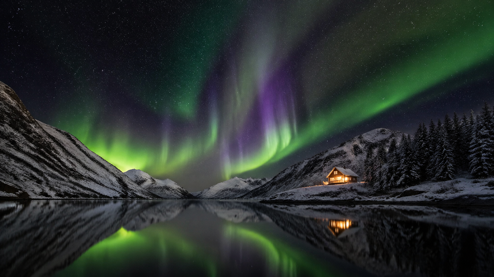

# Nature & Landscapes

Aerial views, atmospheric scenes, and travel photography prompts.

> For landscapes, the power words are **time of day**, **atmospheric condition**, and **vertical scale**. The model has a strong prior for generic "pretty nature" — push it past that.

---

## 1. Waterfall Mist Ethereal

```
Ethereal fantasy nature scene. A graceful young woman in a flowing sheer gossamer dress stands at the edge of a towering waterfall cliff. Dense tropical mist swirls around her legs and the translucent fabric. She extends one arm toward the cascade, water droplets catching golden light. Aerial perspective slightly from above showing the dramatic cliff drop. Lush green ferns frame the composition. Golden hour light filtering through the mist. Ultra-realistic 4K cinematic quality.
```


## 2. Maldives Aerial Float

```
Overhead drone shot of a beautiful woman in a minimal white bikini floating on her back in crystal-clear turquoise shallow water over white sand in the Maldives. Her long dark hair fans out in the water like a halo. The water is so clear her full body is visible through the translucent surface. Tiny fish swim nearby. Travel photography editorial style. Ultra-realistic 4K aerial quality.
```


## 3. Iceland Black Sand Beach

```
Dramatic wide landscape of Iceland's Reynisfjara black sand beach at dawn. Massive basalt sea stacks rise from the churning North Atlantic. Low fog drifts across the black sand. A single figure in a red rain jacket walks along the shoreline for scale. Moody desaturated color grade — almost monochrome with just the red jacket as accent. 24mm wide lens, f/11 for deep focus. Ultra-detailed 4K.
```


## 4. Redwood Cathedral Light

```
Vertical composition looking up through towering California redwood trees. Shafts of golden morning sunlight cut through the fog between the trunks like cathedral light rays. Ferns carpet the forest floor. A tiny hiker in the distance gives scale. Ultra-wide 14mm lens distorting the trunks into a radial pattern toward the sky. Warm green and gold palette. Ultra-realistic 4K nature photography.
```


## 5. Patagonia Mountain Reflection

```
Perfect mirror reflection of the jagged Torres del Paine peaks in a glass-still Patagonian alpine lake at blue hour. Pink and purple alpenglow on the snow-capped summits. A single orange tent on the near shore as human scale. Complete symmetry — upper and lower half of frame are near-mirror images. 35mm lens, f/11. Ultra-realistic 4K landscape.
```


## 6. Sahara Dune Storm

```
Vast Sahara desert at the start of a sandstorm. Rolling orange dunes extend to the horizon, with a towering wall of sand approaching from the left. A lone nomadic figure on camelback is silhouetted against the dust cloud. Sun struggles through the haze as a dim orange disc. Cinematic wide-angle, heavy atmospheric haze. Monochromatic warm orange palette. Ultra-detailed 4K.
```


## 7. Northern Lights Cabin

```
Wide landscape of a tiny warm-lit wooden cabin in a Norwegian fjord valley at 1am. A spectacular green and purple aurora borealis dances overhead, reflecting in the still black fjord water. Snow-dusted pine trees and mountains frame the scene. The cabin glow is the only warm color in an otherwise cold composition. 20-second long exposure feel. Ultra-realistic 4K astrophotography.
```



## 8. African Savanna Sunset

```
Cinematic wide shot of a family of elephants crossing a golden savanna at sunset in Kenya. The sun is a huge orange disc on the horizon, silhouetting the herd. Long grass ripples in the warm wind. Dust kicked up by the herd diffuses the backlight into warm beams. 200mm telephoto compression. National Geographic editorial style. Ultra-realistic 4K wildlife photography.
```


## 9. Cherry Blossom Kyoto

```
Serene wide landscape of the Philosopher's Path in Kyoto at peak cherry blossom season. Pink petals float on the narrow canal, with more drifting down from the trees above. Traditional wooden bridges arch over the water. Early morning mist softens the light into diffused pink. A solo figure in a dark kimono walks along the stone path for scale. 50mm lens, f/4, gentle pastel color grade. Ultra-realistic 4K.
```


## 10. Scottish Highlands Storm

```
Dramatic landscape of the Scottish Highlands during a clearing thunderstorm. Dark churning clouds above a lone glen, with a single shaft of golden sunlight breaking through and lighting one patch of heather-covered hillside. Rainbow arc barely visible at the edge. Ancient standing stones in the foreground. Moody cinematic color grade — steel blue shadows, warm sunlit highlight. 24mm wide, f/11. Ultra-realistic 4K landscape photography.
```


---

## 11. Sketch-to-Photoreal Landscape

**Style:** Sketch-to-Photo Conversion (Edit Mode)
**Source:** [fal.ai Prompting Guide](https://fal.ai/learn/tools/prompting-gpt-image-2)

```
Turn this drawing into a photorealistic landscape image.
Preserve the exact layout, horizon line, river path, mountain placement,
tree placement, and overall perspective.
Use realistic natural materials and sunrise lighting.
Soft morning mist, believable rock texture, natural vegetation,
gentle water reflections.
Do not add people, buildings, animals, or text.
```


**Technique:** Tell the model whether the sketch layout is a suggestion or a contract. "Preserve the exact layout" locks geometry before realism is added. This is an edit prompt -- provide the sketch as input.

---

## 12. Interior Object Swap (Nature/Architectural)

**Style:** Object Replacement / Architectural
**Source:** [OpenAI Official Cookbook](https://developers.openai.com/cookbook/examples/multimodal/image-gen-models-prompting-guide)

```
In this room photo, replace ONLY the white dining chairs with natural oak wooden chairs.
Preserve the camera angle, table shape, window light, floor shadows,
reflections on the table, cabinet geometry, refrigerator reflections,
and all surrounding objects.
Keep the room otherwise unchanged.
Photorealistic contact shadows and believable wood grain.
```


**Technique:** This is an edit prompt. The preserve list carries the edit: camera angle, table, window light, floor shadows, reflections, surrounding objects. Inventory what must stay and the edit stays in scope.

---

## 13. Weather Edit -- Winter Evening

**Style:** Weather/Lighting Edit (Edit Mode)
**Source:** [fal.ai Prompting Guide](https://fal.ai/learn/tools/prompting-gpt-image-2)

```
Change only the weather and lighting.
Make the scene look like a winter evening with light snowfall.
Preserve identity, geometry, camera angle, object placement, and composition.
Keep all signs, buildings, and people in the same positions.
```


**Technique:** The same edit pattern works for any environmental change: state what changes (weather/lighting), then preserve identity, geometry, camera angle, and object placement.

---

## Tips for Nature & Landscapes

- **Time of day is your strongest lever**: dawn, golden hour, blue hour, midnight -- each completely transforms the scene
- **Atmospheric conditions add depth**: fog, mist, storm clearing, sandstorm, aurora, sun shafts
- **Include a human scale element**: a figure, a tent, a cabin -- makes vast landscapes feel epic rather than empty
- **Symmetry and reflection** work well for calm scenes; asymmetric drama for storms
- **For sketch-to-photo edits**: State whether the layout is a "suggestion" or a "contract" -- "preserve the exact layout" locks geometry
- **For object/scene edits**: Use two-column logic -- "Change only X, preserve everything else"

---

[Back to Main](../../README.md)
