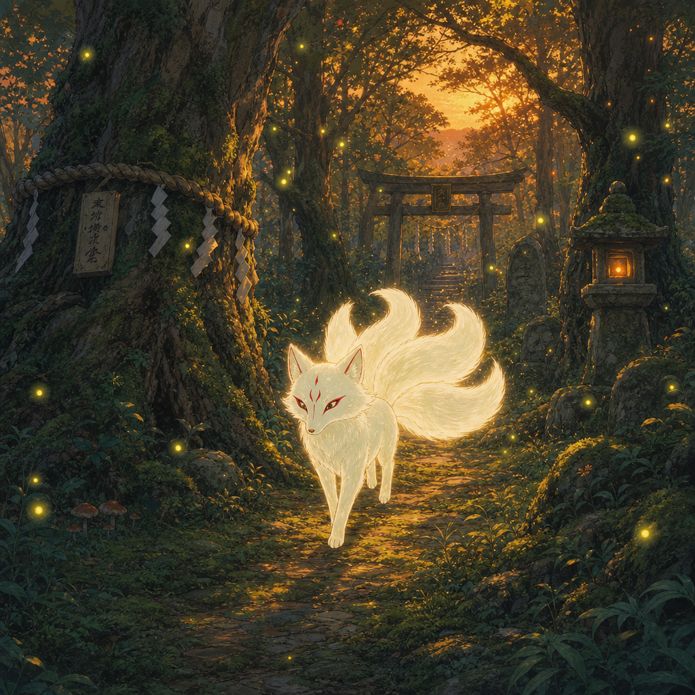
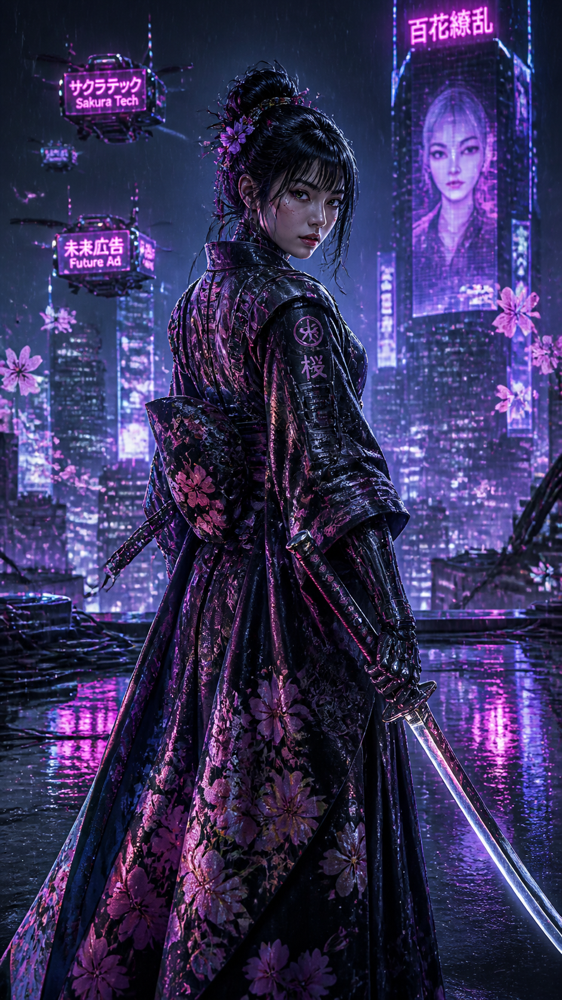

# Fantasy & Illustration

Anime, cyberpunk, Ghibli, concept art, and illustration prompts.

> Fantasy prompts get sharper the moment you name a specific art reference (Ufotable, Arcane, Studio Trigger, Magic: The Gathering illustration). Vague "fantasy art" gets you vague fantasy art.

---

## 01. Ufotable Anime Warrior

**Style:** Anime / Epic Fantasy
**Source:** [gpt-image2-ai.org](https://gpt-image2-ai.org/blog/gpt-image-2-prompt-guide)

```
Epic anime-inspired fantasy warrior princess with flowing silver-white hair that reaches her waist, wearing ornate golden battle armor that hugs her figure with intricate engravings. She holds a glowing magical sword aloft, emitting bright blue energy. Cherry blossom petals and magical sparkles swirl in a violent storm around her. Her expression is fierce and determined. Dynamic action pose mid-battle leap. Ultra-detailed anime with CGI-quality lighting -- Ufotable production quality. Rich colors, dramatic volumetric lighting. 4K quality.
```


**Technique:** Naming the studio (Ufotable) is doing more work than any adjective.

---

## 02. Dark Elf Sorceress

**Style:** Dark Fantasy / Semi-Realistic
**Source:** [gpt-image2-ai.org](https://gpt-image2-ai.org/blog/gpt-image-2-prompt-guide)

```
Dark fantasy dark elf sorceress with long flowing midnight-purple hair, pointed ears, and luminous violet eyes. She wears an elegant off-shoulder dark robe with intricate silver embroidery that reveals her collarbones and shoulders. Purple arcane energy spirals from her outstretched hands, illuminating her face from below. A vast star field and nebula visible in the background through a shattered stone archway. Semi-realistic fantasy illustration style with cinematic lighting. Ultra-detailed 4K.
```


---

## 03. Ghibli Forest Spirit

**Style:** Studio Ghibli / Painterly
**Source:** [gpt-image2-ai.org](https://gpt-image2-ai.org/blog/gpt-image-2-prompt-guide)

```
Studio Ghibli style painterly scene. A small forest spirit that looks like a glowing white fox with three tails walks through a mossy enchanted forest at dusk. Fireflies dance around it. Soft painterly brushstrokes, warm honey-gold light filtering through massive ancient trees. Hayao Miyazaki watercolor aesthetic. Ultra-detailed animation cel quality.
```



---

## 04. Arcane League Style

**Style:** Arcane / Steampunk Illustration
**Source:** [gpt-image2-ai.org](https://gpt-image2-ai.org/blog/gpt-image-2-prompt-guide)

```
Arcane Netflix animated series style illustration. A young woman with blue-tipped braided hair and steampunk goggles leans against a graffitied alley wall in the undercity of Piltover. Neon magical rune-signs glow behind her. Textured painterly brushstrokes visible, 2D illustration with 3D depth, saturated purple and teal color story. Fortiche animation studio aesthetic. Ultra-detailed 4K.
```


---

## 05. Magic the Gathering Dragon

**Style:** Fantasy Card Art / Oil Painting
**Source:** [gpt-image2-ai.org](https://gpt-image2-ai.org/blog/gpt-image-2-prompt-guide)

```
Fantasy illustration in the style of a Magic The Gathering card. A colossal red dragon emerges from molten lava in an underground cavern, wings half-spread, mouth roaring with fire breath forming. A tiny knight in silver armor stands at the cavern's edge for scale, raising a shield. Dramatic low-angle hero composition. Rich oil-painting texture. Ultra-detailed 4K fantasy art.
```


---

## 06. Cyberpunk Samurai

**Style:** Cyberpunk / Neo-Tokyo
**Source:** [gpt-image2-ai.org](https://gpt-image2-ai.org/blog/gpt-image-2-prompt-guide)

```
Cyberpunk fantasy fusion. A female samurai with a chrome katana stands on the rain-slicked rooftop of a neo-Tokyo megacorp tower at night. She wears a fusion of traditional kimono and carbon-fiber combat armor. Holographic cherry blossoms drift around her. Neon reflections on the wet rooftop, flying ad-drones in the background. Illustrated in the style of Katsuhiro Otomo meets modern 3D concept art. Ultra-detailed 4K.
```



---

## 07. Underwater Mermaid

**Style:** Ethereal Underwater Fantasy
**Source:** [gpt-image2-ai.org](https://gpt-image2-ai.org/blog/gpt-image-2-prompt-guide)

```
Ethereal underwater fantasy. A graceful mermaid with iridescent teal and violet scales swims through a coral reef illuminated by shafts of sunlight piercing the water surface above. Her long turquoise hair flows weightlessly. Bubbles trail from her fingertips. School of small silver fish swim past. Dreamlike painterly quality. Ultra-detailed 4K fantasy art.
```


---

## 08. Steampunk Airship Captain

**Style:** Steampunk / Illustrated Portrait
**Source:** [gpt-image2-ai.org](https://gpt-image2-ai.org/blog/gpt-image-2-prompt-guide)

```
Illustrated steampunk fantasy portrait. A young female airship captain in a brass-buttoned red military coat, goggles pushed up on her forehead, stands at the wheel of a wooden airship. Visible brass gears and copper pipes. Behind her, clouds and other distant airships. Warm golden hour lighting. Illustration style inspired by Nausicaa and Howl's Moving Castle. Ultra-detailed 4K.
```


---

## 09. Gothic Cathedral Interior

**Style:** Dark Fantasy / Environment Concept
**Source:** [gpt-image2-ai.org](https://gpt-image2-ai.org/blog/gpt-image-2-prompt-guide)

```
Dark fantasy interior of a vast gothic cathedral at night. Colored light streams through enormous stained glass windows depicting battle scenes, casting ruby and sapphire patterns on the stone floor. Rows of stone pillars recede into darkness. A single cloaked figure stands tiny at the far end for scale. Inspired by Dark Souls environment design. Atmospheric fog, god rays through the windows. Ultra-detailed 4K concept art.
```


---

## 10. Bioluminescent Forest

**Style:** Sci-Fi Fantasy / Alien Landscape
**Source:** [gpt-image2-ai.org](https://gpt-image2-ai.org/blog/gpt-image-2-prompt-guide)

```
Fantasy landscape of an alien bioluminescent forest at night. Giant mushroom-like trees glow in neon blue, green, and purple. Floating luminous spores drift through the air like fireflies. A narrow stone path winds through the forest. A lone explorer in a glowing suit stands looking up at the canopy. Avatar Pandora aesthetic with Studio Ghibli softness. Ultra-detailed 4K concept art.
```


---

## 11. Mecha Girl Sea-City Key Visual

**Style:** Mecha / Concept Art / Cinematic
**Source:** [EvoLink.ai](https://evolink.ai/gpt-image-2-prompts)

```
Create a moody key visual of a mecha girl standing on the rusted edge of a tilted steel platform over dark water. She has pale skin, ash-white hair in a high ponytail, matte gunmetal exoskeleton armor, glowing cyan coolant lines, and a massive rail cannon on her shoulder. Behind her, a vast derelict sea-city rises from the ocean in colossal silhouettes, with fog, dead cables, rusted towers, and bruised dusk light. Use cinematic concept-art lighting and a medium-wide shot.
```


---

## 12. Double Exposure Silhouette

**Style:** Surreal / Fine Art
**Source:** [NoteGPT](https://notegpt.io/blog/gpt-image-2-prompt-guide-use-cases)

```
A double exposure silhouette of a man's head. Inside the silhouette is a dense, foggy pine forest with a soaring eagle. White background, artistic fine art style.
```


---

## 13. Knitted World Macro

**Style:** Tactile / Macro Photography / Surreal
**Source:** [NoteGPT](https://notegpt.io/blog/gpt-image-2-prompt-guide-use-cases)

```
A macro shot of a tiny forest made entirely out of colorful knitted wool. Knitted squirrels and birds. Soft, tactile texture, macro photography style.
```


---

## 14. Retro 8-Bit Pixel Landscape

**Style:** Pixel Art / Retro Game
**Source:** [NoteGPT](https://notegpt.io/blog/gpt-image-2-prompt-guide-use-cases)

```
A sprawling 8-bit pixel art landscape of a medieval castle during a thunderstorm. Purple lightning bolts. Retro video game aesthetic.
```


---

## 15. Giant Whale Floating Above Desert

**Style:** Surrealism / Oil Painting
**Source:** [NoteGPT](https://notegpt.io/blog/gpt-image-2-prompt-guide-use-cases)

```
A giant whale floating through a sea of clouds above a desert. The whale's back carries a small, lush forest. Surrealist oil painting style, vibrant colors, dreamlike lighting.
```


---

## 16. Style Transfer - Pixel Art to New Scene

**Style:** Pixel Art / Style Transfer (Edit Mode)
**Source:** [fal.ai Prompting Guide](https://fal.ai/learn/tools/prompting-gpt-image-2)

```
Use the same visual language as the input image:
chunky pixel forms, limited arcade palette, bright glow accents,
clean silhouette edges, playful 1980s poster energy.
Generate a new scene of a motorcycle chase through a neon desert at night.
White background. No watermark.
```


**Technique:** Describe the visual language concretely (palette, edge treatment, silhouette language) rather than just saying "same style."

---

## Style Swap Template

Lock the subject and only change the style slot. Useful for mood-boarding:

**Base prompt:**
```
A beautiful young woman with shoulder-length brown hair stands in a sunlit garden, wearing a simple white sundress, one hand lightly touching a rose bush. Soft golden afternoon light. Three-quarter body framing, slightly tilted head, warm smile.
```

**Photoreal variant:**
```
[Base] -- Hyperreal fashion photography aesthetic. 85mm lens at f/1.8, soft natural light, editorial sharpness. Ultra-realistic 4K.
```

**Anime variant:**
```
[Base] -- Japanese anime style with cel shading, bold line art, vibrant saturated colors, large expressive eyes. Kyoto Animation production quality. Ultra-detailed.
```

**Oil painting variant:**
```
[Base] -- Classical oil painting style with visible thick brushstrokes, warm Renaissance lighting, chiaroscuro shadow, Vermeer-like color palette. Museum-quality.
```

**Cyberpunk variant:**
```
[Base] -- Neon-drenched cyberpunk futurism. Holographic overlays, circuit-pattern light tattoos on skin, magenta and cyan rim lighting. Ghost in the Shell art direction. Ultra-detailed.
```

---

## Tips for Fantasy & Illustration

- **Name the studio**: "Ufotable production quality" or "Kyoto Animation" does more work than any adjective
- **Style era + medium**: "1970s oil painting" or "cel animation" anchors better than "cool art style"
- **Color story**: Explicitly name 2-3 colors ("saturated purple and teal") for cohesive results
- **Scale contrast**: Add a tiny figure next to something massive for instant drama
- **For style transfer edits**: Describe the visual language concretely (palette, edges, silhouettes) rather than abstract style names

---

[Back to Main](../../README.md)
