# Product & Commercial

Product shots, advertising, brand imagery, packaging, and marketing prompts.

---

## 01. Luxury Perfume Bottle

**Style:** Luxury Product Photography
**Source:** Community

```
High-end product photography of a luxury perfume bottle on a polished black glass surface. The bottle is crystal-clear with gold cap and rose-gold liquid inside. Single hard spotlight from above-left creates a sharp reflection on the surface and a glowing caustic pattern through the liquid. Soft fill from the right. Ultra-clean background -- deep black gradient. Shot on 100mm macro lens, f/8, focus stacked. Editorial luxury ad quality. Ultra-realistic 4K.
```

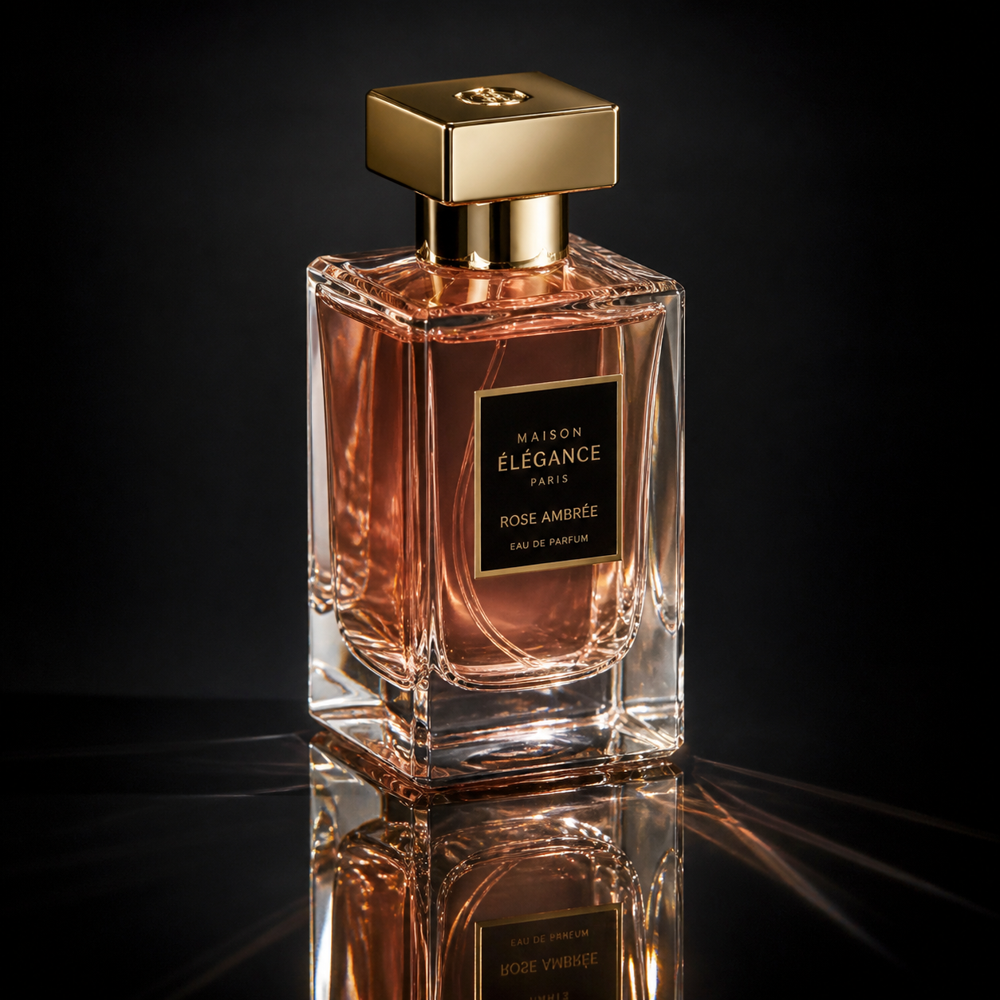

---

## 02. Sneaker Floating Display

**Style:** Athletic Product / Floating
**Source:** Community

```
Product photograph of a limited-edition basketball sneaker floating in mid-air against a gradient background transitioning from deep navy to bright orange. Dramatic side-lighting reveals texture of the mesh upper. Small LED accent light from below creates a subtle glow on the outsole. Particle effects -- tiny dust motes floating around the shoe. Clean, modern, Nike-advertising energy. 85mm lens, f/5.6. Ultra-realistic 4K.
```

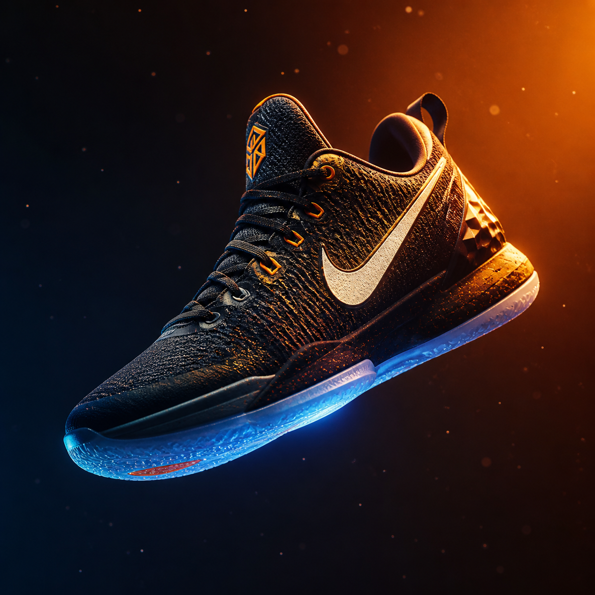

---

## 03. Coffee Splash

**Style:** Food & Beverage Commercial
**Source:** Community

```
Commercial product shot of a ceramic coffee cup on a white marble counter. A splash of coffee is frozen mid-air -- drops and rivulets arcing above the cup rim. Two coffee beans rest on the counter surface. Morning window light from the left creates soft shadows. Minimal composition, lots of negative space. Shot on 100mm macro, f/4. Clean, bright, lifestyle editorial. Ultra-realistic 4K.
```

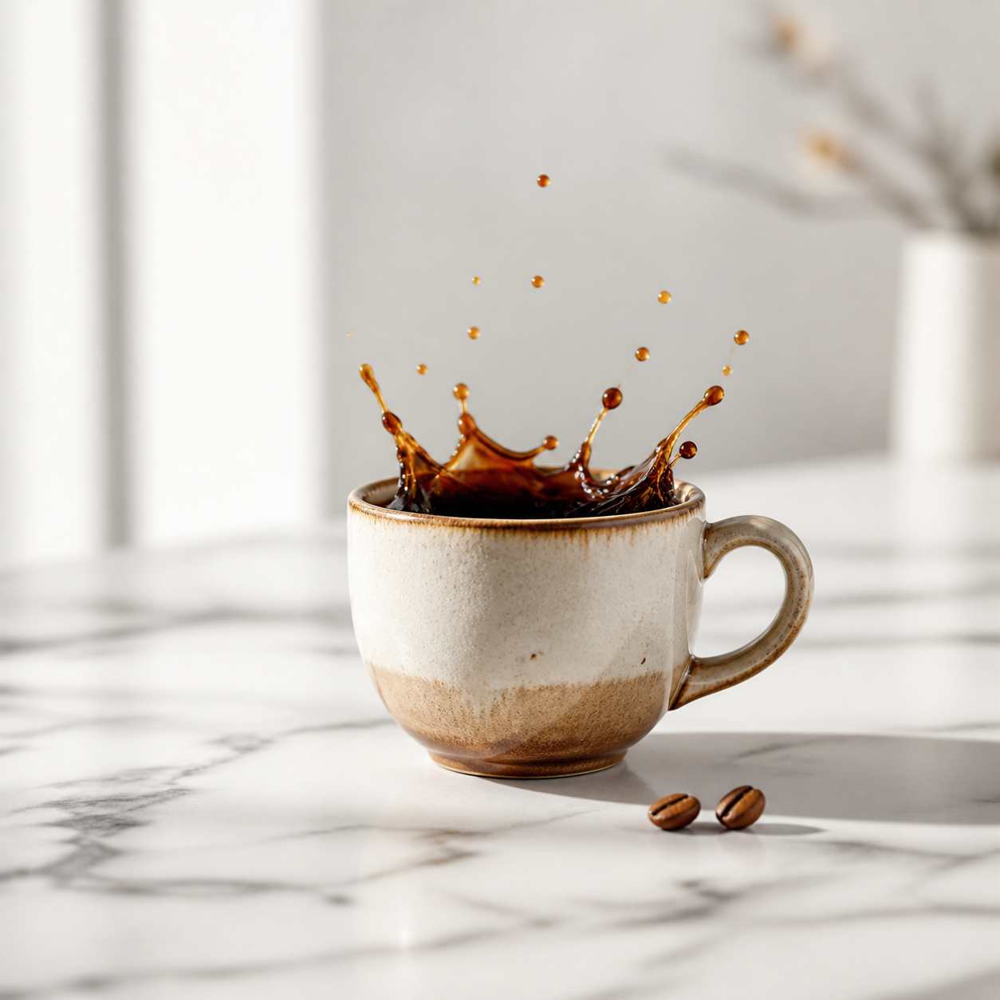

---

## 04. Skincare Flat Lay

**Style:** Beauty Product / Flat Lay
**Source:** Community

```
Overhead flat-lay product photograph of a luxury skincare collection arranged on a white marble surface. Products include a frosted glass serum bottle, a cream jar with gold lid, and a stone facial roller. Scattered eucalyptus leaves and a single white orchid petal around the products. Soft diffused daylight. Minimal, clean, editorial aesthetic. Shot from directly above, 50mm lens, f/8. Ultra-realistic 4K.
```

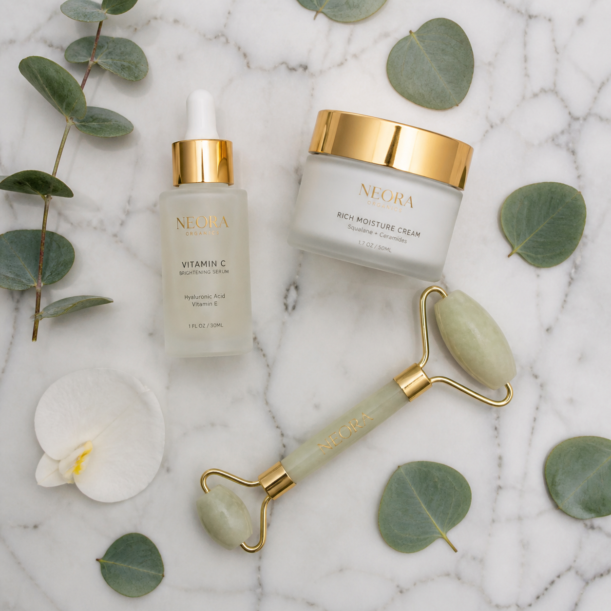

---

## 05. Watch Hero Shot

**Style:** Macro Luxury / Dark Moody
**Source:** Community

```
Macro hero shot of a luxury Swiss chronograph watch on a dark gray slate surface. The watch face catches a single hard beam of light from above, illuminating the dial details and sapphire crystal reflection. Watch strap falls in a natural curve. Tiny dust particles visible in the light beam. Shot on 100mm macro, f/11, focus stacked. Dark, moody, high-end advertising. Ultra-detailed 4K.
```

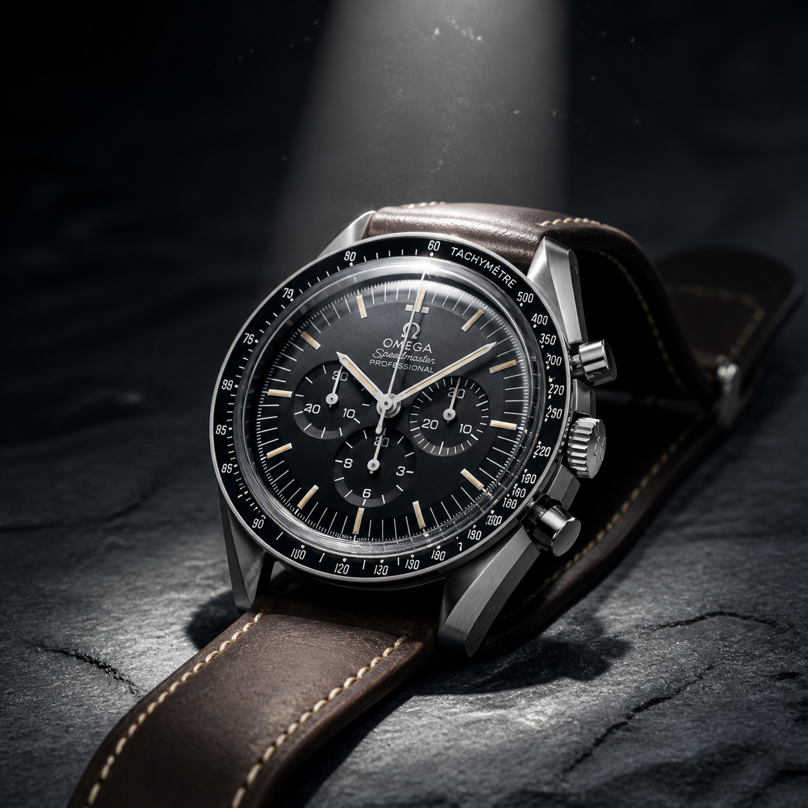

---

## 06. Food Photography -- Dessert

**Style:** Editorial Food Photography
**Source:** Community

```
Editorial food photography of a layered chocolate mousse cake on a matte black ceramic plate. A fork has just cut into one slice, revealing the layers. A drizzle of raspberry sauce on the plate. Dark moody lighting -- single overhead softbox, warm tungsten key light. Shallow depth of field -- plate sharp, dark wood table background blurred. Bon Appetit magazine quality. Ultra-realistic 4K.
```

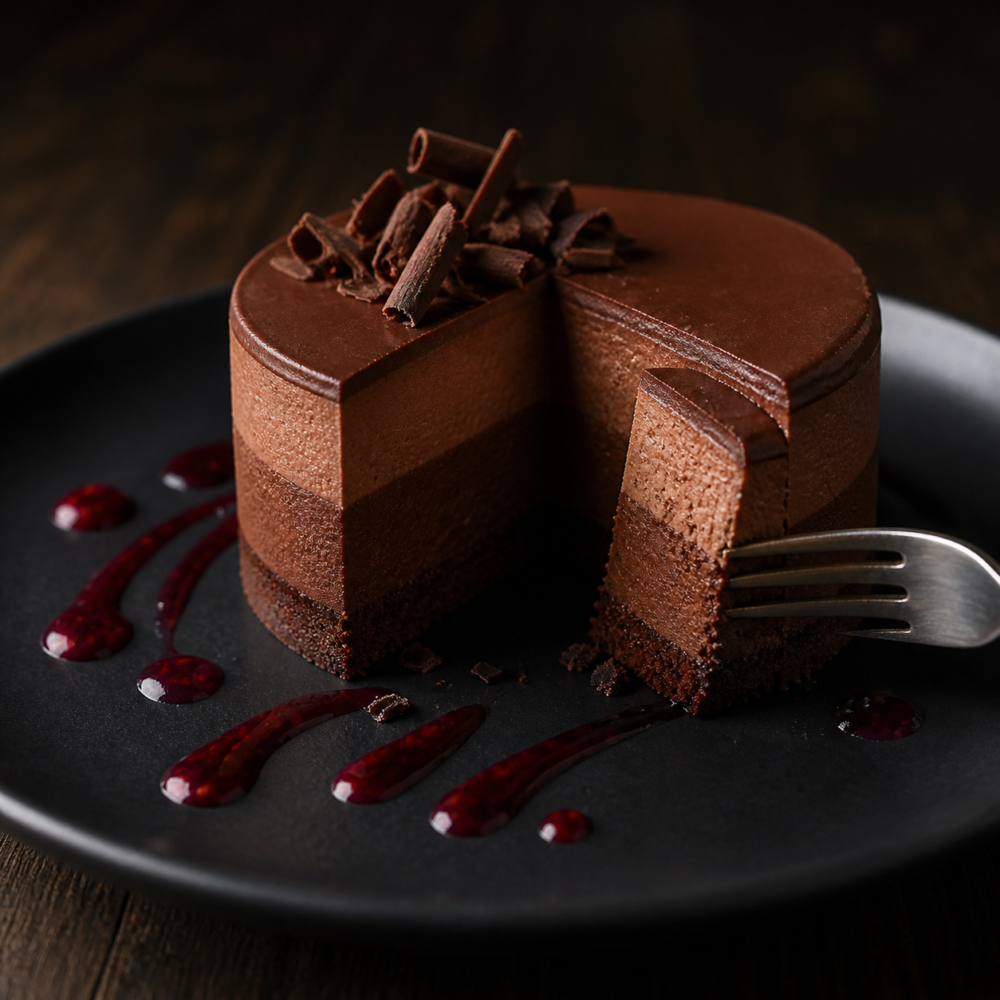

---

## 07. Wireless Earbuds in Stone (Museum Archive)

**Style:** Conceptual Product / Deadpan
**Source:** [fal.ai Prompting Guide](https://fal.ai/learn/tools/prompting-gpt-image-2)

```
Create a museum archive photograph of two perfectly recognizable wireless earbuds carved from worn gray stone and placed on neutral conservation foam under soft overhead museum light. Accession card next to the pieces reads ACC. 2126.04 - EARLY 21C PERSONAL ACOUSTIC IMPLEMENT. Flat even lighting, no dramatic shadow, neutral beige backdrop, shallow depth of field, the material reads as carved stone not plastic. No watermark, no brand logos.
```

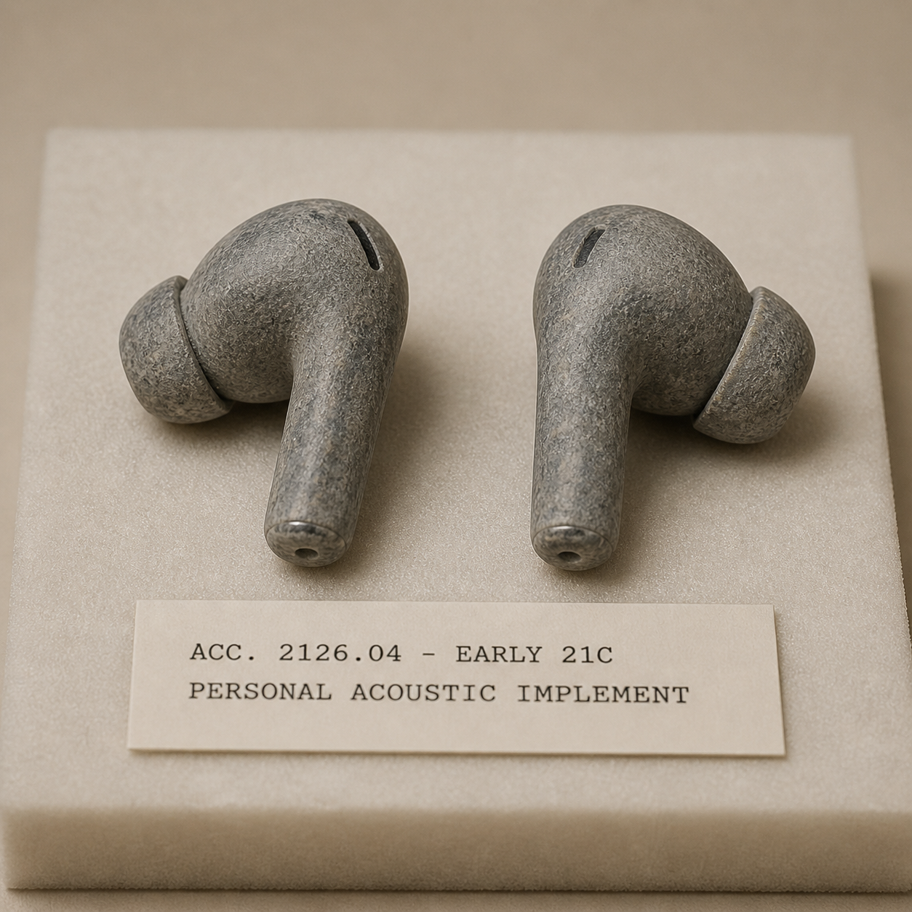

**Technique:** Museum archive framing, accession card, conservation foam, flat lighting. The deadpan holds because every element in the prompt reinforces it.

---

## 08. Matte White Electric Kettle

**Style:** Minimalist Product / Lifestyle
**Source:** [NoteGPT](https://notegpt.io/blog/gpt-image-2-prompt-guide-use-cases)

```
A premium matte white electric kettle on a light oak wooden stand. Simple grey background. Studio lighting with a crisp drop shadow. High-end lifestyle photography.
```

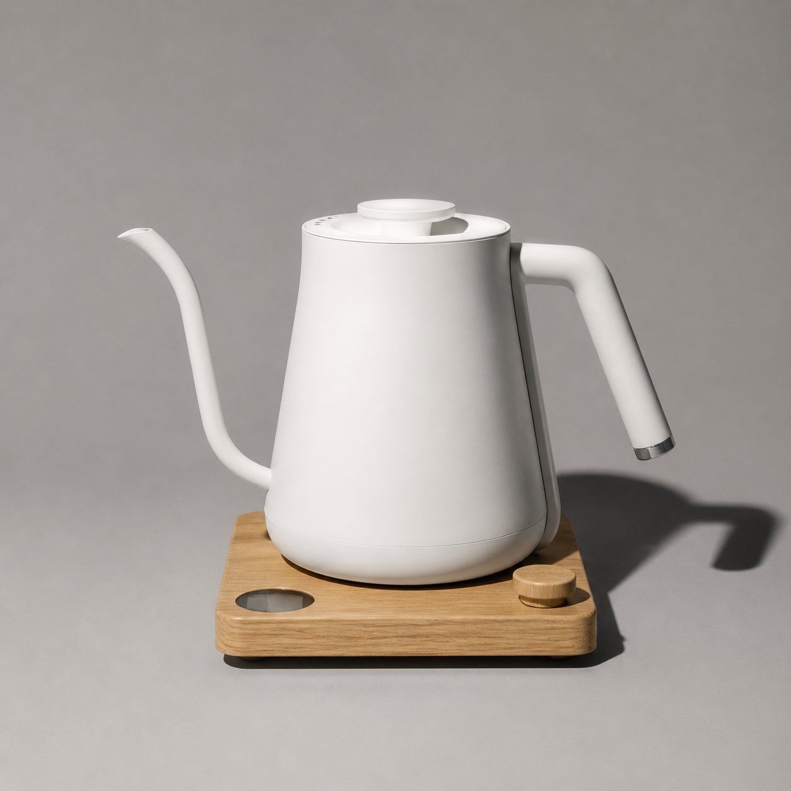

---

## 09. Perfume Bottle Underwater

**Style:** Luxury Beauty / Dramatic
**Source:** [NoteGPT](https://notegpt.io/blog/gpt-image-2-prompt-guide-use-cases)

```
A clear glass perfume bottle filled with light pink liquid. Submerged in clear water with small air bubbles. Dramatic refraction of light. No text. Luxury advertising style.
```

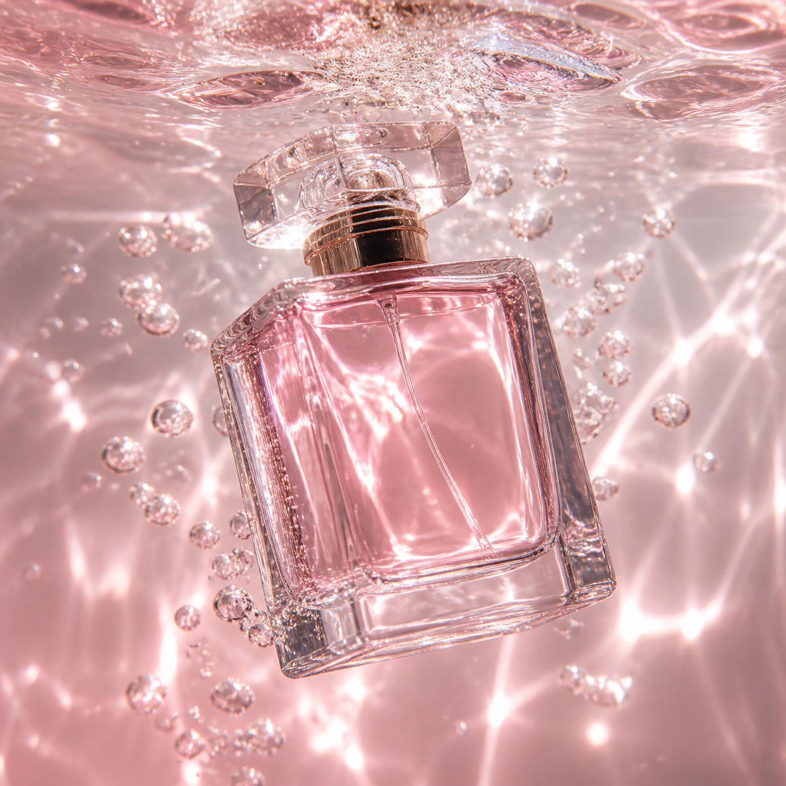

---

## 10. Coffee Packaging Mockup

**Style:** Packaging Design / Mockup
**Source:** [NoteGPT](https://notegpt.io/blog/gpt-image-2-prompt-guide-use-cases)

```
A close-up of a brown kraft paper coffee bag standing upright. The label is perfectly legible and says 'MIDNIGHT ROAST' in bold black vintage typography. Small coffee beans scattered around the base. Realistic paper texture.
```

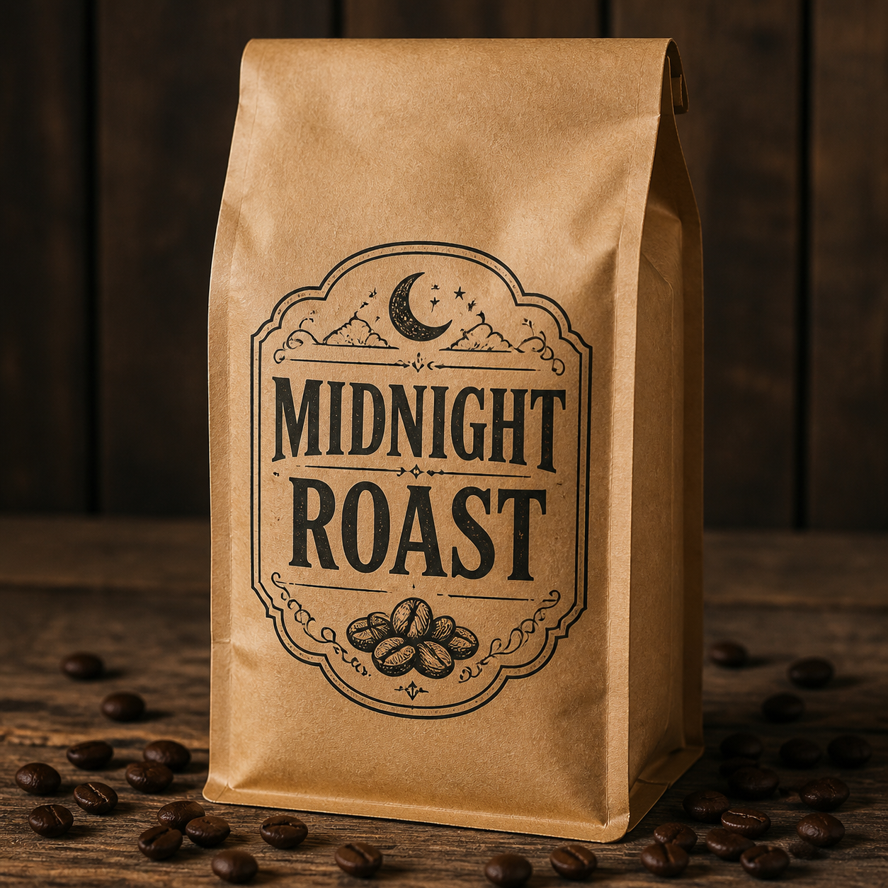

---

## 11. Strawberry Soft Serve Product Photography

**Style:** Food Product / Premium Commercial
**Source:** [EvoLink.ai](https://evolink.ai/gpt-image-2-prompts)

```
Ultra-realistic product photography of a rich strawberry soft-serve ice cream in a crispy waffle cone, styled with a clean, modern premium aesthetic. The soft serve is vibrant natural pink, thick and creamy, sculpted into a smooth swirl with a softly curled peak. The cone has a rustic, crunchy texture with slightly uneven edges for an artisanal feel. The background is soft beige with natural sunlight casting subtle leaf shadows, creating a calm, organic atmosphere. Include softly blurred greenery in the foreground for depth. The composition is minimal, balanced, and uses negative space effectively, similar to high-end American food brand ads. Include modern English typography in a clean, elegant layout. Lighting: soft natural daylight, warm highlights, shallow depth of field, high-end commercial food photography style. Mood: fresh, premium, modern, and inviting.
```

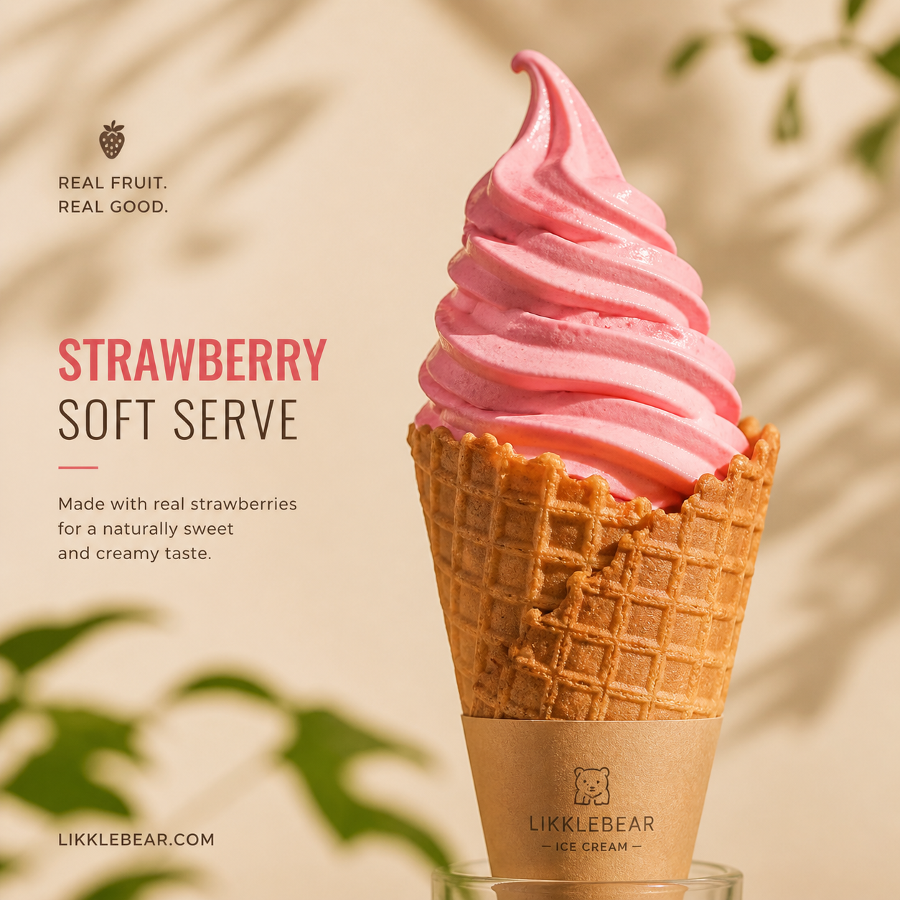

---

## 12. Green Tea Film Kit Product Shot

**Style:** Skincare Product / E-commerce
**Source:** [EvoLink.ai](https://evolink.ai/gpt-image-2-prompts)

```
CALMING GREEN TEA Film Kit displayed frontally, the open box shows soft sage-green film pouches and translucent ampoules with matte silver caps, product placed centrally with clear branding CALMING GREEN TEA -- 7 Days to Soothed Skin, pastel green background with botanical graphic accents, three minimal icons (leaf, wave, balance) floating around the product to emphasize benefits, photographic, hyper detailed, ultra realistic, lifelike, 8k, high detail, soft professional lighting.
```

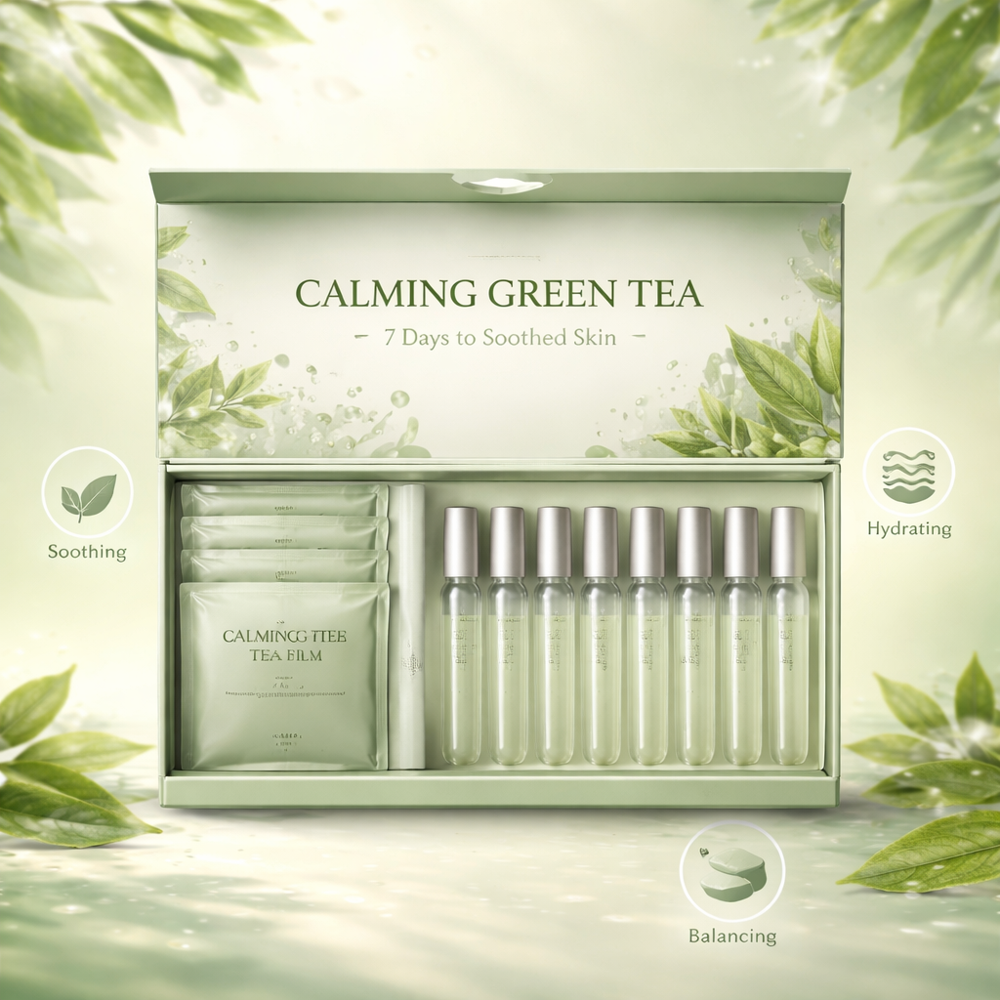

---

## 13. Product Cutout with Clean Background

**Style:** Product Extraction / E-commerce Prep
**Source:** [OpenAI Official Cookbook](https://developers.openai.com/cookbook/examples/multimodal/image-gen-models-prompting-guide)

```
Extract the product from the input image and place it on a plain white opaque background.
Output: centered product, crisp silhouette, no halos/fringing.
Preserve product geometry and label legibility exactly.
Add only light polishing and a subtle realistic contact shadow.
Do not restyle the product; only remove background and lightly polish.
```

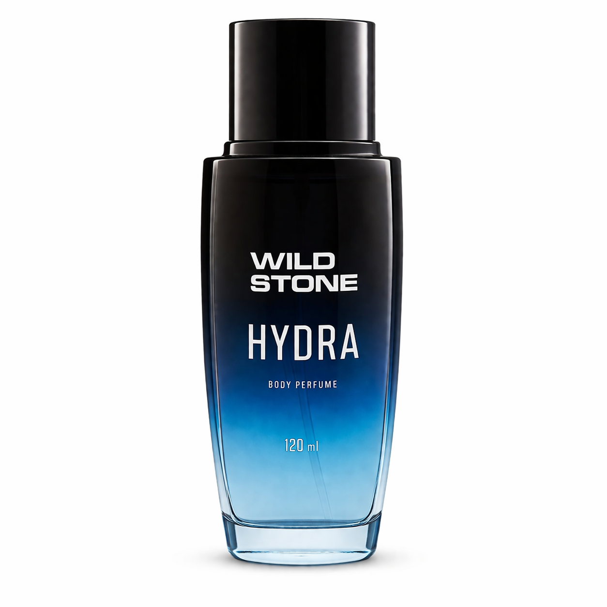

**Technique:** This is an edit prompt. Keep the output background opaque and use a downstream background-removal step if you need transparent assets.

---

## 14. Billboard Mockup with Product

**Style:** Advertising Mockup / In-Context
**Source:** [fal.ai Prompting Guide](https://fal.ai/learn/tools/prompting-gpt-image-2)

```
Create a realistic roadside billboard at sunset using the product from the input image.

Headline (EXACT TEXT):
"Fresh and clean"

Typography:
Bold sans serif, high contrast, centered vertically in the left half,
clean kerning, readable from a distance.

Layout:
Product on the right, headline on the left, lots of empty space.

Constraints:
Render the text verbatim.
No extra words.
No duplicate text.
No watermark.
No extra logos.
```

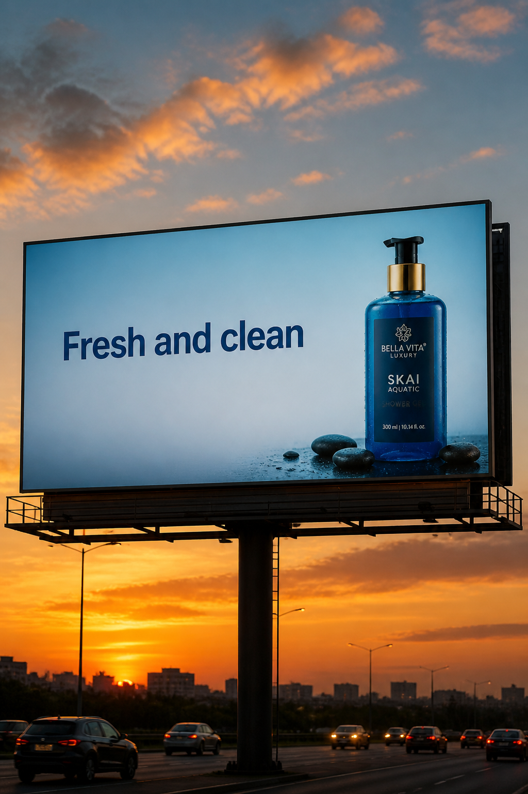

---

## 15. Brand Logo Generation

**Style:** Logo Design / Brand Identity
**Source:** [OpenAI Official Cookbook](https://developers.openai.com/cookbook/examples/multimodal/image-gen-models-prompting-guide)

```
Create an original, non-infringing logo for a company called Field & Flour, a local bakery.
The logo should feel warm, simple, and timeless. Use clean, vector-like shapes, a strong silhouette, and balanced negative space.
Favor simplicity over detail so it reads clearly at small and large sizes. Flat design, minimal strokes, no gradients unless essential.
Plain background. Deliver a single centered logo with generous padding. No watermark.
```

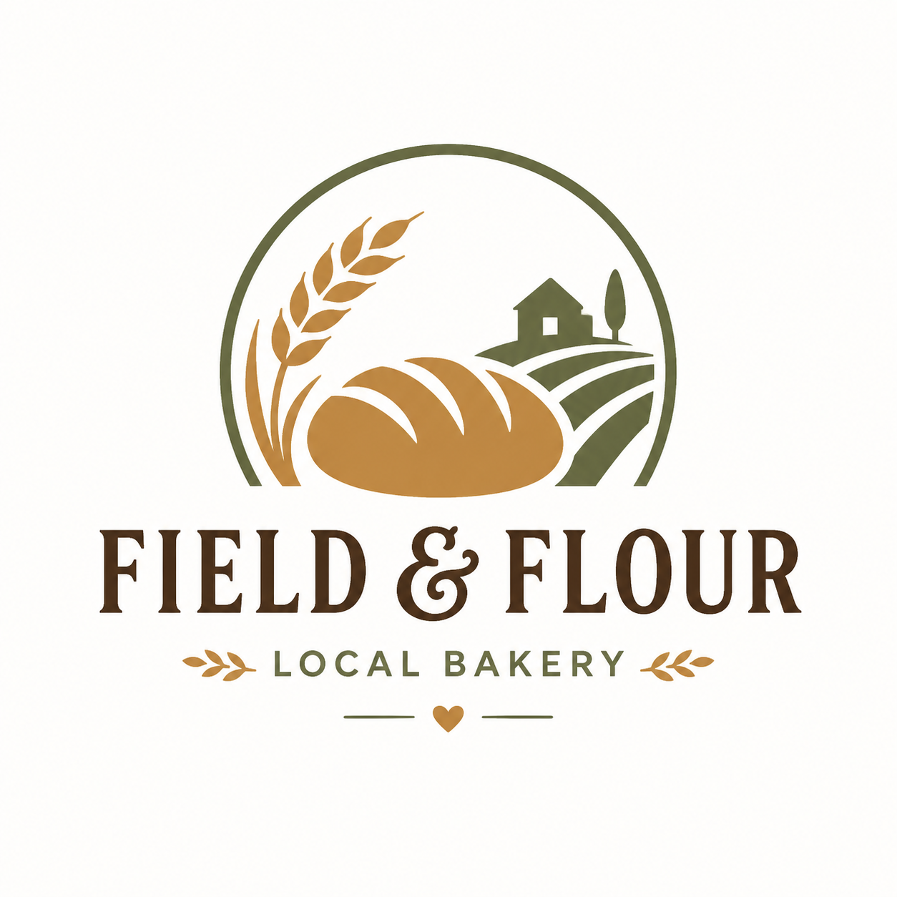

**Technique:** Use parameter `n=4` to generate 4 logo variations in a single API call.

---

## 16. Fashion Campaign Ad

**Style:** Fashion Advertising / Campaign
**Source:** [OpenAI Official Cookbook](https://developers.openai.com/cookbook/examples/multimodal/image-gen-models-prompting-guide)

```
Give me a cool in culture ad / fashion shot for a brand called Thread.
It's a hip young street brand. The ad shows a group of friends hanging out together with the tagline "Yours to Create."
Make it feel like a polished campaign image for a youth streetwear audience: stylish, contemporary, energetic, and tasteful.
Use clean composition, strong color direction, natural poses, and premium fashion photography cues.
Render the tagline exactly once, clearly and legibly, integrated into the ad layout.
No extra text, no watermarks, no unrelated logos.
```

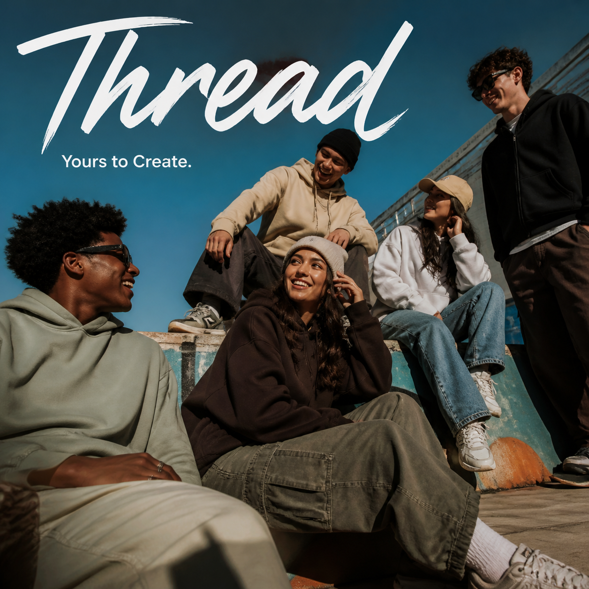

**Technique:** Write the prompt like a creative brief rather than a technical image spec. Include brand positioning, audience, vibe, scene, and tagline.

---

## 17. Christmas Collectible Toy Packaging

**Style:** Merchandise / Premium Toy Photography
**Source:** [OpenAI Official Cookbook](https://developers.openai.com/cookbook/examples/multimodal/image-gen-models-prompting-guide)

```
Create a collectible action figure of a vintage-style toy propeller airplane with rounded wings, a front-mounted spinning propeller, slightly worn paint edges, classic childhood proportions, designed as a nostalgic holiday collectible, in blister packaging.

Concept:
A nostalgic holiday collectible inspired by the simple toy airplanes children used to play with during winter holidays. Evokes warmth, imagination, and childhood wonder.

Style:
Premium toy photography, realistic plastic and painted metal textures, studio lighting, shallow depth of field, sharp label printing, high-end retail presentation.

Constraints:
- Original design only
- No trademarks
- No watermarks
- No logos

Include ONLY this packaging text (verbatim):
"Christmas Memories Edition"
```


---

## 18. Christmas Holiday Card

**Style:** Greeting Card / Premium Photography
**Source:** [OpenAI Official Cookbook](https://developers.openai.com/cookbook/examples/multimodal/image-gen-models-prompting-guide)

```
Create a Christmas holiday card illustration.

Scene:
a cozy Christmas scene with an old teddy bear sitting inside a keepsake box, slightly worn fur, soft stitching repairs, placed near a window with falling snow outside. The scene suggests the child has grown up, but the memories remain.

Mood:
Warm, nostalgic, gentle, emotional.

Style:
Premium holiday card photography, soft cinematic lighting,
realistic textures, shallow depth of field,
tasteful bokeh lights, high print-quality composition.

Constraints:
- Original artwork only
- No trademarks
- No watermarks
- No logos

Include ONLY this card text (verbatim):
"Merry Christmas -- some memories never fade."
```

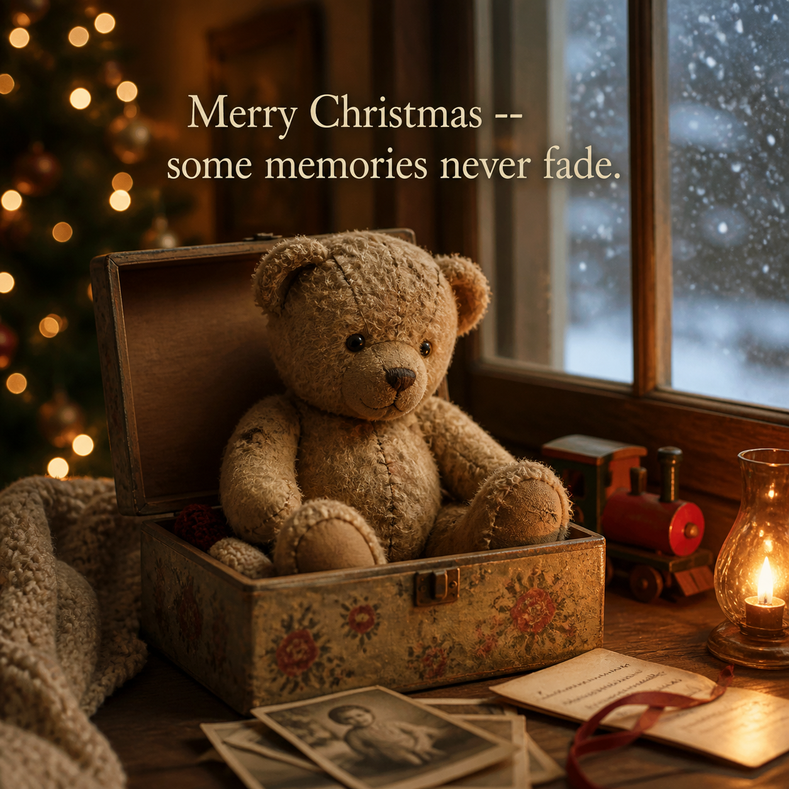

---

## Tips for Product & Commercial

- **Surface material matters**: marble, slate, glass, wood -- each gives a different brand feel
- **Negative space is your friend**: leave room for copy/text overlay in the composition
- **Single hero product**: one item >> many items. Simplicity reads as premium
- **Macro lens language**: "100mm macro, f/8, focus stacked" locks in the commercial look
- **Frozen splashes**: "frozen mid-air splash" + "1/4000 shutter speed" for liquid dynamics
- **For ads, write like a brief**: Include brand positioning, audience, vibe, and exact tagline
- **For product edits**: Explicitly state "do not restyle the product" to prevent unwanted changes

---

[Back to Main](../../README.md)
