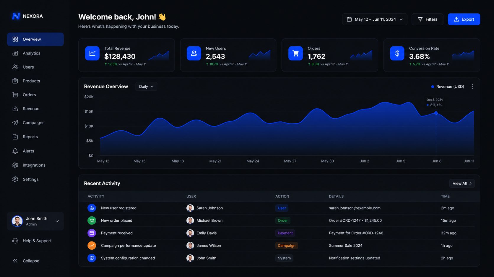

# UI/UX Design

App mockups, landing pages, dashboard designs, and screenshot-style prompts.

---

## 01. SaaS Dashboard Dark Mode

**Style:** Dashboard / Dark Mode
**Source:** Community

```
UI design of a modern SaaS analytics dashboard in dark mode. Left sidebar with navigation icons (home, analytics, users, settings). Main content area shows a large area chart with gradient fill, four KPI cards at the top (revenue, users, conversion, churn), and a recent activity table below. Color scheme: dark charcoal background (#1a1a2e), electric blue accents (#4361ee), white text. Clean sans-serif typography. Figma-quality UI design. Dribbble-worthy.
```



---

## 02. Mobile Banking App

**Style:** Mobile App / Finance
**Source:** Community

```
Mobile app UI design for a premium banking application. Single screen showing the main account view. Top section has a sleek debit card visualization with gradient purple-to-blue. Below: account balance in large bold type, recent transactions list with merchant icons, and a bottom navigation bar with home, payments, cards, and profile tabs. Minimal, clean, premium feel. iOS design language. Light mode. Dribbble-quality UI design.
```


---

## 03. E-commerce Landing Page

**Style:** Web Design / Landing Page
**Source:** Community

```
Web landing page design for a luxury furniture brand. Hero section with a large lifestyle photograph of a modern living room, overlaid with minimal headline text "Design Your Space" and a white CTA button. Below: product grid with three featured items, each with image, name, and price. Clean white background, black typography, warm accent color. Scrollable layout. Modern, editorial web design. Desktop viewport. Dribbble-quality.
```


---

## 04. Fitness App Workout Screen

**Style:** Mobile App / Health & Fitness
**Source:** Community

```
Mobile fitness app UI design showing an active workout tracking screen. Large circular progress ring at top showing workout completion percentage. Below: current exercise name, set/rep counter with +/- buttons, and a rest timer. Bottom has play/pause and skip controls. Color scheme: dark background, vibrant green accent, white text. Sporty, energetic typography. iOS design language. Dribbble-quality.
```


---

## 05. Music Player Interface

**Style:** Desktop App / Media
**Source:** Community

```
Desktop music player application UI in dark mode. Left sidebar with playlist library. Main area shows album artwork large on the left, track list on the right. Bottom bar has playback controls, progress bar, and volume slider. Vinyl record aesthetic blended with modern UI. Color scheme: deep purple background, amber/gold accents, cream text. Spotify-quality design. Dribbble-worthy.
```


---

## 06. Crypto Wallet Mobile App

**Style:** Mobile App / Fintech
**Source:** [NoteGPT](https://notegpt.io/blog/gpt-image-2-prompt-guide-use-cases)

```
A high-fidelity mobile app UI for a crypto wallet. Showing a 'Total Balance' card with '$12,450.00' and a green 'Up 5%' trend line. Dark mode, neon green accents. Minimalist glassmorphism style.
```


---

## 07. Farmers Market App

**Style:** Mobile App / Local Commerce
**Source:** [OpenAI Official Cookbook](https://developers.openai.com/cookbook/examples/multimodal/image-gen-models-prompting-guide)

```
Create a realistic mobile app UI mockup for a local farmers market.
Show today's market with a simple header, a short list of vendors with small photos and categories, a small "Today's specials" section, and basic information for location and hours.
Design it to be practical, and easy to use. White background, subtle natural accent colors, clear typography, and minimal decoration.
It should look like a real, well-designed, beautiful app for a small local market.
Place the UI mockup in an iPhone frame.
```


**Technique:** Describe the product as if it already exists. Focus on layout, hierarchy, spacing, and real interface elements. Avoid concept art language.

---

## 08. To-Do App Screenshot (DAYBREAK)

**Style:** Mobile App / Productivity
**Source:** [fal.ai Prompting Guide](https://fal.ai/learn/tools/prompting-gpt-image-2)

```
Create a clean mobile app screenshot for a minimalist to-do app called DAYBREAK.
Top status bar reads 9:41 AM.
Title: DAYBREAK.
Subtitle: Tuesday, 23 April.
Four tasks listed:
- Review quarterly notes
- Call mom
- Ship the image update
- Pick up bread
One task is checked off.
Muted cream background, deep navy accent color, rounded sans serif, soft card shadows, perfect legibility, generous spacing.
No watermark. No real app branding.
```


**Technique:** The model gets dramatically better once the screen type, copy, hierarchy, and spacing are all explicit.

---

## 09. Game HUD Screenshot (Block Survival)

**Style:** In-Game Screenshot / UI
**Source:** [fal.ai Prompting Guide](https://fal.ai/learn/tools/prompting-gpt-image-2)

```
Create a first-person gameplay screenshot of a cozy lakeside stone cottage in a lush block-built survival world at golden hour. Premium game-engine realism, ray-traced global illumination, detailed grass and flowers, soft atmospheric haze, subtle player hand in the lower right, clean survival HUD along the bottom, believable UI spacing. No logos, no watermark, no exact brand references.
```


**Technique:** "Clean survival HUD along the bottom, believable UI spacing" does the layout work. Remove those two clauses and the HUD collapses into noise.

---

## 10. Mobile Onboarding Screen (NESTING)

**Style:** Mobile App / Onboarding Flow
**Source:** [fal.ai Prompting Guide](https://fal.ai/learn/tools/prompting-gpt-image-2)

```
Create a vertical mobile onboarding screen for a fictional app called NESTING.
Headline: WELCOME TO NESTING.
Supporting line: A quieter way to gather people around a table.
Buttons: Get started, I already have an account.
Small line illustration of three plates and two wine glasses.
Warm cream background, coral primary button, rounded sans serif,
clean spacing, exact readable copy.
No watermark. No real app branding.
```


---

## 11. Social Dating App Match Screen

**Style:** Mobile App / Social / Dark Mode
**Source:** [EvoLink.ai](https://evolink.ai/gpt-image-2-prompts)

```
A social dating app match success screen mockup. Two user profile cards colliding in the center with a glowing heart effect between them. The headline reads "It's a Match!" with a subtitle below. Each card shows a profile photo, name, age, location, and job title. Below the cards, two action buttons: a primary pink "Chat" button and a secondary "Continue" button. Dark purple gradient background with floating pink heart particles and sparkle effects. Clean, modern mobile UI design, 9:16 vertical aspect ratio, realistic app screenshot aesthetic, polished shadows, and glass-morphism card edges.
```


---

## 12. Pitch Deck Slide (Market Opportunity)

**Style:** Presentation / Startup Pitch
**Source:** [OpenAI Official Cookbook](https://developers.openai.com/cookbook/examples/multimodal/image-gen-models-prompting-guide)

```
Create one pitch-deck slide titled "Market Opportunity" that feels like a real Series A fundraising slide from a YC-backed startup.

Use a clean white background, modern sans-serif typography like Inter, and a crisp, minimal layout. The slide should include:

* A TAM/SAM/SOM concentric-circle diagram in muted blues and grays
* Specific, believable market sizing numbers:
  * TAM: $42B
  * SAM: $8.7B
  * SOM: $340M
* A clean bar chart below showing market growth from 2021 to 2026, with a subtle upward trend
* Small footnotes: "AGI Research, 2024" and "Internal analysis"
* A company logo placeholder in the bottom-right corner

The design should look like it belongs in a deck that actually raised money: highly readable text, clear data hierarchy, polished spacing, and professional startup-style visual language.

Avoid clip art, stock photography, gradients, shadows, decorative elements, or anything that feels generic or overdesigned.
```


**Technique:** Name the exact deliverable (slide), define canvas and hierarchy, provide real data, describe the visual language. Use `quality="high"` for slides with small text.

---

## 13. SaaS Dashboard Laptop Mockup

**Style:** Product Mockup / In-Context
**Source:** [EvoLink.ai](https://evolink.ai/gpt-image-2-prompts)

```
A hyper-realistic UI/UX mockup displayed on a slim modern laptop placed on a minimal wooden desk with soft natural daylight. The screen shows a clean SaaS dashboard with elegant typography, glassmorphism cards, smooth gradients, subtle drop shadows, and neatly spaced components. Visible charts, analytics panels, sidebar navigation, and micro-interactions. Realistic macOS-style window frame, soft reflections on the screen, shallow depth of field, cozy workspace atmosphere, shot in photorealistic product photography style, ultra-detailed.
```


---

## Tips for UI/UX Design

- **Specify the platform**: "Mobile iOS", "Desktop viewport", "Web landing page" -- each has different conventions
- **Name color schemes explicitly**: hex codes or color names ("dark charcoal, electric blue accents") lock the palette
- **Reference design quality**: "Dribbble-quality", "Figma-quality" sets the bar
- **Dark vs Light mode**: Always specify which -- it changes everything
- **List UI components**: sidebar, cards, charts, navigation bar, CTA buttons -- each element you name appears
- **Screen type + copy + hierarchy**: The model gets dramatically better when you specify all three
- **For screenshots**: Include UI elements like status bar, HUD, or navigation to make it look real

---

[Back to Main](../../README.md)
