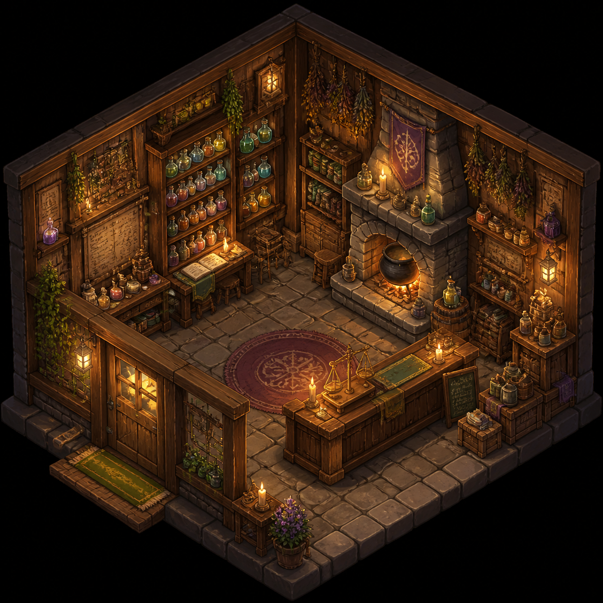

# Game Assets

Character sprites, environments, in-game screenshots, items, and tilemap prompts.

---

## 01. RPG Character Portrait

**Style:** RPG Portrait Icon
**Source:** Community

```
RPG character portrait icon. A female elven ranger with short cropped green hair, one green eye and one amber eye, wearing dark leather armor with leaf-pattern embossing. She has a small scar across her nose. Forest green cloak clasp at her neck. Expression: calm confidence. Fantasy RPG art style, semi-realistic, painted digitally. Square format, clean edges, suitable for game UI portrait frame. Ultra-detailed 4K.
```


---

## 02. Isometric Game Environment

**Style:** Isometric / 2.5D Interior
**Source:** Community

```
Isometric game environment tile of a cozy fantasy alchemist shop interior. Wooden shelves line the walls with colorful potion bottles, dried herbs hanging from the ceiling, a stone hearth with a cauldron, and a wooden counter with a brass scale. Warm candlelight glow. The floor is worn stone. Style: hand-painted 2.5D isometric game art, similar to Hades or Disco Elysium environment art. Rich detail, warm color palette. Ultra-detailed 4K.
```



---

## 03. Pixel Art Character Sprite

**Style:** 16-bit Pixel Art / Sprite Sheet
**Source:** Community

```
16-bit pixel art character sprite sheet of a knight character. Four directional views (up, down, left, right) arranged in a grid. The knight wears silver plate armor with a blue tabard, a bucket helm with a T-shaped visor slit, and carries a sword and shield. Clean pixel lines, limited color palette (16 colors maximum). Style inspired by SNES-era RPG sprites like Final Fantasy VI. Transparent background.
```


---

## 04. Game Item Icons Set

**Style:** Item Icons / Grid
**Source:** Community

```
Set of 6 game item icons arranged in a grid. Each icon is a square with rounded corners on a subtle dark gradient background. Items: a glowing blue health potion, a golden coin with a crown stamp, a silver longsword, a wooden shield with iron bands, a scroll with red seal, and a ruby ring. Each item is centered in its cell with a soft drop shadow. Icon art style similar to Diablo or World of Warcraft item icons. Detailed, colorful, game-ready.
```


---

## 05. Game Background -- Forest Path

**Style:** 2D Background / Parallax
**Source:** Community

```
2D game background of a fantasy forest path at autumn. The path winds from bottom-center toward a distant mountain peak. Maple trees with orange and red leaves frame both sides. Soft light rays filter through the canopy. Parallax-ready layers -- foreground grass and rocks, midground trees, distant mountains with atmospheric haze. Hand-painted style similar to Ori and the Blind Forest. Warm autumn palette. Ultra-detailed 4K.
```


---

## 06. Boss Monster Design

**Style:** Boss Design / Dark Fantasy
**Source:** Community

```
Game boss monster concept art. A massive crystal golem creature made of jagged purple amethyst formations in a humanoid shape. Glowing orange core visible between the crystal plates where its heart would be. Ground cracks beneath its weight with purple energy leaking out. One arm is raised, about to slam down. Environment: underground crystal cavern. Dark fantasy boss design, League of Legends splash art quality. Ultra-detailed 4K.
```


---

## 07. First-Person Block Survival Screenshot

**Style:** In-Game Screenshot / Survival Game
**Source:** [fal.ai Prompting Guide](https://fal.ai/learn/tools/prompting-gpt-image-2)

```
Create a first-person gameplay screenshot of a cozy lakeside stone cottage in a lush block-built survival world at golden hour. Premium game-engine realism, ray-traced global illumination, detailed grass and flowers, soft atmospheric haze, subtle player hand in the lower right, clean survival HUD along the bottom, believable UI spacing. No logos, no watermark, no exact brand references.
```


**Technique:** "Clean survival HUD along the bottom, believable UI spacing" does the layout work. Without those constraints the HUD collapses into noise.

---

## 08. Retro CRT Terminal (BBS)

**Style:** Retro Computing / In-Game UI
**Source:** [fal.ai Prompting Guide](https://fal.ai/learn/tools/prompting-gpt-image-2)

```
Create a photograph of a 1992-era CRT monitor displaying a bulletin board system terminal.
Phosphor green text on black.
ASCII banner: THE NIGHT OWL BBS.
Main menu items:
1 Message Base
2 File Library
3 Chat Rooms
4 User Config
5 Log Off
Status line at bottom: user handle GHOSTWALKER.
Subtle scanline glow, dusty monitor bezel, keyboard slightly out of focus.
No modern UI elements. No watermark.
```


**Technique:** This is a stress test for small text, old-screen glow, and physical monitor detail all at once.

---

## 09. Counter-Strike x Terraria Mashup

**Style:** Game Mashup / Crossover
**Source:** [EvoLink.ai](https://evolink.ai/gpt-image-2-prompts)

```
Counter-Strike in-game screenshot, mixed with Terraria. Combine the first-person shooter perspective and tactical gameplay elements of Counter-Strike with the 2D pixel art, block-based world, and colorful aesthetic of Terraria. Create a hybrid visual that feels like both games merged into one scene.
```


---

## 10. Minecraft Japanese Research Lab

**Style:** In-Game Screenshot / Atmospheric
**Source:** [EvoLink.ai](https://evolink.ai/gpt-image-2-prompts)

```
Create a Minecraft in-game screenshot image of exploring a mysterious pre-war Japanese research laboratory. The scene should combine Minecraft's block-based aesthetic with eerie, atmospheric elements of an abandoned 1930s-1940s Japanese lab -- dim lighting, strange equipment, research notes, and a sense of discovery and unease. Maintain authentic Minecraft visual style with block textures and characteristic lighting.
```


---

## 11. Rust In-Game Screenshot

**Style:** In-Game Screenshot / Survival
**Source:** [EvoLink.ai](https://evolink.ai/gpt-image-2-prompts)

```
An in-game screenshot of Rust. Capture the survival game's distinctive visual style with its harsh environment, makeshift structures, rugged terrain, and characteristic lighting. Include typical gameplay elements like base buildings, resource gathering areas, and the game's signature post-apocalyptic wilderness atmosphere.
```


---

## 12. Among Us Realistic Screenshot

**Style:** Realistic Game Render / Social Deduction
**Source:** [EvoLink.ai](https://evolink.ai/gpt-image-2-prompts)

```
Generate a precise realistic in-game image of Among Us. Maintain the game's distinctive character design (bean-shaped astronauts, colored spacesuits, visors) but render everything with realistic textures, lighting, and materials. Include typical game elements like the spaceship interior, task stations, and the characteristic atmosphere of suspicion and teamwork.
```


---

## Tips for Game Assets

- **Art style reference**: Name specific games for style anchoring ("Hades", "Ori", "Diablo", "SNES-era RPG")
- **Specify the format**: sprite sheet grid, icon set, portrait, isometric tile, background
- **Color palette constraints**: "16 colors maximum" for pixel art, "limited palette" for stylized looks
- **Game-ready language**: "transparent background", "parallax-ready layers", "UI portrait frame"
- **For in-game screenshots**: Include HUD elements, UI spacing, and player hand/avatar for authenticity
- **Mashups work well**: GPT Image 2 understands game references and can merge visual languages

---

[Back to Main](../../README.md)
