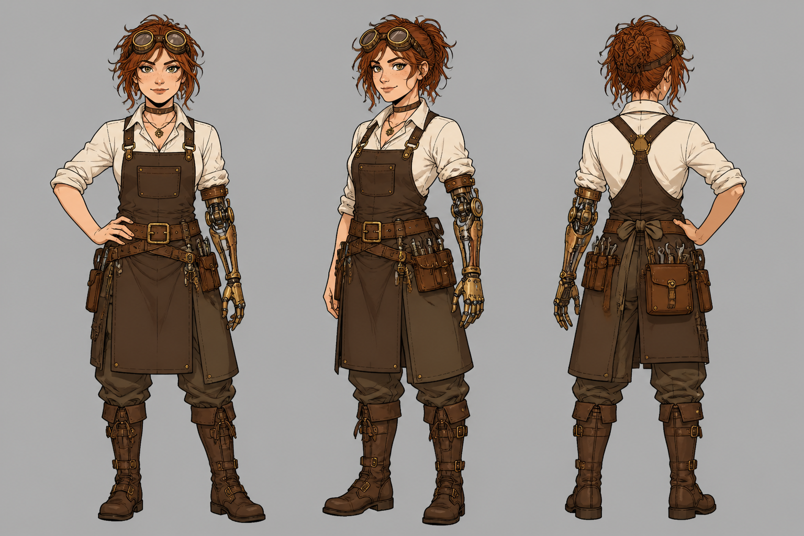

# Character Design

Character sheets, turnarounds, expression boards, and reference cards.

---

## 01. Fantasy Character Sheet

**Style:** Steampunk / Full Turnaround
**Source:** Community

```
Character design sheet of a female steampunk inventor. Three views: front view, 3/4 view, and back view, arranged side by side on a neutral gray background. She is 25 years old with messy auburn hair tied back with a leather cord, goggles pushed up on her forehead, a brown leather apron over a white blouse, utility belt with tools, and high leather boots. One mechanical arm from the elbow down (brass and copper). Confident, slightly mischievous expression. Clean line art with flat color fills. Professional character design sheet format.
```



---

## 02. Anime Character Expressions

**Style:** Anime / Expression Sheet
**Source:** Community

```
Anime character expression sheet showing the same female character in 6 different emotion states: happy/laughing, angry/yelling, surprised/shocked, sad/crying, confused, and smirking. The character has short blue hair, red eyes, and wears a school uniform. Each expression is a bust shot (shoulders up) arranged in a 2x3 grid. Clean anime line art with cel shading. Professional character design reference sheet.
```


---

## 03. Sci-Fi Soldier Turnaround

**Style:** Sci-Fi / Power Armor Turnaround
**Source:** Community

```
Character turnaround sheet of a sci-fi space marine. Four views arranged horizontally: front, left 3/4, side, and back. Full body. The soldier wears matte black power armor with glowing blue accents at the joints, a helmet with a reflective visor, and carries a futuristic rifle on the back. Build: athletic, imposing. No face visible behind the visor. Clean concept art style with subtle gray shading. Professional character turnaround format on white background.
```


---

## 04. Cartoon Mascot Design

**Style:** Mascot / Brand Character
**Source:** Community

```
Character design of a friendly cartoon mascot for a tech startup. A round, chubby robot character with a single large screen for a face showing a simple smiley expression. Body is white plastic with rounded edges. Small stubby arms and legs. A small antenna on top with a glowing blue tip. Friendly, approachable, minimalist. Shown in a casual standing pose. Clean vector-style illustration with soft gradients. Suitable for logo and brand use.
```


---

## 05. Monster Design Sheet

**Style:** Creature / Dark Fantasy
**Source:** Community

```
Creature design sheet of a forest guardian monster. Two views: front facing and side profile. The creature is a humanoid tree-being with bark-like skin, moss growing on its shoulders, glowing yellow eyes deep within a wooden face, and long branch-like fingers with leaves. Roots form its feet, planted into the ground. A small bird nests in its shoulder branches. Dark fantasy creature design. Detailed digital painting style on neutral background.
```


---

## 06. Children's Book Character Anchor

**Style:** Storybook / Character Consistency
**Source:** [OpenAI Official Cookbook](https://developers.openai.com/cookbook/examples/multimodal/image-gen-models-prompting-guide)

```
Create a children's book illustration introducing a main character.

Character:
A young, storybook-style hero inspired by a little forest outlaw,
wearing a simple green hooded tunic, soft brown boots, and a small belt pouch.
The character has a kind expression, gentle eyes, and a brave but warm demeanor.
Carries a small wooden bow used only for helping, never harming.

Theme:
The character protects and rescues small forest animals like squirrels, birds, and rabbits.

Style:
Children's book illustration, hand-painted watercolor look,
soft outlines, warm earthy colors, whimsical and friendly.
Proportions suitable for picture books (slightly oversized head, expressive face).

Constraints:
- Original character (no copyrighted characters)
- No text
- No watermarks
- Plain forest background to clearly showcase the character
```


**Technique:** This is the "character anchor" pattern. Generate this first, then use the image as a reference in subsequent prompts for character consistency across scenes.

---

## 07. Character Consistency -- Story Continuation

**Style:** Storybook / Consistency Edit
**Source:** [OpenAI Official Cookbook](https://developers.openai.com/cookbook/examples/multimodal/image-gen-models-prompting-guide)

```
Continue the children's book story using the same character.

Scene:
The same young forest hero is gently helping a frightened squirrel
out of a fallen tree after a winter storm.
The character kneels beside the squirrel, offering reassurance.

Character Consistency:
- Same green hooded tunic
- Same facial features, proportions, and color palette
- Same gentle, heroic personality

Style:
Children's book watercolor illustration,
soft lighting, snowy forest environment,
warm and comforting mood.

Constraints:
- Do not redesign the character
- No text
- No watermarks
```


**Technique:** Use the image from prompt #06 as a reference input. Re-state all character details on each iteration to prevent drift.

---

## 08. Adventure Character Design Sheet (Advanced)

**Style:** Full Character Sheet / Concept Art
**Source:** [EvoLink.ai](https://evolink.ai/gpt-image-2-prompts)

```
Create a detailed character design sheet for "Lira", a young female explorer-mechanic-inventor who travels across frozen lands in search of forgotten technology. Include front, side, and back turnaround views showing her full outfit: olive-green fur-lined parka with hood, golden knit scarf, brown utility belt with brass buckle, cargo pants, and insulated boots. Add a row of six facial expressions (default, happy, determined, surprised, angry, sad). Include an equipment breakdown section showing gloves, tool pouch, belt and buckle, and boots as separate items. Add a warm earth-tone color palette strip, three silhouette poses, and a small "World" thumbnail showing a snowy mountain village. Clean off-white background, thin layout guides, semi-realistic painterly illustration style with soft lighting and visible brushwork.
```


---

## 09. Anime Snapshot Conversion

**Style:** Photo to Anime Conversion
**Source:** [EvoLink.ai](https://evolink.ai/gpt-image-2-prompts)

```
Show me the attached image as a snapshot from an actual anime. Keep the scene readable and cinematic, with authentic anime lighting, stylized line treatment, clean color blocking, and the feeling of a real frame from a polished TV or film production.
```


---

## 10. Persona-Style Character Reference Card

**Style:** Game Character Card / Reference
**Source:** [EvoLink.ai](https://evolink.ai/gpt-image-2-prompts)

```
Based on the character and background reference, create a polished official-style character reference card. Include front, side, and back views, a few expression variations, callouts for clothing and equipment details, a compact color palette, and a short worldbuilding note. Use an organized white-background layout with illustration-style panels, high-resolution concept-art quality, and a presentation that feels like a professional game or animation design document.
```


---

## 11. Gal Game Character Introduction Page

**Style:** Visual Novel / Character Page
**Source:** [EvoLink.ai](https://evolink.ai/gpt-image-2-prompts)

```
Create a high-quality character introduction page in the style of a Japanese visual novel (gal game). Include the full standing illustration, a chibi character variant, facial expression variations, and a CG illustration preview. Add a character profile section with name, image color, height, weight, and a signature quote. The layout should look like a real game website character page -- polished enough to use as-is. Clean white background, organized grid layout, anime illustration style.
```


---

## 12. Saint Seiya Gold Saints Card Grid

**Style:** Collectible Card / Anime Grid
**Source:** [EvoLink.ai](https://evolink.ai/gpt-image-2-prompts)

```
Generate a 12-cell card grid image of the 12 Gold Saints from Saint Seiya, with each card displaying the corresponding character name. Arrange 4 cards per row, 16:9 aspect ratio. Each card has its own individual border, and the character wears an ornate Gold Cloth armor. The background of each card features the starry constellation pattern matching that Saint's zodiac sign. The overall style is that of a high-quality collectible game card set.
```


---

## Tips for Character Design

- **Specify the sheet type**: turnaround, expression sheet, pose sheet, concept sheet
- **Arrangement format**: "arranged side by side", "2x3 grid", "horizontal row" -- controls layout
- **Number of views**: 3 (front/3/4/back) or 4 (front/side/3/4/back) for turnarounds
- **Expression count**: 6 is the standard for expression sheets
- **Background**: "neutral gray" or "white background" keeps focus on the character
- **Character anchor pattern**: Generate a base character first, then use that image as reference for consistency
- **Re-state invariants**: On each iteration, repeat the character description to prevent drift

---

[Back to Main](../../README.md)
