# Poster & Graphic Design

Movie posters, flyers, album covers, infographics, and logo design prompts.

---

## 01. Sci-Fi Movie Poster

**Style:** Movie Poster / Sci-Fi
**Source:** Community

```
Movie poster design for a sci-fi film titled "NEXUS". Composition: a lone astronaut in a white spacesuit stands on a desert planet surface, looking up at a massive floating alien structure that fills the sky -- a geometric crystalline formation emitting cold blue light. Title "NEXUS" in clean modern sans-serif at the bottom. Actor names in small text above the title. Credits block at the very bottom. Dramatic vertical composition, 2:3 poster aspect ratio. Cinematic color grade -- orange desert below, blue structure above. Ultra-detailed 4K.
```

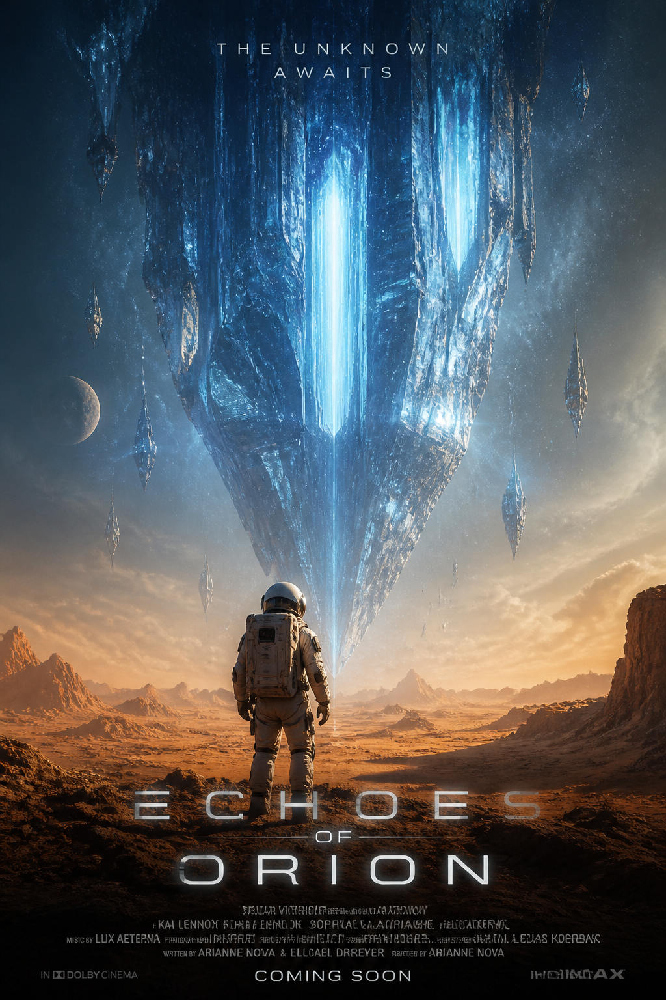

---

## 02. Music Festival Poster

**Style:** Event Poster / Psychedelic
**Source:** Community

```
Music festival poster design for "ECHO FESTIVAL 2026". Psychedelic art style with flowing organic shapes, geometric patterns, and vibrant colors -- electric purple, hot pink, teal, and gold on a dark navy background. Central artwork is an abstract eye surrounded by sound waves morphing into a forest. Festival name in bold distorted typography at the top. Date and location in smaller text at the bottom. Lineup text in the middle. Retro-futuristic psychedelic poster art. Ultra-detailed 4K.
```

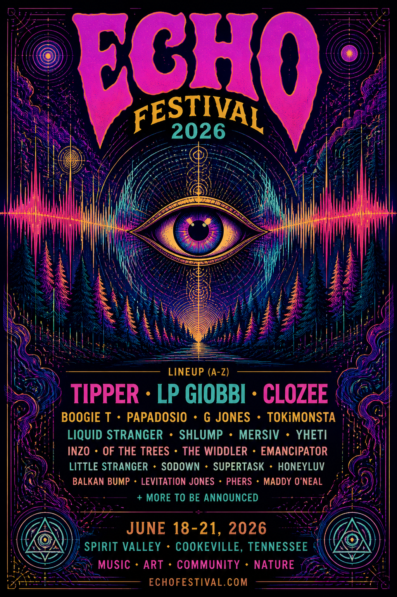

---

## 03. Minimal Brand Logo

**Style:** Logo Design / Minimal
**Source:** Community

```
Minimal logo design for a coffee brand called "MORNING". The logo is a simple line-art illustration of a sunrise inside a coffee cup, using a single continuous flowing line in a warm brown color on a cream background. Below the icon, the word "MORNING" in a clean modern serif font, evenly spaced letters. Negative space used cleverly -- the steam from the cup forms the sun rays. Professional logo design, scalable vector aesthetic.
```

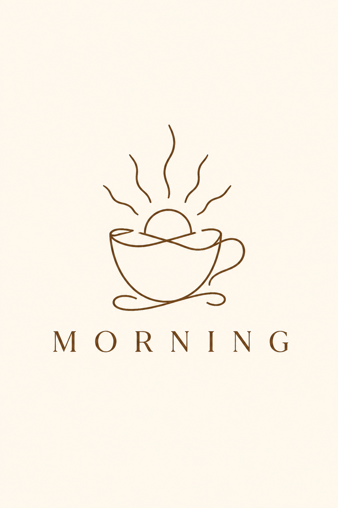

---

## 04. Album Cover Art

**Style:** Album Cover / Abstract
**Source:** Community

```
Album cover art for an indie electronic music album. Square format. Abstract geometric composition -- overlapping translucent circles and rectangles in soft pastel colors (blush pink, sage green, pale blue, cream) on a warm off-white background. Subtle paper texture visible. Title "WAVELENGTHS" in small elegant sans-serif text at the bottom center. Minimal, sophisticated, modern art gallery aesthetic. 4K quality.
```

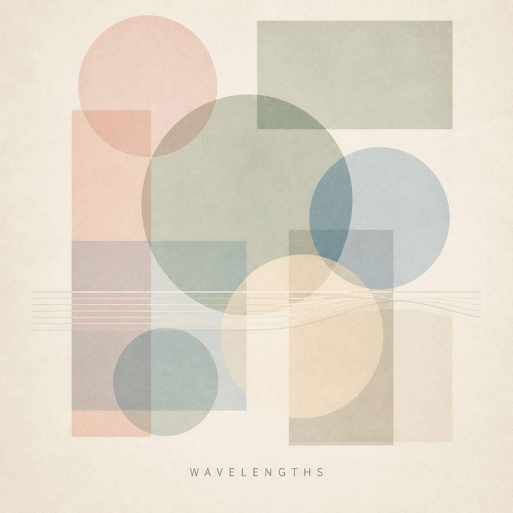

---

## 05. Retro Travel Poster

**Style:** Vintage Travel / Art Deco
**Source:** Community

```
Vintage travel poster for Tokyo in 1930s Art Deco style. Composition: a stylized Mount Fuji in the background with cherry blossoms framing the scene. In the foreground, a geisha in a vibrant red kimono walks along a bridge. Bold flat colors -- red, black, gold, and cream. "TOKYO" in large Art Deco typography at the top. "JAPAN" in smaller text below. Classic travel poster layout with decorative border. Lithograph print texture.
```

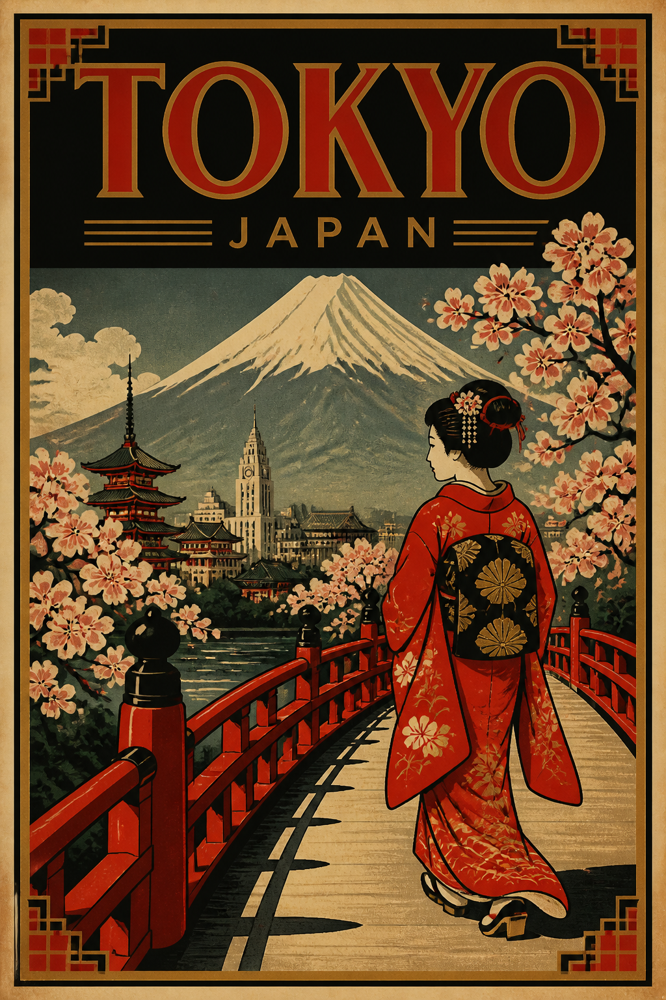

---

## 06. Sci-Fi Movie Teaser Poster (INVENTOR)

**Style:** Movie Teaser / Sci-Fi Epic
**Source:** [EvoLink.ai](https://evolink.ai/gpt-image-2-prompts)

```
Create a cinematic sci-fi movie teaser poster in 16:9 landscape format. A lone woman stands in silhouette at the center, viewed from behind, facing an enormous cubic chamber filled with thousands of glowing holographic screens and data panels stretching in every direction. The screens display fragments of landscapes, cities, galaxies, and abstract data. A bright golden-white light source emanates from the center of the chamber, casting volumetric rays and lens flare. The title "INVENTOR" is displayed in wide-spaced uppercase serif typography at the bottom center. Below it, the tagline "DISCOVERY IS JUST THE BEGINNING" in smaller caps, and "COMING SOON" at the very bottom. Dark moody atmosphere, deep blues and warm amber highlights, photorealistic lighting, epic sense of scale, no other characters visible.
```

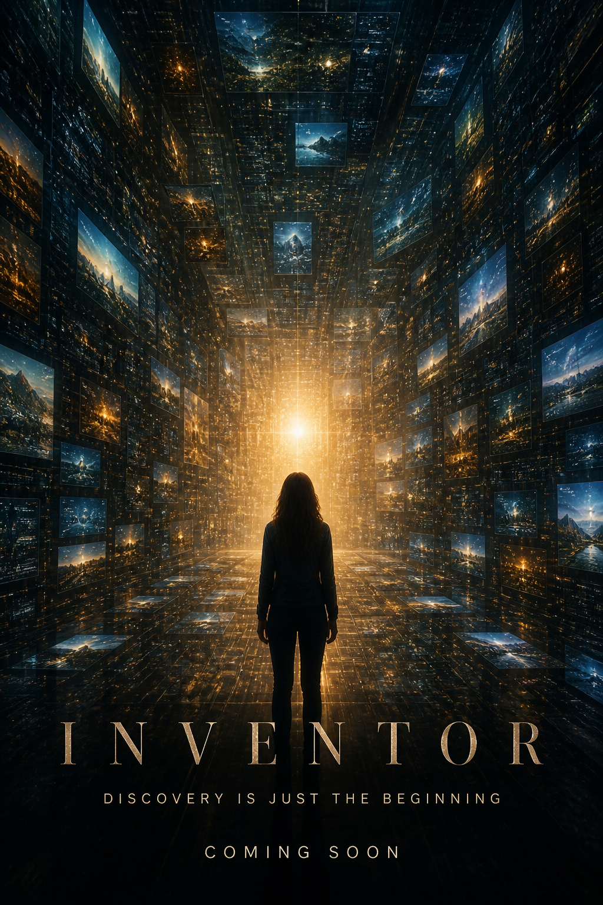

---

## 07. Infographic -- Seed to Tree Process

**Style:** Infographic / Educational
**Source:** [NoteGPT](https://notegpt.io/blog/gpt-image-2-prompt-guide-use-cases)

```
A clean infographic showing the 3-step 'Seed to Tree' process. 1. Seed, 2. Sprout, 3. Tree. Simple flat vector icons, pastel colors. Perfectly legible numbers and titles for each stage.
```

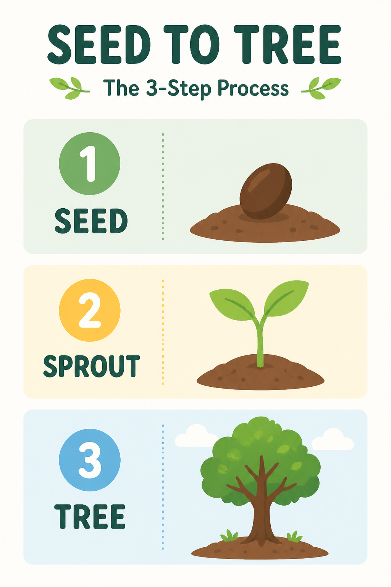

---

## 08. Infographic -- Coffee Machine Flow

**Style:** Technical Infographic / Diagram
**Source:** [OpenAI Official Cookbook](https://developers.openai.com/cookbook/examples/multimodal/image-gen-models-prompting-guide)

```
Create a detailed Infographic of the functioning and flow of an automatic coffee machine like a Jura.
From bean basket, to grinding, to scale, water tank, boiler, etc.
I'd like to understand technically and visually the flow.
```

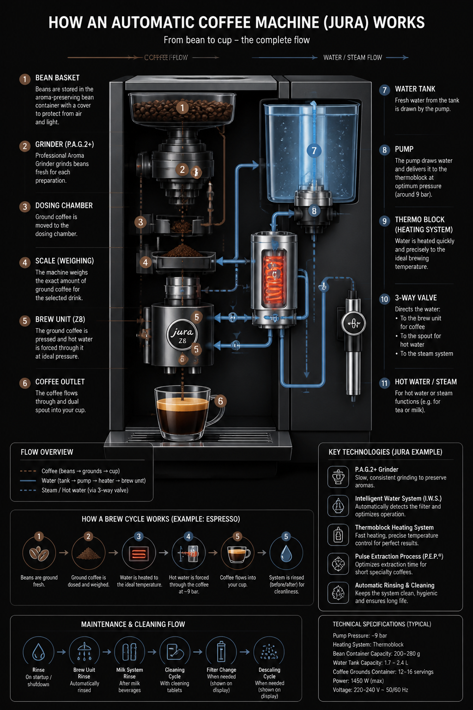

**Technique:** Use `quality="high"` for dense infographics with lots of labels. Set size to portrait (1024x1536).

---

## 09. Scientific Diagram -- Cellular Respiration

**Style:** Educational / Biology Diagram
**Source:** [OpenAI Official Cookbook](https://developers.openai.com/cookbook/examples/multimodal/image-gen-models-prompting-guide)

```
Create a simple biology diagram titled "Cellular Respiration at a Glance" for high school students.

Show how glucose turns into energy inside a cell. Include glycolysis, the Krebs cycle, and the electron transport chain.
Use arrows to connect the steps, and label the main molecules: glucose, pyruvate, ATP, NADH, FADH2, CO2, O2, and H2O.
Make it look like a clean classroom handout or slide, with a white background, simple icons, clear labels, and easy-to-read text.

Avoid tiny text, extra decoration, or anything that makes the diagram hard to understand.
```

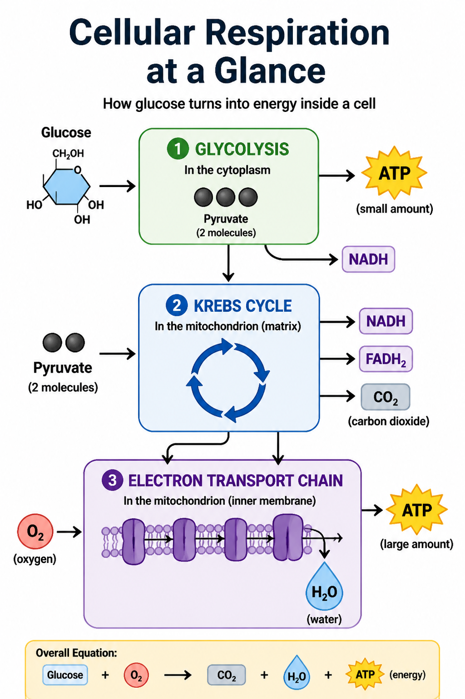

---

## 10. Volcanic Eruption Cross-Section

**Style:** Educational Diagram / Geology
**Source:** [NoteGPT](https://notegpt.io/blog/gpt-image-2-prompt-guide-use-cases)

```
A cross-section diagram of a volcanic eruption. Labeled parts: 'Magma Chamber', 'Main Vent', and 'Ash Cloud'. Scientific illustration style, clear labels in black sans-serif font.
```

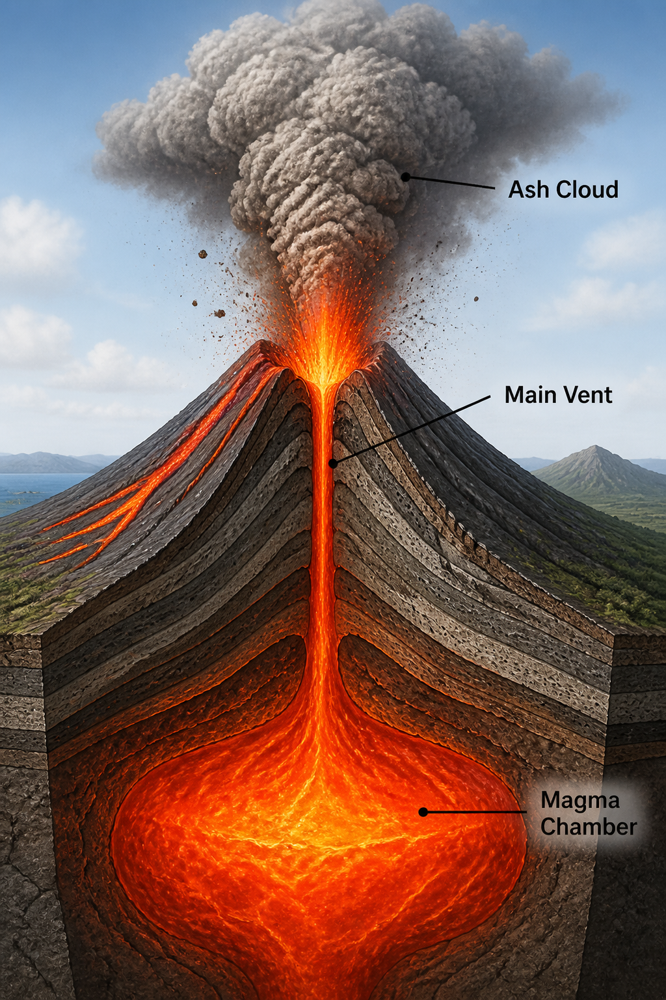

---

## 11. Story-to-Comic Strip (4 Panels)

**Style:** Comic Strip / Sequential Art
**Source:** [OpenAI Official Cookbook](https://developers.openai.com/cookbook/examples/multimodal/image-gen-models-prompting-guide)

```
Create a short vertical comic-style reel with 4 equal-sized panels.
Panel 1: The owner leaves through the front door. The pet is framed in the window behind them, small against the glass, eyes wide, paws pressed high, the house suddenly quiet.
Panel 2: The door clicks shut. Silence breaks. The pet slowly turns toward the empty house, posture shifting, eyes sharp with possibility.
Panel 3: The house transformed. The pet sprawls across the couch like it owns the place, crumbs nearby, sunlight cutting across the room like a spotlight.
Panel 4: The door opens. The pet is seated perfectly by the entrance, alert and composed, as if nothing happened.
```

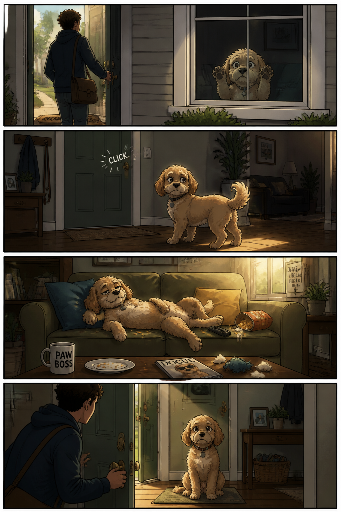

**Technique:** Define the narrative as a sequence of clear visual beats, one per panel. Keep descriptions concrete and action-focused.

---

## 12. Vintage Newspaper Front Page

**Style:** Vintage Print / Newspaper Design
**Source:** [EvoLink.ai](https://evolink.ai/gpt-image-2-prompts)

```
Create the most realistic front page design of a vintage newspaper. The layout should be made in the style of a real printed newspaper with a cinematic black-and-white aesthetic. The main photo should be prominently placed in the center, framed like an editorial article header. Create a bold, attention-grabbing headline at the top with a smaller subtitle underneath. Add realistic newspaper elements: columns of small text, a fictitious publication name at the top, date, issue number and location, decorative lines, dividers, and vintage typography, small additional articles or captions. Style: black and white or slightly faded monochrome paper, fine paper texture, grain, and ink defects, small shadows and creases that mimic real printed paper. The aesthetics of a clean but slightly worn vintage newspaper. Aspect ratio: 4:5, high-detail, ultra-realistic hybrid of editorial photography and print design.
```

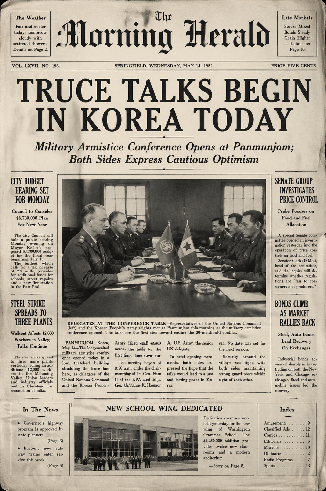

---

## 13. Ink-Curve City Poster (Guangzhou Aesthetics)

**Style:** Chinese Aesthetics / Ink Art
**Source:** [EvoLink.ai](https://evolink.ai/gpt-image-2-prompts)

```
Pure deep black background, a bold and powerful ink calligraphy S-curve sweeping from one end of the canvas to the other, forming the visual backbone and narrative flow of the entire composition. Above the curve floats a translucent oriole bird with traditional architecture reflections and blue-green light streams inside its body. Along the curve, Guangzhou landmarks and classical buildings are arranged in staggered sequence, with white cranes and a lake in the foreground and layered mountain ranges in the distance. The overall piece uses non-linear perspective, cold tones as the dominant palette with warm accent touches, blending Eastern aesthetics with modern imagery, 8K ultra-HD rendering, 9:16 aspect ratio.
```

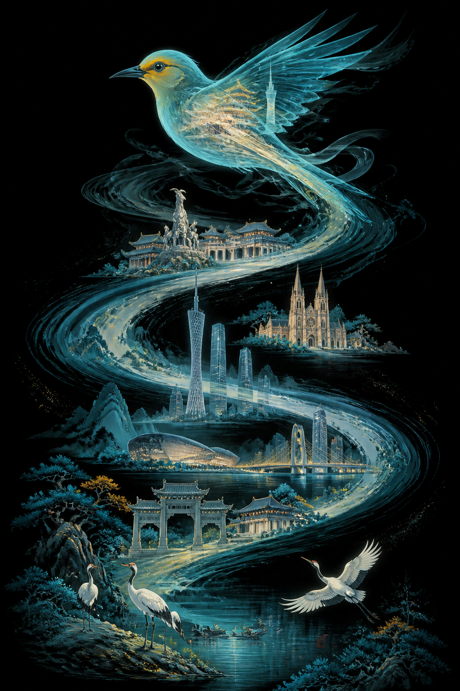

---

## 14. Epic Silhouette World Poster

**Style:** Narrative Silhouette / Collectible Poster
**Source:** [EvoLink.ai](https://evolink.ai/gpt-image-2-prompts)

```
Collectible epic poster where a character side-profile silhouette contains a complete world and classic scenes growing from within. The overall style blends cinematic movie poster aesthetics with dreamy watercolor illustration, creating an atmosphere that is quiet, grand, sacred, and nostalgic, with paper grain texture, light fog effects, dry-brush strokes, and premium negative space.
```

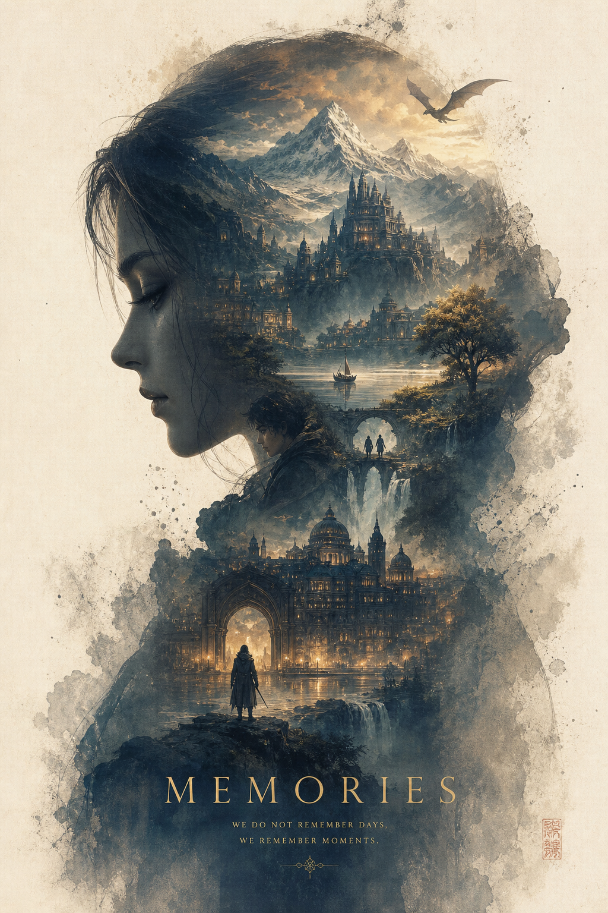

---

## 15. Comparison Chart -- Old vs New

**Style:** Comparison Infographic
**Source:** [NoteGPT](https://notegpt.io/blog/gpt-image-2-prompt-guide-use-cases)

```
A 'Vs' comparison image. Left side: 'OLD TECH' with a chunky grey monitor. Right side: 'NEW TECH' with a thin holographic screen. High contrast, clean layout.
```

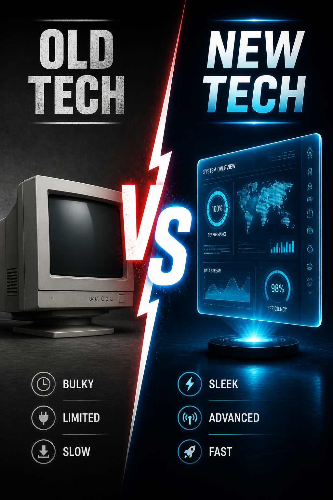

---

## 16. Chengdu Food Map Illustration

**Style:** Hand-Drawn Map / Food Illustration
**Source:** [EvoLink.ai](https://evolink.ai/gpt-image-2-prompts)

```
A hand-drawn style city food map themed around Chengdu. The base is a bird's-eye-view hand-drawn simplified city map with major roads and landmarks indicated -- not aiming for precise proportions but rather a charming, hand-drawn feel. Scattered across the map are 12 exquisite hand-drawn mini illustrations of food spots: skewered hot pot (chuanchuan) on Chunxi Road, Sandapao rice balls in Kuanzhai Alley, egg puff cakes (dan hong gao) on Jianshe Road, hot pot on Yulin Road, and more. Each illustration occupies roughly 5% of the map area, with a handwritten-style label next to it showing the shop name and a one-line recommendation. The map edges are framed with hand-drawn vine and chili pepper decorations. A hand-drawn compass and legend sit in the bottom-right corner. The top-left title reads "Chengdu Foodie Walking Map" in plump, rounded hand-lettered art typography adorned with chili peppers. The overall art style is a watercolor-plus-colored-pencil mixed hand-drawn texture, dominated by warm tones, with a 1:1 aspect ratio.
```

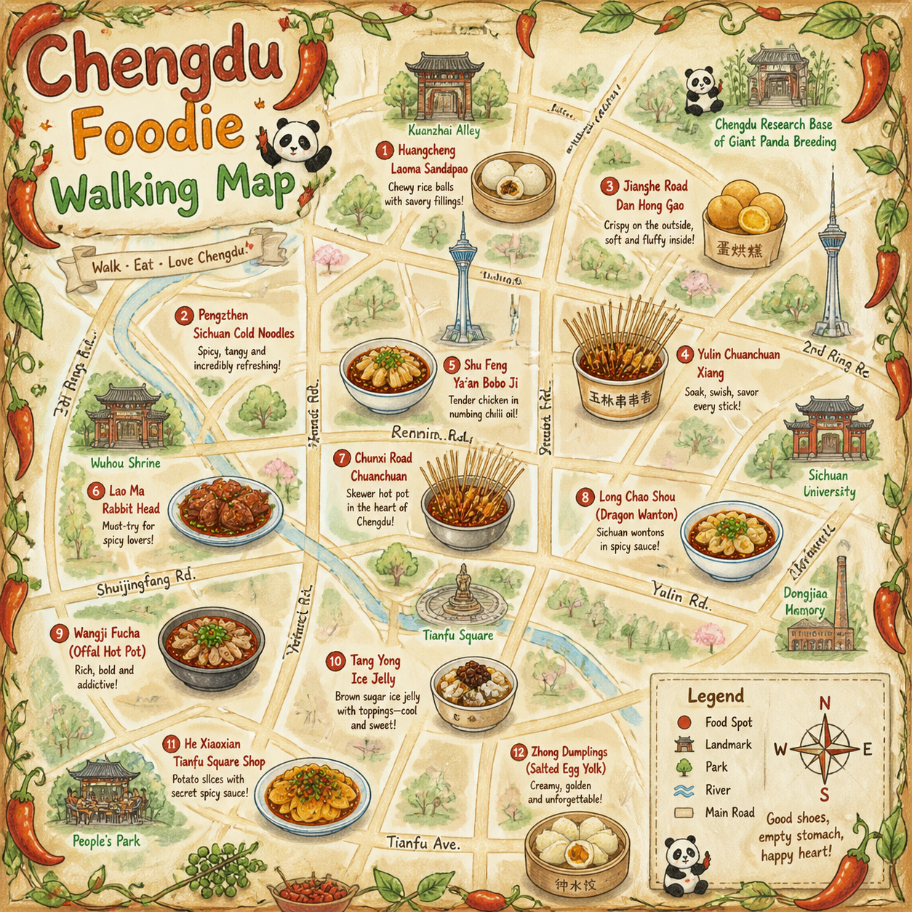

---

## Tips for Poster & Graphic Design

- **Always specify aspect ratio**: 2:3 for movie posters, 1:1 for social media, 16:9 for banners
- **Typography control**: Name the font style ("sans-serif", "serif", "Art Deco") and position
- **Credit blocks**: "credits block at bottom" adds professional poster realism
- **Art style era**: "1930s Art Deco", "psychedelic 60s", "Swiss design" -- era references are powerful
- **Color palette**: Name 3-4 specific colors to avoid generic palettes
- **For infographics**: Use `quality="high"` for dense labels and diagrams
- **For comics**: Define narrative as clear visual beats, one per panel, with concrete action descriptions

---

[Back to Main](../../README.md)
